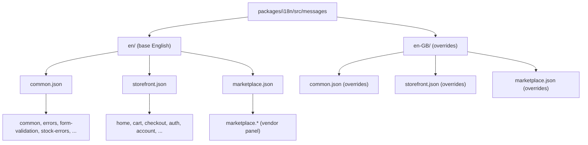
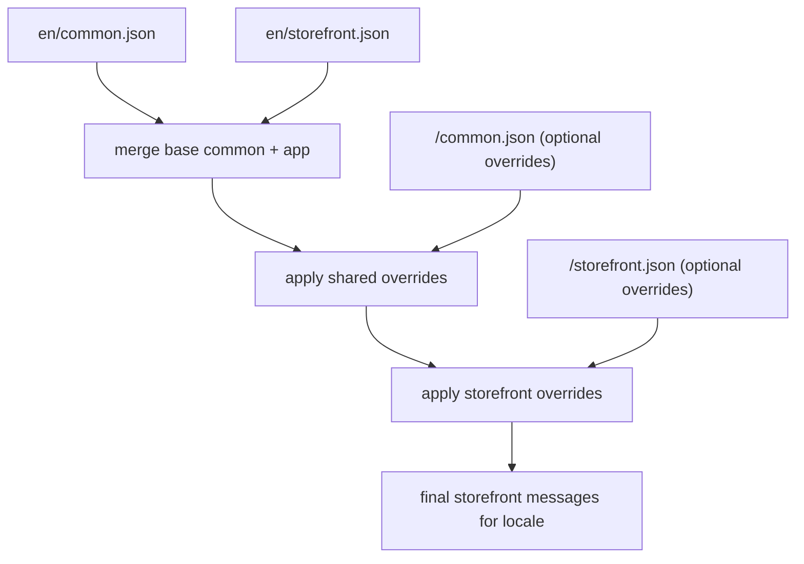

# i18n architecture

Nimara uses a shared i18n package with **feature-based message files** and **locale overrides** that are consumed by all apps (storefront, marketplace, stripe, etc.).

- Base English messages live under `packages/i18n/src/messages/en/`:
  - `common.json` – shared namespaces (`common`, `errors`, `form-validation`, `stock-errors`, etc.)
  - `storefront.json` – storefront-specific namespaces (`home`, `cart`, `checkout`, `auth`, `account`, `order`, etc.)
  - `marketplace.json` – marketplace-specific namespaces (`marketplace.*`, vendor products, orders, collections, etc.)
- Regional overrides live under `packages/i18n/src/messages/<locale>/` (for example `en-GB`) and only contain keys that differ from base English.

This keeps **keys stable** across locales (for example `home.title`, `marketplace.configuration.general.heading`) while allowing regions to override wording where needed.

## Files and namespaces

## How a messages object is composed

Each app passes an `app` identifier into `@nimara/i18n`’s `createRequestConfig`, which calls `loadMessages(locale, app)` to build the final messages object.

For example, the storefront uses `app: "storefront"`:

The marketplace app works the same way, but uses `app: "marketplace"` and `en/marketplace.json` instead of `en/storefront.json`.

Other apps can plug into the same mechanism by:

1. Adding an `<app>.json` base file under `packages/i18n/src/messages/en/`.
2. Optionally adding `<locale>/<app>.json` override files where wording differs from base English.
3. Passing `app: "<app>"` into `createRequestConfig` in the app’s i18n bootstrap code.

