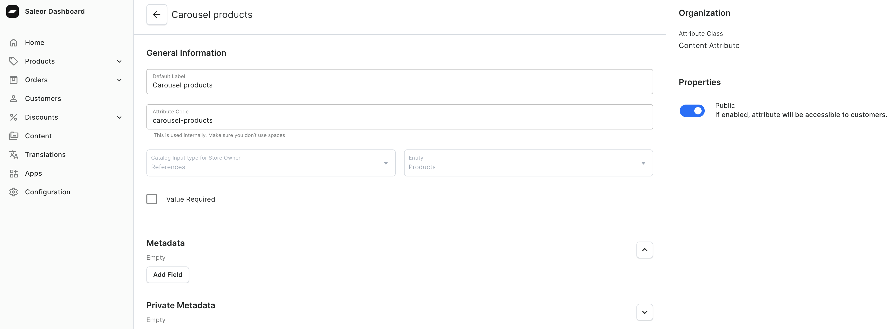
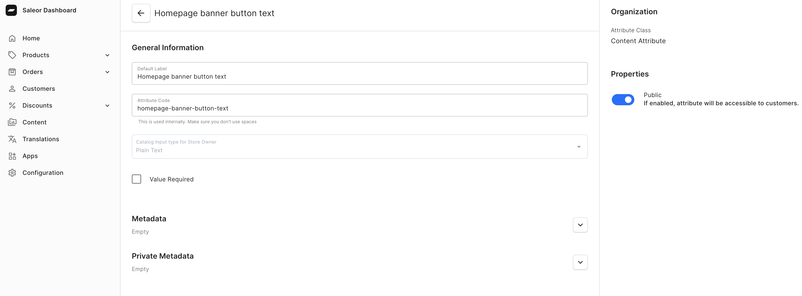
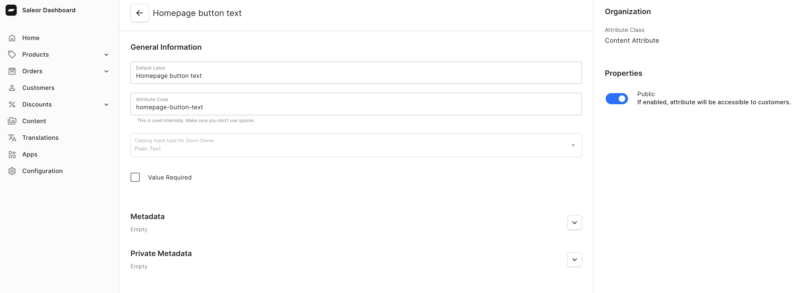
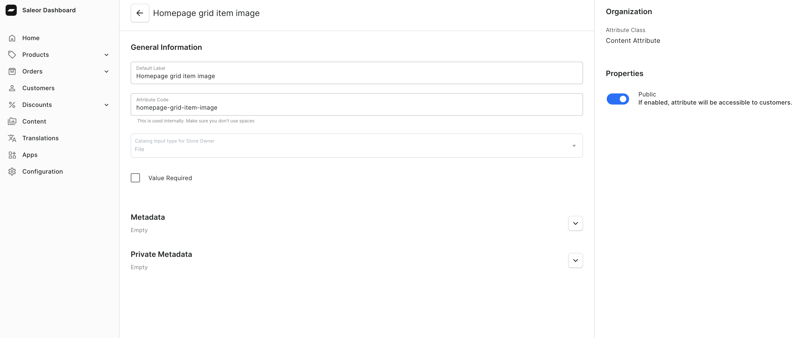
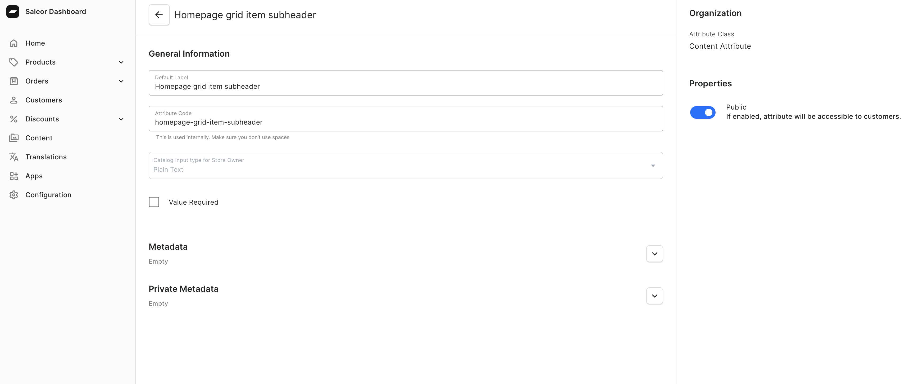
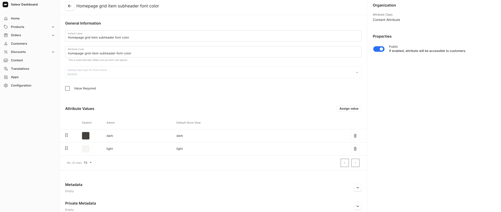
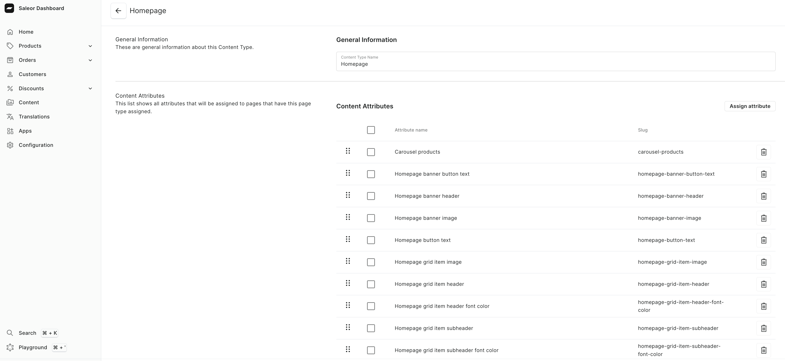
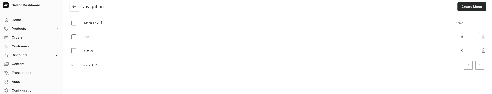

import { Steps } from "nextra/components";

# Add content with Saleor CMS

This guide will help you set up Saleor CMS, which manages your storefront's **homepage**, **footer**, and **navigation**.

## Configure homepage

Saleor CMS relies on attributes to organize content and specific attributes are required for setting up the homepage. Refer to the screenshots below to identify the necessary attributes.

<Steps>
### Create required attributes

Navigate to Saleor dashboard > **Configuration** > **Attributes and Product Types** and select **Attributes**.
Create the following attributes:

**Carousel products** - display up to 8 products in a carousel on the homepage:

**Homepage banner button text** - display button text on banner section:

**Homepage banner header** - display header on banner section:

**Homepage banner image** - display the background image of the banner section:

**Homepage button text** - display button text on page bottom:

**Homepage grid item header** - display header on featured carousel's element:

**Homepage grid item header font color** - set the font color of the header on featured carousel's element:

**Homepage grid item image** - display the background image of the featured carousel's element:

**Homepage grid item subheader** - display subheader on featured carousel's element:

**Homepage grid item subheader font color** - set the font color of subheader on featured carousel's element:

### Create Homepage page type

To set up the homepage, you need to create **Page Type** and assign appropriate attributes. Follow these steps:

<Steps>

#### Navigate to Page Types

Go to Saleor dashboard > **Configuration** > **Content Management** and select **Page Types**.

#### Create new Page Type

Click on **Create page type**.
Enter the name **Homepage** for Content Type Name and click **Save**.

#### Assign attributes

Assign all required attributes to **Homepage Page Type**:

</Steps>

### Create an actual homepage

Once **Homepage Page Type** is set up, you can create the actual homepage content by following these steps:

<Steps>
#### Navigate to Content management

Go to Saleor dashboard > **Content** and click **Create content**.

#### Select Page Type

In the dropdown, select **Homepage**.
This ensures that attributes assigned to **Homepage Page Type** are available for editing.

#### Fill in attributes

</Steps>
</Steps>

## Configure navigation & footer

<Steps>

### Navigate to Navigation management

Go to Saleor dashboard > **Configuration** > **Miscellaneous** and select **Navigation**

### Create Menu for navigation and footer

Click **Create menu** to open menu creation form.
For the main navigation, name menu **navbar**.
This menu will manage links displayed in your website's header navigation.
For the footer, create another menu and name it **footer**.
This menu will handle links displayed in the footer section of your website.

### Create Menu items

Select the menu you want to edit and click **Create new item** to open the menu item creation form.
Menu items can link to various resources:

- **Category**,
- **Collection**,
- **Static Page** - link to page created in **Content** section,
- **URL** - URL to an external website or link to an internal page within your storefront.

</Steps>

## Configure Static Page

A static page in Saleor is used for standalone content, such as "About Us" or "Contact" page. Unlike **Homepage** page type, **Static Page** does not require attributes. Follow these steps to create one:

<Steps>
### Navigate to Content Management
Go to Saleor dashboard > **Configuration** > **Content Management** and select **Page Types**.
#### Create new Page Type

Click on **Create page type**.
Enter the name **Static page** for Content Type Name and click **Save**.

### Enter page details

- **Title** - provide a title for the page (e.g., "About Us").
- **Slug** - specify the slug for the page, this will determine its URL (e.g., /about-us).
- **Content** - use a rich text editor to add your content (e.g., text paragraphs, headings, bullet points or numbered lists, images, hyperlinks)

### Create an actual static page

Creating an actual static page follows the same steps as creating a homepage.

</Steps>
