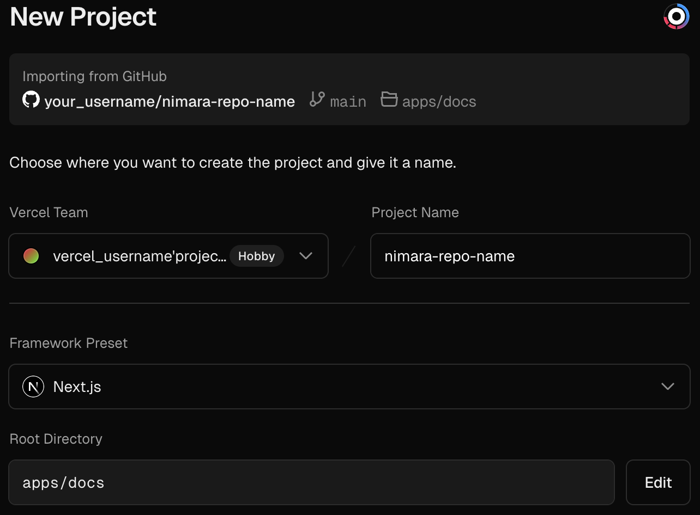

import { Steps } from "nextra/components";
import Image from "next/image";

# Storefront

This guide will help you set up a [Nimara storefront](https://www.demo.nimara.store) in your local environment.

<Steps>
### Install project

Clone repo and install dependencies.

```bash
git clone https://github.com/mirumee/nimara-ecommerce.git nimara-ecommerce
cd nimara-ecommerce
pnpm install
```

### Copy variables

Copy environment variables from **.env.example** to **.env**:

```bash
cp .env.example .env
```

### Add backend URL and set up environment variables

Use a free developer account at Saleor Cloud to start quickly with the backend. Alternatively, you can run Saleor locally using Docker.

```properties
# Add backend address
NEXT_PUBLIC_SALEOR_API_URL=https://{your_domain}.saleor.cloud/graphql/

# Local example
# NEXT_PUBLIC_SALEOR_API_URL=http://localhost:8000/graphql/
```

For a full list of required and optional variables, see the [Environment Variables Guide](./environment-variables).

### Run project

Run the development server.

```bash
pnpm run dev:storefront
```

</Steps>

## Deployment

<Steps>
### Connect GitHub Repository
Go to your projects on [Vercel](https://vercel.com/) -> click **Add New** and select **Project**.

Choose your Nimara GitHub repository and click **Import**.

### Set up New Project

Select your **Vercel Team**, add **Project Name**, set **Root Directory** to `apps/storefront`:

<div style={{ maxWidth: "400px", width: "100%", margin: "auto" }}>
  
</div>

Set **Build Command** to `turbo run build --filter=storefront` and **Install Command** to `pnpm install`:

<div style={{ maxWidth: "400px", width: "100%", margin: "auto" }}>
  
</div>

Vercel does not use your local **.env** file so you must define all required variables:

<div style={{ maxWidth: "400px", width: "100%", margin: "auto" }}>
  
</div>
**Note**: See the [Environment Variables section](./environment-variables) for
detailed instructions on setting up these variables.

Deploy your new project: click **Deploy**

#### Verify Deployment & Configure Settings

After successful deployment, click **Continue to Dashboard** to manage deployed Nimara project.

From the **Vercel dashboard**, you can manage and customize your storefront project:

- Monitor deployments – view the status of each deployment (production & previews)
- Set environment variables – add or update secrets without redeploying locally
- Configure custom domains – add or change production and staging domains
- Trigger redeployments – manually redeploy if you update envs
- Inspect logs – view build and runtime logs for debugging
- Manage team access – invite developers with role-based permissions
- Enable password protection – secure preview deployments from public access
- Enable analytics – track performance and traffic with Vercel Analytics

</Steps>
