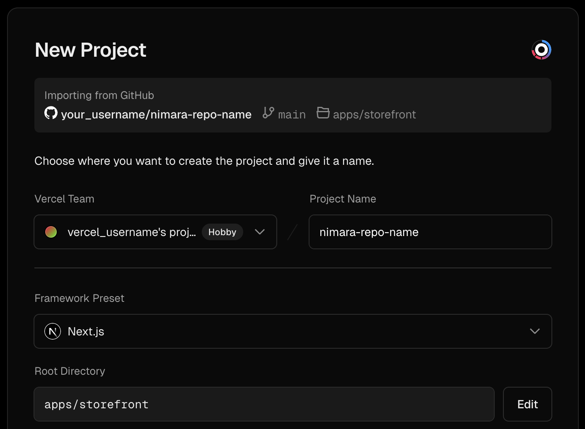

import { Steps } from "nextra/components";

# Storefront

This guide will help you set up a [Nimara storefront](https://www.demo.nimara.store) in your local environment.

<Steps>
### Fork and clone project
First, **fork** the Nimara repository to your own GitHub account. This allows you to make changes independently and submit pull requests later.

Go to the Nimara GitHub repo.

Click the **Fork** button in the top-right corner.

Once the fork is created, clone your fork locally:

```bash
git clone https://github.com/{your_github_username}/nimara-ecommerce.git nimara-ecommerce
cd nimara-ecommerce
```

### Install project's dependencies

```bash
pnpm install
```

### Copy variables

Copy environment variables from **.env.example** to **.env**:

```bash
cp .env.example .env
```

### Add backend URL and set up environment variables

Use a free developer account at Saleor Cloud to start quickly with the backend. Alternatively, you can run Saleor locally using Docker.

```properties
# Add backend address
NEXT_PUBLIC_SALEOR_API_URL=https://{your_domain}.saleor.cloud/graphql/

# Local example
# NEXT_PUBLIC_SALEOR_API_URL=http://localhost:8000/graphql/
```

For a full list of required and optional variables, see the [Environment Variables Guide](./environment-variables).

### Set up webhooks in Saleor (see Webhooks section)

### Run project

Run the development server.

```bash
pnpm run dev:storefront
```

</Steps>

## 🪝 Webhooks

Webhooks in Saleor let you receive real-time notifications for events like product or page updates, allowing you to instantly reflect changes in your frontend. This keeps your Nimara storefront in sync with Saleor, enabling instant cache updates and smooth integration.

### How to set up webhooks in Saleor dashboard

<Steps>

### Create a new extension for webhooks

Go to your Saleor dashboard → **Extensions** → click **Add Extension** → select **Provides details manually** -> add name and assign the necessary permissions for your app - **Manage navigation**, **Manage pages**, **Manage products** -> click **Save**.

### Create Webhooks

In section **Webhooks & Events** click **Create Webhook**

You will need to create four webhooks, one for each of the following:

`Product Webhook`

- Target URL: `https://<your-domain-url>/api/webhooks/saleor/products`
- Events: select all events related to the `Product` object, except `Export completed`.

`Menu Webhook`

- Target URL: `https://<your-domain-url>/api/webhooks/saleor/menu`
- Events: select all events related to the `Menu` object.

`Page Webhook`

- Target URL: `https://<your-domain-url>/api/webhooks/saleor/page`
- Events: select all events related to the `Page` object.

`Collection Webhook`

- Target URL: `https://<your-domain-url>/api/webhooks/saleor/collections`
- Events: select `Deleted` and `Updated` events related to `Collection` object.

</Steps>

## 🚀 Deployment

<Steps>
### Connect GitHub Repository
Go to your projects on [Vercel](https://vercel.com/) -> click **Add New** and select **Project**.

Choose your Nimara GitHub repository and click **Import**.

### Set up New Project

Select your **Vercel Team**, add **Project Name**, set **Root Directory** to `apps/storefront`:

<div style={{ maxWidth: "400px", width: "100%", margin: "auto" }}>
  
</div>

Set **Build Command** to `turbo run build --filter=storefront` and **Install Command** to `pnpm install`:

<div style={{ maxWidth: "400px", width: "100%", margin: "auto" }}>
  
</div>

Vercel does not use your local **.env** file so you must define all required variables:

<div style={{ maxWidth: "400px", width: "100%", margin: "auto" }}>
  
</div>
**Note**: See the [Environment Variables section](./environment-variables) for
detailed instructions on setting up these variables.

Deploy your new project: click **Deploy**

#### Verify Deployment & Configure Settings

After successful deployment, click **Continue to Dashboard** to manage deployed Nimara project.

To ensure your storefront builds and runs correctly, set the **Node.js**web version in your Vercel project settings.

⚠️ Required: Node.js version 22 or higher

From the **Vercel dashboard**, you can manage and customize your storefront project:

- Monitor deployments – view the status of each deployment (production & previews)
- Set environment variables – add or update secrets without redeploying locally
- Configure custom domains – add or change production and staging domains
- Trigger redeployments – manually redeploy if you update envs
- Inspect logs – view build and runtime logs for debugging
- Manage team access – invite developers with role-based permissions
- Enable password protection – secure preview deployments from public access
- Enable analytics – track performance and traffic with Vercel Analytics

</Steps>
