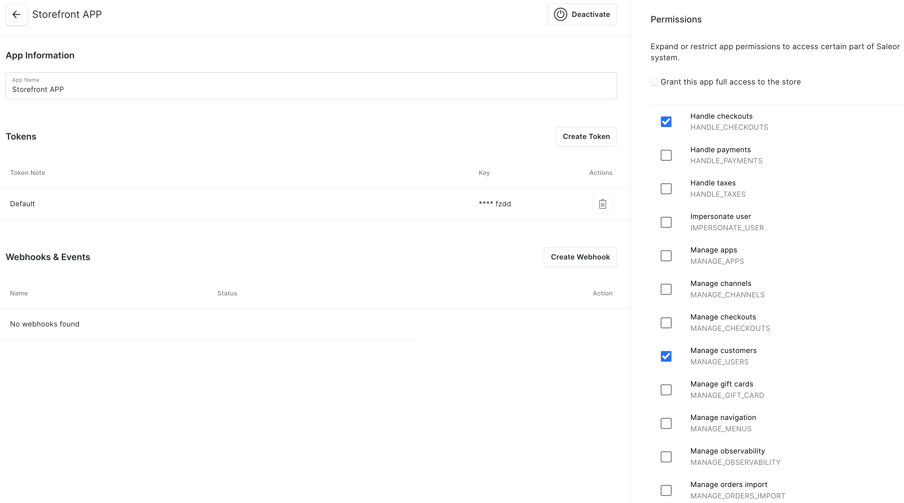

import { Steps } from "nextra/components";

# Storefront

This guide will help you set up a [Nimara storefront](https://www.demo.nimara.store) in your local environment.

<Steps>
### Install project

Clone repo and install dependencies.

```bash
git clone https://github.com/mirumee/nimara-ecommerce.git nimara-ecommerce
cd nimara-ecommerce
pnpm install
```

### Copy variables

Copy environment variables from **.env.example** to **.env**:

```bash
cp .env.example .env
```

### Add backend URL

Use a free developer account at Saleor Cloud to start quickly with the backend. Alternatively, you can run Saleor locally using Docker.

```properties
# Add backend address
# Make sure to add slash at the end:
NEXT_PUBLIC_SALEOR_API_URL=https://{your_domain}.saleor.cloud/graphql/

# Local example
# NEXT_PUBLIC_SALEOR_API_URL=http://localhost:8000/graphql/
```

### Set Saleor App Token

To authenticate the storefront with the Saleor backend, you need to generate an **App Token**.

1. Go to the Saleor dashboard: **Configuration** → **Webhooks & Events**.

2. Click **Create App**.

3. Assign the necessary permissions for your app - **Handle checkouts** and **Manage Customers**:


4. Copy the generated token and add it to your **.env** file:

```properties
SALEOR_APP_TOKEN={your_generated_token}
```

### Run project

Run the development server.

```bash
pnpm run dev:storefront
```

</Steps>
