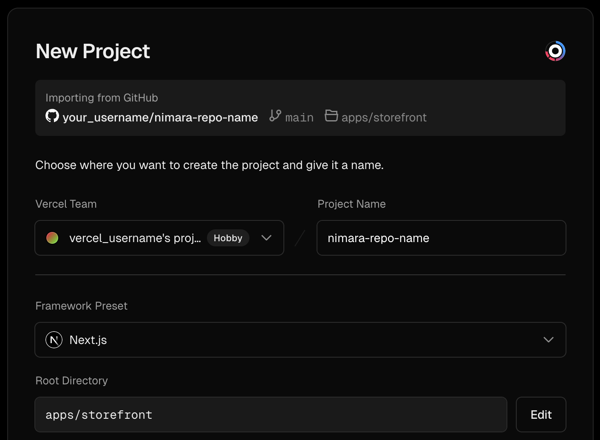
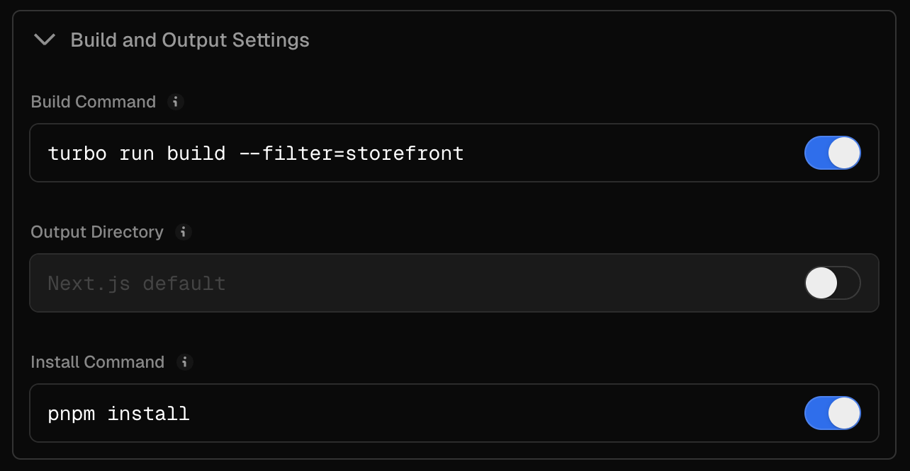
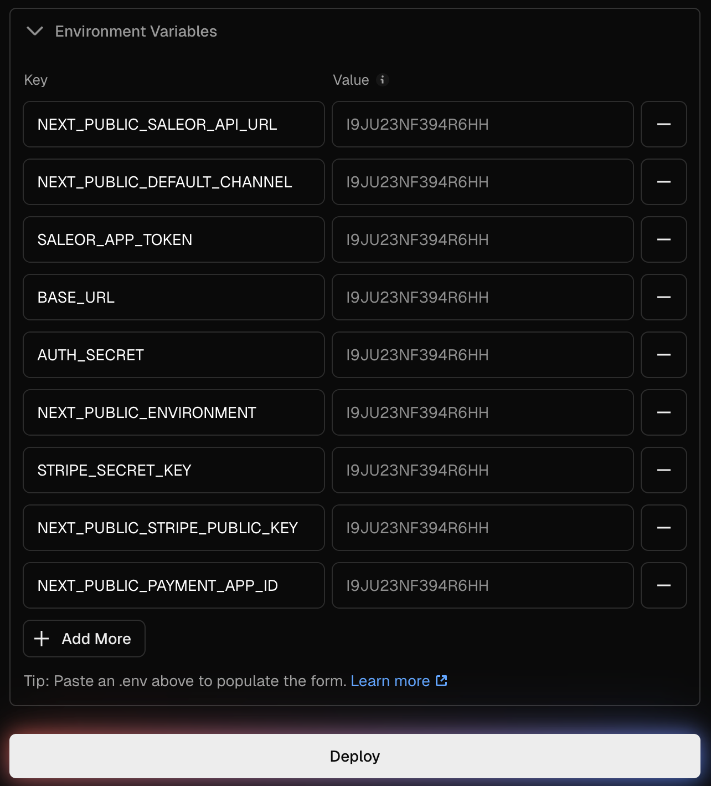

# Storefront

This guide will help you set up a [Nimara storefront](https://www.demo.nimara.store) in your local environment.

### Fork and clone project

First, **fork** the Nimara repository to your own GitHub account. This allows you to make changes independently and submit pull requests later.

Go to the [Nimara GitHub repo](https://github.com/mirumee/nimara-ecommerce).

Click the **Fork** button in the top-right corner.

Once the fork is created, clone your fork locally:

```bash
git clone https://github.com/{your_github_username}/nimara-ecommerce.git nimara-ecommerce
cd nimara-ecommerce
```

### Install project's dependencies

```bash
pnpm install
```

### Set up environment variables

The recommended way is to run the interactive preflight wizard from the repo root. It lets you pick providers (Search, CMS) and optional features (auth, Stripe, marketplace, Sentry), shows exactly which env vars each choice requires, and writes the env file for you (defaults to `apps/storefront/.env.local`):

```bash
pnpm preflight
```

Alternatively, copy **.env.example** to **.env** by hand and fill it in yourself (the file lives in `apps/storefront`, so run this from the repo root):

```bash
cp apps/storefront/.env.example apps/storefront/.env
```

### Add backend URL

Use a free developer account at Saleor Cloud to start quickly with the backend. Alternatively, you can run Saleor locally using Docker.

```properties
# Add backend address
NEXT_PUBLIC_SALEOR_API_URL=https://{your_domain}.saleor.cloud/graphql/

# Local example
# NEXT_PUBLIC_SALEOR_API_URL=http://localhost:8000/graphql/
```

For a full list of required and optional variables, see the [Environment Variables Guide](./environment-variables).

### Set up webhooks in Saleor

See the [Webhooks](#webhooks) section below.

### Run project

Run the development server:

```bash
pnpm run dev:storefront
```

## i18n

The storefront uses the shared i18n package and message composition system described in the [i18n architecture docs](/Advanced/i18n). It passes `app: "storefront"` to `@nimara/i18n`'s `createRequestConfig`, so it receives the `common` + `storefront` message bundles (with locale-specific overrides applied where defined).

## Webhooks

Webhooks in Saleor let you receive real-time notifications for events like product or page updates, allowing you to instantly reflect changes in your frontend. This keeps your Nimara storefront in sync with Saleor, enabling instant cache updates and smooth integration.

### How to set up webhooks in Saleor dashboard

### Create a new extension for webhooks

Go to your Saleor dashboard → **Extensions** → click **Add Extension** → select **Provides details manually** → add name and assign the necessary permissions for your app: **Manage navigation**, **Manage pages**, **Manage products** → click **Save**.

### Create webhooks

In the **Webhooks & Events** section click **Create Webhook**.

You will need to create four webhooks, one for each of the following.

**Product Webhook**

- Target URL: `https://<your-domain-url>/api/webhooks/saleor/products`
- Events: select all events related to the `Product` object, except `Export completed`.
- Payload's Subscription Query:

  ```graphql
  subscription {
    event {
      __typename
      ... on ProductUpdated {
        product {
          slug
        }
      }
      ... on ProductDeleted {
        product {
          slug
        }
      }
      ... on ProductMetadataUpdated {
        product {
          slug
        }
      }
      ... on ProductMediaCreated {
        productMedia {
          productId
        }
      }
      ... on ProductMediaUpdated {
        productMedia {
          productId
        }
      }
      ... on ProductMediaDeleted {
        productMedia {
          productId
        }
      }
      ... on ProductVariantCreated {
        productVariant {
          product {
            slug
          }
        }
      }
      ... on ProductVariantUpdated {
        productVariant {
          product {
            slug
          }
        }
      }
      ... on ProductVariantDeleted {
        productVariant {
          product {
            slug
          }
        }
      }
      ... on ProductVariantBackInStock {
        productVariant {
          product {
            slug
          }
        }
      }
      ... on ProductVariantOutOfStock {
        productVariant {
          product {
            slug
          }
        }
      }
      ... on ProductVariantMetadataUpdated {
        productVariant {
          product {
            slug
          }
        }
      }
      ... on ProductVariantStockUpdated {
        productVariant {
          product {
            slug
          }
        }
      }
    }
  }
  ```

**Menu Webhook**

- Target URL: `https://<your-domain-url>/api/webhooks/saleor/menu`
- Events: select all events related to the `Menu` object.
- Payload's Subscription Query:

  ```graphql
  subscription {
    event {
      __typename
      ... on MenuCreated {
        menu {
          slug
        }
      }
      ... on MenuUpdated {
        menu {
          slug
        }
      }
      ... on MenuDeleted {
        menu {
          slug
        }
      }
      ... on MenuItemCreated {
        menuItem {
          menu {
            slug
          }
        }
      }
      ... on MenuItemUpdated {
        menuItem {
          menu {
            slug
          }
        }
      }
      ... on MenuItemDeleted {
        menuItem {
          menu {
            slug
          }
        }
      }
    }
  }
  ```

**Page Webhook**

- Target URL: `https://<your-domain-url>/api/webhooks/saleor/page`
- Events: select all events related to the `Page` object.
- Payload's Subscription Query:

  ```graphql
  subscription {
    event {
      __typename
      ... on PageCreated {
        page {
          slug
        }
      }
      ... on PageUpdated {
        page {
          slug
        }
      }
      ... on PageDeleted {
        page {
          slug
        }
      }
      ... on PageTypeCreated {
        pageType {
          slug
        }
      }
      ... on PageTypeUpdated {
        pageType {
          slug
        }
      }
      ... on PageTypeDeleted {
        pageType {
          slug
        }
      }
    }
  }
  ```

**Collection Webhook**

- Target URL: `https://<your-domain-url>/api/webhooks/saleor/collections`
- Events: select `Deleted` and `Updated` events related to `Collection` object.
- Payload's Subscription Query:

  ```graphql
  subscription {
    event {
      __typename
      ... on CollectionUpdated {
        collection {
          slug
        }
      }
      ... on CollectionDeleted {
        collection {
          slug
        }
      }
    }
  }
  ```

## Deployment

### Connect GitHub Repository

Go to your projects on [Vercel](https://vercel.com/) → click **Add New** and select **Project**.

Choose your Nimara GitHub repository and click **Import**.

### Set up New Project

Select your **Vercel Team**, add **Project Name**, set **Root Directory** to `apps/storefront`:



Set **Build Command** to `turbo run build --filter=storefront` and **Install Command** to `pnpm install`:



Vercel does not use your local **.env** file so you must define all required variables:



:::note
See the [Environment Variables section](./environment-variables) for detailed instructions on setting up these variables.
:::

### Deploy

Click **Deploy** to deploy your project.

### Verify Deployment & Configure Settings

After successful deployment, click **Continue to Dashboard** to manage your deployed Nimara project.

:::warning
Node.js version 24.x is required. Set the Node.js version in your Vercel project settings.
:::

From the **Vercel dashboard**, you can manage and customize your storefront project:

- Monitor deployments – view the status of each deployment (production & previews)
- Set environment variables – add or update secrets without redeploying locally
- Configure custom domains – add or change production and staging domains
- Trigger redeployments – manually redeploy if you update envs
- Inspect logs – view build and runtime logs for debugging
- Manage team access – invite developers with role-based permissions
- Enable password protection – secure preview deployments from public access
- Enable analytics – track performance and traffic with Vercel Analytics
