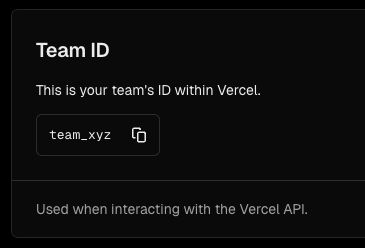
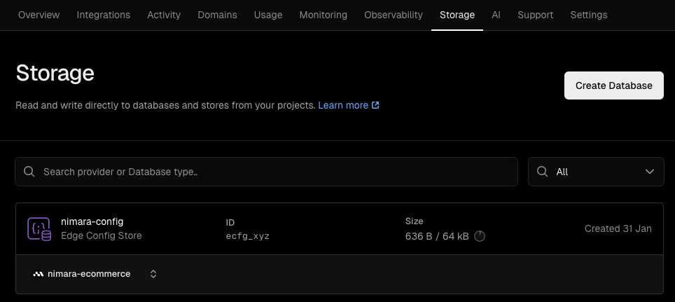
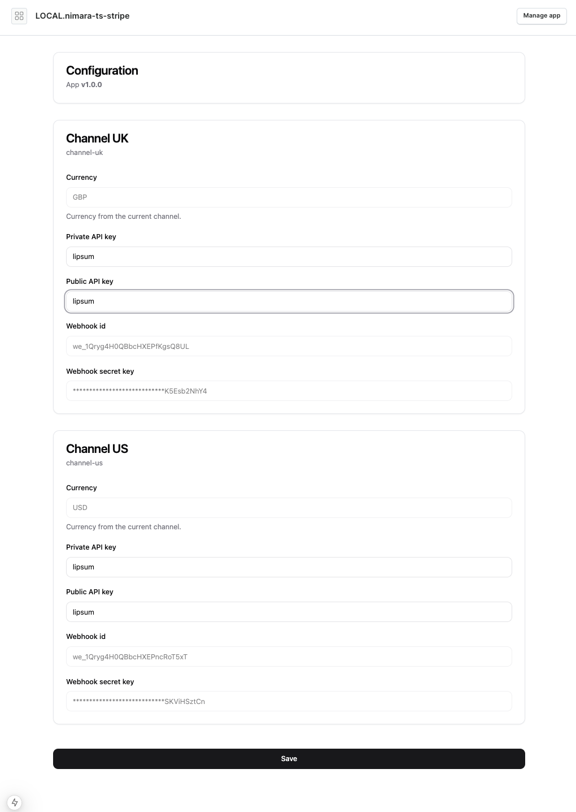

<div align="center">
  <picture>
    <source media="(prefers-color-scheme: dark)" srcset="../docs/images/logo-light.svg">
    <source media="(prefers-color-scheme: light)" srcset="../docs/images/logo.svg">
    
  </picture>
  <h1>Saleor Stripe payment app</h1>
</div>

<div align="center">
  <strong>Stripe Payment app for Saleor which can be deployed to your Vercel along side with the Nimara storefront.</strong>
</div>
<br />

## 🔧 Prerequisites

- You need to have a [Stripe](https://stripe.com/) account.

- You need to have a [Vercel](https://vercel.com/) account.

## ⚡ Quickstart

Copy `.env.example` to `.env`:

```bash
cp .env.example .env
```

Edit .env file and provide required variables:

- `VERCEL_TEAM_ID` - Your Vercel Team ID which can be found in your Vercel dashboard project > Settings tab.<br />
  

- `VERCEL_ACCESS_TOKEN` - Your [Vercel access token](https://vercel.com/guides/how-do-i-use-a-vercel-api-access-token) which can be found in your [Vercel dashboard](https://vercel.com/account/settings/tokens). This is required to properly save app's settings upon installation.

- `VERCEL_EDGE_CONFIG_ID` - Your Vercel Edge config database ID. If you don't have an Edge config database you need to create one. This can be found in your Vercel dashboard project > Storage tab.

- `NEXT_PUBLIC_SALEOR_API_URL` - Your Saleor API URL.

Now in [**nimara storefront**](../storefront) environment variables set `NEXT_PUBLIC_PAYMENT_APP_ID` to `LOCAL.nimara-ts-stripe` in your `.env` file.

**Note** that the `LOCAL` environment prefix may change depending on your `NEXT_PUBLIC_ENVIRONMENT` environment variable.

## ⚙️ Installation

Once everything is set up and the App is running, the manifest can be found under `/api/saleor/manifest`.

To install it on [Saleor Cloud](https://cloud.saleor.io) you can:

- Use the following link, just remember to replace the Saleor domain & app domain accordingly:
  [https://YOUR-SALEOR-CLOUD-DOMAIN.eu.saleor.cloud/dashboard/apps/install?manifestUrl=https://YOUR-APP-DOMAIN/api/saleor/manifest](https://YOUR-CLOUD-DOMAIN.eu.saleor.cloud/dashboard/apps/install?manifestUrl=https://YOUR-APP-DOMAIN/api/saleor/manifest)

- Go to the [apps dashboard](https://YOUR-SALEOR-CLOUD-DOMAIN..eu.saleor.cloud/dashboard/apps/) and click `Install external app`. There just provide the manifest URL of the app.

Once successfully installed, just provide correct private & public keys from your Stripe account.
<br />
**Note** that the webhooks will be installed automatically when the keys are provided.

<div align="center">
  <picture>
    
  </picture>
</div>

<br/>

<div align="center">
  <strong>Crafted with ❤️ by Mirumee Software</strong>

[hello@mirumee.com](mailto:hello@mirumee.com)

</div>
