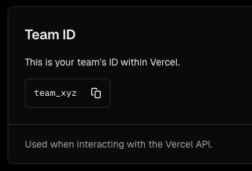
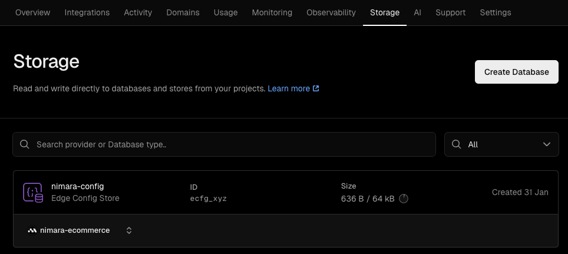
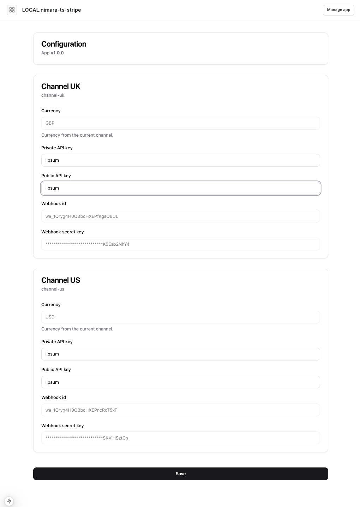

<div align="center">
  <picture>
    <source media="(prefers-color-scheme: dark)" srcset="../docs/images/logo-light.svg">
    <source media="(prefers-color-scheme: light)" srcset="../docs/images/logo.svg">
    
  </picture>
  <h1>Saleor Stripe payment app</h1>
</div>

<div align="center">
  <strong>Stripe Payment app for Saleor — a Hono + Vite app that deploys to Vercel alongside the Nimara storefront.</strong>
</div>
<br />

## 🔧 Prerequisites

- You need to have a [Stripe](https://stripe.com/) account.

- You need to have a [Vercel](https://vercel.com/) account.

## ⚡ Quickstart

Copy `.env.example` to `.env`:

```bash
cp .env.example .env
```

This is a **multi-tenant** app: one deployment serves every Saleor instance in
`ALLOWED_DOMAINS`, storing each tenant's config (install token + its Stripe
keys) keyed by its domain. Edit `.env`:

- `ALLOWED_DOMAINS` - Comma-separated Saleor domains allowed to install the app.
  Wildcards allowed (`*.eu.saleor.cloud`, or `*` for any — never `*` in prod).

- `CONFIG_PROVIDER` - Where every installed Saleor's config is stored: `edge`
  (Vercel Edge Config) or `file` (local JSON, dev only — no Vercel account
  needed).

For `CONFIG_PROVIDER=edge` also set (Vercel dashboard):

- `VERCEL_TEAM_ID` - Settings tab.<br />
- `VERCEL_ACCESS_TOKEN` - [access token](https://vercel.com/guides/how-do-i-use-a-vercel-api-access-token) from your [dashboard](https://vercel.com/account/settings/tokens).
- `VERCEL_EDGE_CONFIG_ID` - Storage tab (create an Edge Config if needed).

Now in [**nimara storefront**](../storefront) set `NEXT_PUBLIC_PAYMENT_APP_ID`
to `LOCAL.stripe` in its `.env`.

**Note** the `LOCAL` prefix follows your `ENVIRONMENT` variable.

## 🚀 Development

Each app is a [Hono](https://hono.dev) server with an optional Vite-built React
config UI. Apps live under `src/apps/<name>/`:

- `entry-server.ts` — the Hono app; exports `app` (Vercel/dev) and `handler`
  (AWS Lambda).
- `entry-client.tsx` — the React config UI (optional; omit for an API-only app).

```bash
pnpm dev            # vite dev server (Hono via @hono/vite-dev-server) on :4000
pnpm build          # per-app build (see Build targets below)
pnpm test           # vitest
pnpm lint:types     # tsc --noEmit
```

### Auto-discovery

Both dev and build **auto-discover** `src/apps/*` — adding an app dir needs no
config change.

- **Dev** (`src/dev-server.ts`, vite `import.meta.glob`): a single app is
  served at `/`; with multiple apps each runs under `/<app>` (the dev server
  sets each app's `BASE_PATH`, so its routes/manifest/assets stay correct).
- **Build** (`etc/build.ts`): one Vite pass **per app** so every app bundles
  into a single self-contained file — no shared chunks between apps.

### Local config UI

The config UI normally runs as a Dashboard iframe, which supplies the Saleor URL
and a staff token. To work on it as a plain page instead, set both dev-only
variables in `.env.local` and open <http://localhost:4000/app>:

```bash
VITE_SALEOR_API_URL=https://your-shop.eu.saleor.cloud/graphql/
VITE_SALEOR_APP_TOKEN=<staff access token>
```

Mint the token against that Saleor:

```graphql
mutation {
  tokenCreate(email: "admin@example.com", password: "…") {
    token
  }
}
```

Setting only one of the two fails loudly rather than hanging on a spinner, and
both reads sit behind `import.meta.env.DEV`, so a production bundle carries no
token even if the variables are set at build time. Inside the Dashboard iframe
they are ignored.

> **The dev server does not verify the token signature.** Staff JWTs expire in
> minutes, which makes them useless for a working session, so under
> `import.meta.env.DEV` the app accepts any token for its own config API and a
> long-lived Saleor **app token** works. The token is still sent to Saleor for
> the GraphQL calls, so it must be real and hold staff permissions — this skips
> the signature check, not authentication against Saleor.
>
> The gate is `import.meta.env.DEV`, which vite compiles into the bundle: no
> environment variable turns it on, and the branch is absent from the built
> server (`grep passThroughJwtVerification dist/handler/entry-server.js` finds
> nothing). Saleor webhook signature checks are untouched.
>
> It does apply while a tunnel is pointed at your dev server. Anyone who can
> reach that URL can read and write your Stripe keys — close the tunnel when
> you are done.

The Saleor domain must still be listed in `ALLOWED_DOMAINS`.

Two things behave differently from a deployment:

- **Saving** works without an install record — the dev server creates the stored
  entry, so the screen is usable before the app is installed anywhere. A deployed
  build refuses that and reports the missing installation, since there the screen
  is only reachable from an installed app.
- **Stripe webhooks** are not created from a local URL; the app logs a warning
  and skips them.

### Base path

An app self-prefixes all routes and the URLs it advertises (manifest, client
assets) with `BASE_PATH` — empty at root, `/stripe` behind a gateway, or set
per app in multi-app dev. `/healthcheck` and the manifest `targetUrl`s resolve
under it.

### Build targets

`BUILD_TARGET` is read from the environment and validated against the two values
below. It has no default — unset, empty, or unknown fails the build rather than
guessing a layout the deploy target cannot serve, so it must be set locally
(`.env`) and in every deployment:

- `vercel` — client → `public/assets/<app>-entry-client.js`,
  server → `dist/<app>/entry-server.js`. The root `index.js` re-exports the
  built app for the native **Hono framework preset**.
- `node` — each app self-contained in `dist/<app>/` (`entry-server.js` +
  `assets/`), for AWS Lambda + S3/CloudFront.

Either way the browser path is `/assets/<app>-entry-client.js`. On Vercel the
function serves it: the CDN only carries files that exist when the deployment
is created, and the client bundle is written by the build, so `vercel.json`
ships `public/assets/**` into the function with `includeFiles`. On the `node`
target CloudFront answers first and that route stays unused.

### Architecture (DDD-ish)

- `src/apps/*` — presentation: Hono routes + the React UI per app.
- `src/domain` — pure types/schemas (payment, config).
- `src/use-cases` — application use-cases + services.
- `src/infrastructure` — app-specific adapters (Stripe API, webhook endpoints).
- `src/container` — [iti](https://itijs.org) composition root wiring ports to
  adapters; routes only pull use-cases from the container.
- Shared Saleor machinery lives in `@nimara/infrastructure`: `apps/saleor`
  (install use-case, config repo, client), `jose` (JWKS + verification),
  `config` (Vercel Edge Config).

## ⚙️ Installation

Once everything is set up and the App is running, the manifest can be found under `/api/saleor/manifest`.

To install it on [Saleor Cloud](https://cloud.saleor.io) you can:

- Use the following link, just remember to replace the Saleor domain & app domain accordingly:
  [https://YOUR-SALEOR-CLOUD-DOMAIN.eu.saleor.cloud/dashboard/apps/install?manifestUrl=https://YOUR-APP-DOMAIN/api/saleor/manifest](https://YOUR-CLOUD-DOMAIN.eu.saleor.cloud/dashboard/apps/install?manifestUrl=https://YOUR-APP-DOMAIN/api/saleor/manifest)

- Go to the [apps dashboard](https://YOUR-SALEOR-CLOUD-DOMAIN.eu.saleor.cloud/dashboard/apps/) and click `Install external app`. There just provide the manifest URL of the app.

## 🔑 Configuration

The app holds **one Stripe configuration per installation**. Pick a **default
channel** in the config UI, enter the publishable and secret key on it, and every
other channel inherits those keys.

A channel that must settle through a different Stripe account gets an
**override**: press `Override` on the channel and give it its own key pair. An
override replaces both keys rather than merging them, so a channel never runs
with a publishable key from one account and a secret key from another. Press
`Use default` to drop the override and fall back to the default channel's keys.

The default channel is a UI concept only: it decides which channel the keys are
typed on, never which keys a payment uses. Key resolution is
`channelOverrides[slug] ?? default`, so changing it moves the form, not the
money. The choice is stored per installed Saleor, so one deployment serves
installations whose channel-slug conventions differ. A stored channel that later
disappears from Saleor simply leaves the field unset for that installation.

Webhook endpoints belong to the Stripe account, not to the channel: the app
creates one endpoint per configured account on save, reuses it while the secret
key stays the same, and removes it once no channel uses that key anymore.

> **Upgrading from the per-channel configuration:** the stored config changed
> shape and is not migrated. Clear the app's stored config
> (`CONFIG_FILE_PATH`, default `.saleor-app-config.json`, for
> `CONFIG_PROVIDER=file`; the Edge Config item for `edge`), reinstall the app,
> and enter the keys once.

<div align="center">
  <picture>
    
  </picture>
</div>

<br/>

<div align="center">
  <strong>Crafted with ❤️ by Mirumee Software</strong>

[hello@mirumee.com](mailto:hello@mirumee.com)

</div>
