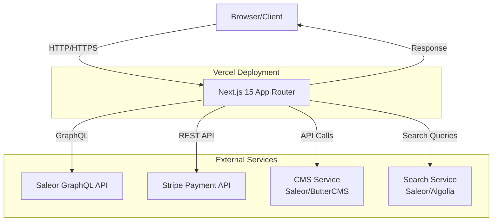
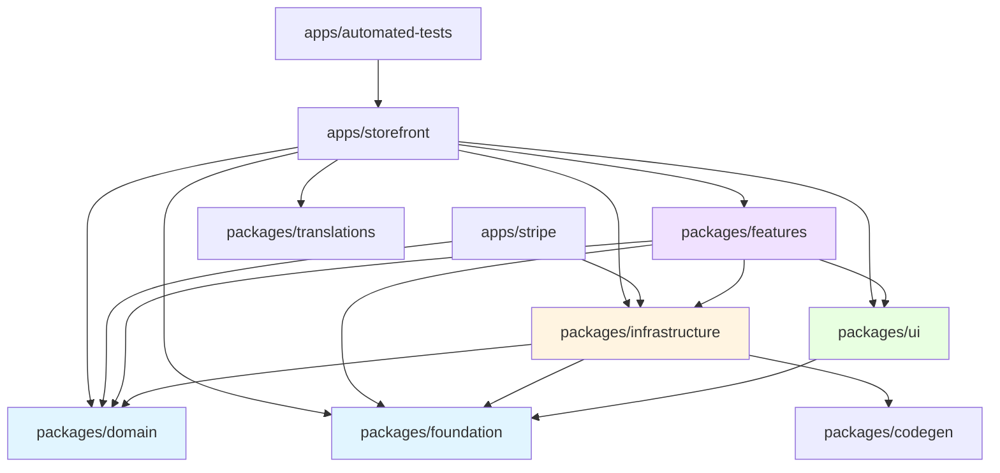
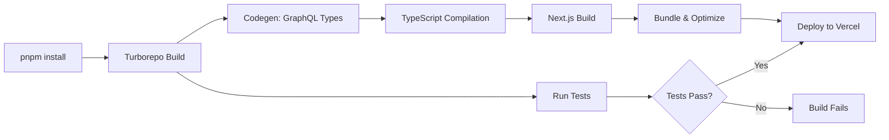
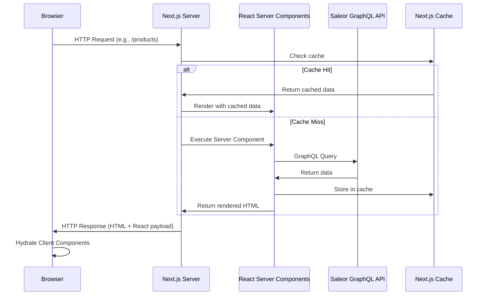
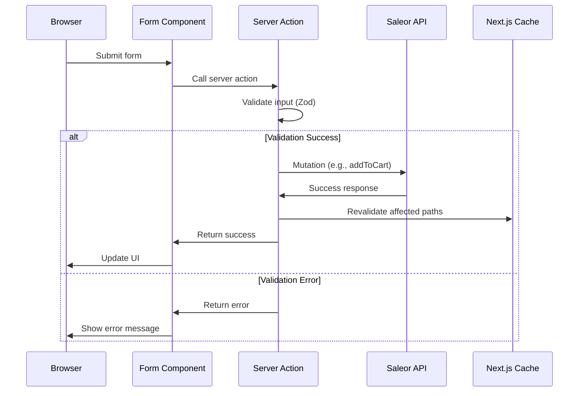
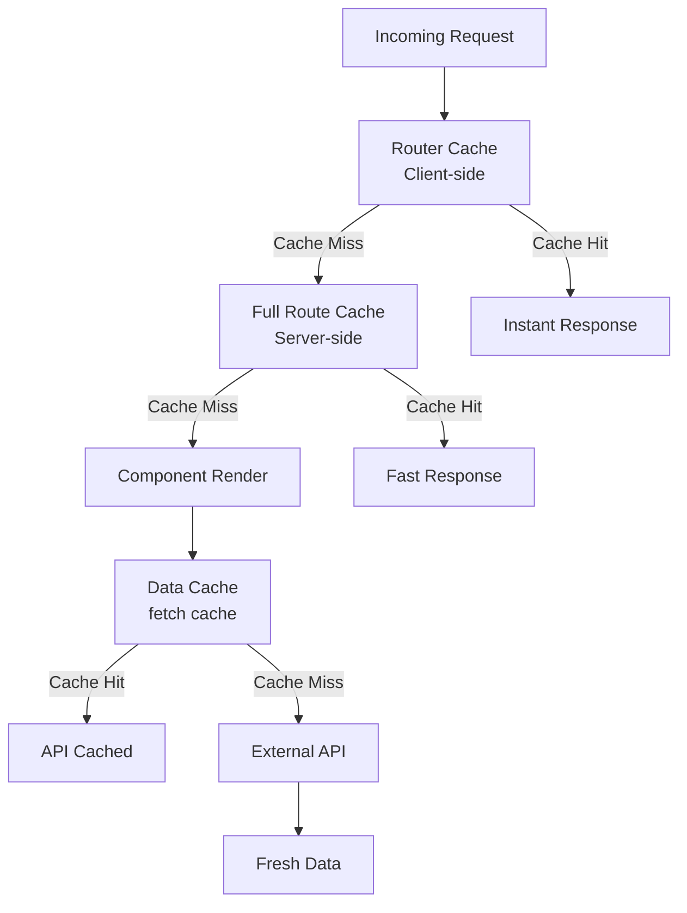
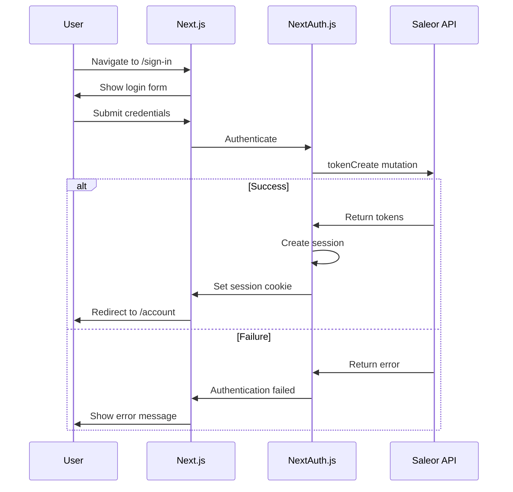
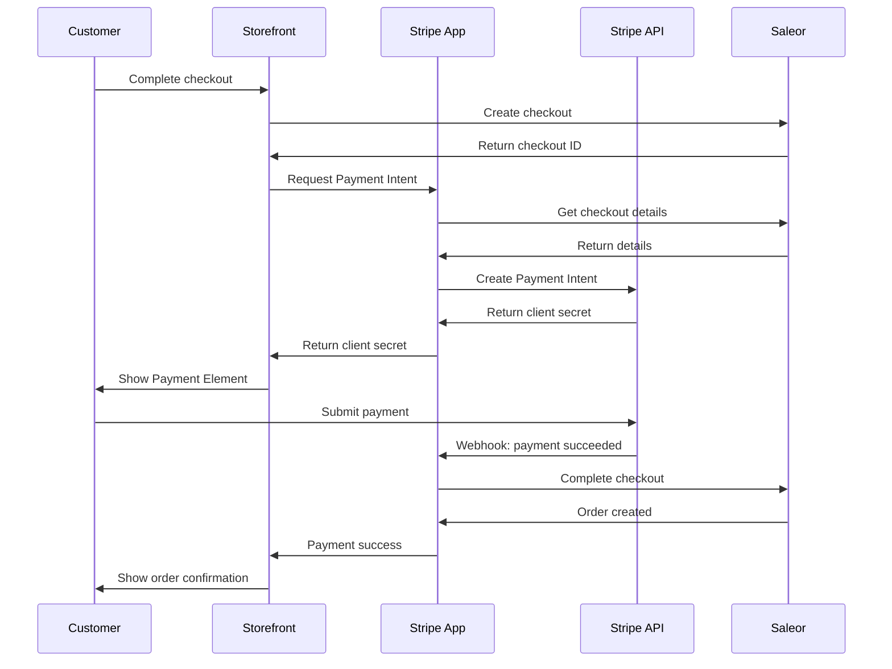
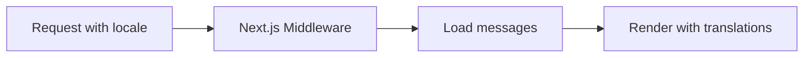

# Nimara E-commerce Architecture

**Last Updated:** January 26, 2026
**Version:** 1.0

---

## Table of Contents

1. [System Overview](#system-overview)
2. [Monorepo Structure](#monorepo-structure)
3. [Data Flow](#data-flow)
4. [Caching Strategy](#caching-strategy)
5. [State Management](#state-management)
6. [Authentication & Authorization](#authentication--authorization)
7. [Payment Processing](#payment-processing)
8. [Internationalization](#internationalization)
9. [Development Workflow](#development-workflow)

---

## System Overview

Nimara is a modern, high-performance e-commerce platform built with a headless architecture. It provides a flexible, scalable solution for multi-region, global brands.

### High-Level Architecture



### Technology Stack

#### Frontend
- **Framework:** Next.js 15 (App Router)
- **React:** Version 19 with Server Components
- **TypeScript:** Strict mode enabled
- **Styling:** Tailwind CSS 3.x
- **UI Components:** Shadcn UI (Radix primitives)
- **Forms:** React Hook Form with Zod validation

#### Backend & APIs
- **Headless Commerce:** Saleor GraphQL API
- **Payments:** Stripe Payment Element
- **Authentication:** NextAuth.js v5 (Auth.js)
- **CMS:** Saleor (default) or ButterCMS
- **Search:** Saleor (default) or Algolia

#### Monorepo & Build Tools
- **Monorepo:** Turborepo with pnpm workspaces
- **Package Manager:** pnpm 9.x
- **TypeScript:** Shared tsconfig for consistency
- **Linting:** ESLint with custom configs
- **Formatting:** Prettier with Tailwind plugin

#### Testing
- **Unit/Integration:** Vitest
- **E2E:** Playwright
- **Testing Library:** React Testing Library

#### Deployment & Monitoring
- **Hosting:** Vercel
- **Error Tracking:** Sentry
- **Logging:** Pino
- **Analytics:** Configurable providers

### Key Integrations

| Service | Purpose | Configuration |
|---------|---------|---------------|
| **Saleor** | Headless commerce backend | `NEXT_PUBLIC_SALEOR_API_URL`, `SALEOR_APP_TOKEN` |
| **Stripe** | Payment processing | `STRIPE_SECRET_KEY`, `NEXT_PUBLIC_STRIPE_PUBLIC_KEY` |
| **NextAuth** | Authentication | `AUTH_SECRET`, `AUTH_URL` |
| **Sentry** | Error monitoring | `SENTRY_DSN`, `SENTRY_AUTH_TOKEN` |
| **Algolia** | Search (optional) | `ALGOLIA_APP_ID`, `ALGOLIA_API_KEY` |
| **ButterCMS** | CMS (optional) | `BUTTER_CMS_API_KEY` |

---

## Monorepo Structure

Nimara uses Turborepo to manage a monorepo with multiple applications and shared packages.

### Directory Structure

```
nimara-ecommerce/
├── apps/                      # Deployable applications
│   ├── storefront/           # Main customer-facing app (Vercel)
│   ├── stripe/               # Stripe integration app (Vercel)
│   ├── automated-tests/      # Playwright E2E tests
│   └── docs/                 # Documentation site (Nextra)
│
├── packages/                  # Shared packages
│   ├── domain/               # Business logic & entities
│   ├── features/             # Feature implementations
│   ├── infrastructure/       # External service integrations
│   ├── foundation/           # Core utilities & helpers
│   ├── ui/                   # Shared UI components
│   ├── translations/         # i18n message catalogs
│   ├── codegen/              # GraphQL code generation
│   ├── config/               # Shared configurations
│   └── tsconfig/             # TypeScript configs
│
└── terraform/                # Infrastructure as Code
```

### Dependency Graph



### Apps vs Packages

**Apps** are deployable applications:
- **storefront:** Main e-commerce site (Next.js)
- **stripe:** Stripe integration app for payment handling
- **automated-tests:** E2E test suite (Playwright)
- **docs:** Documentation site (Nextra)

**Packages** are shared libraries:
- **domain:** Pure business logic, no external dependencies
- **features:** Feature-specific implementations (cart, checkout, products)
- **infrastructure:** External API integrations (Saleor, Stripe, search)
- **foundation:** Core utilities (formatting, validation, hooks)
- **ui:** Reusable UI components (Shadcn-based)
- **translations:** i18n message catalogs
- **codegen:** GraphQL code generation configuration

### Build Pipeline



**Build Commands:**
- `pnpm install` - Install all dependencies
- `pnpm run codegen` - Generate TypeScript types from GraphQL schema
- `pnpm run build` - Build all apps and packages
- `pnpm run test` - Run all tests
- `pnpm run dev` - Start development servers

---

## Data Flow

### Request Lifecycle



### Server Components vs Client Components

**Default: Server Components**
- Run only on the server
- Direct database/API access
- Zero JavaScript sent to client
- Async/await for data fetching
- Access to server-only resources

**When to use Client Components** (marked with `'use client'`):
- Interactivity (onClick, onChange, etc.)
- Browser APIs (localStorage, window, etc.)
- React hooks (useState, useEffect, etc.)
- Event listeners
- Custom hooks

**Composition Pattern:**
```typescript
// ✅ Good: Server Component wraps Client Component
// app/products/page.tsx (Server Component)
export default async function ProductsPage() {
  const products = await getProducts(); // Server-side fetch

  return (
    <div>
      <h1>Products</h1>
      <ProductFilters products={products} /> {/* Client Component */}
    </div>
  );
}

// components/ProductFilters.tsx (Client Component)
'use client';
export function ProductFilters({ products }) {
  const [filtered, setFiltered] = useState(products);
  // Interactive logic here
}
```

### Server Actions Flow

Server Actions handle mutations and form submissions.



**Server Action Pattern:**
```typescript
// app/cart/actions.ts
'use server';

export async function addToCart(productId: string) {
  // 1. Validate session
  const session = await auth();
  if (!session) {
    return { success: false, error: 'Not authenticated' };
  }

  // 2. Call API
  const result = await saleorAPI.addToCart(productId);

  // 3. Revalidate cache
  revalidatePath('/cart');

  // 4. Return result
  return { success: true, data: result };
}
```

### GraphQL Query/Mutation Patterns

**1. Define queries in `.graphql` files:**
```graphql
# packages/infrastructure/src/cart/queries/GetCart.graphql
query GetCart($id: ID!) {
  checkout(id: $id) {
    id
    lines {
      id
      quantity
      variant {
        id
        name
        pricing {
          price {
            gross {
              amount
              currency
            }
          }
        }
      }
    }
  }
}
```

**2. Run codegen to generate types:**
```bash
pnpm run codegen
```

**3. Use generated types:**
```typescript
import { GetCartDocument } from '@nimara/infrastructure/cart/queries.generated';

const { data } = await saleorClient.query({
  query: GetCartDocument,
  variables: { id: cartId },
});
// data is fully typed
```

---

## Caching Strategy

Next.js 15 provides multiple caching layers. Nimara leverages these for optimal performance.

### Caching Layers



### Cache Configuration

**1. Static Generation (SSG):**
```typescript
// app/products/[slug]/page.tsx
export async function generateStaticParams() {
  const products = await getProducts();
  return products.map(product => ({
    slug: product.slug,
  }));
}

// This page is pre-rendered at build time
export default async function ProductPage({ params }) {
  const product = await getProduct(params.slug);
  return <ProductDetail product={product} />;
}
```

**2. Incremental Static Regeneration (ISR):**
```typescript
// Revalidate every hour
export const revalidate = 3600;

export default async function ProductsPage() {
  const products = await getProducts();
  return <ProductList products={products} />;
}
```

**3. Dynamic Rendering:**
```typescript
// app/account/orders/page.tsx
import { cookies } from 'next/headers';

// Force dynamic rendering
export const dynamic = 'force-dynamic';

export default async function OrdersPage() {
  const session = await auth();
  const orders = await getUserOrders(session.userId);
  return <OrdersList orders={orders} />;
}
```

**4. On-Demand Revalidation:**
```typescript
import { revalidatePath, revalidateTag } from 'next/cache';

export async function updateProduct(productId: string) {
  await saleorAPI.updateProduct(productId);

  // Revalidate specific path
  revalidatePath('/products/[slug]', 'page');

  // Or revalidate by tag
  revalidateTag('products');
}
```

### Cache Tags

Tag data fetches for granular cache invalidation:

```typescript
// Fetch with cache tags
const products = await fetch(SALEOR_API_URL, {
  method: 'POST',
  body: JSON.stringify({ query: GetProductsQuery }),
  next: {
    tags: ['products', `product-${id}`],
    revalidate: 3600,
  },
});

// Invalidate specific tags
revalidateTag('products');
revalidateTag(`product-${id}`);
```

---

## State Management

Nimara follows a server-first approach to state management.

### State Types & Solutions

| State Type | Solution | Example |
|------------|----------|---------|
| **Server State** | React Server Components | Product data, user profile |
| **Client State** | useState, useReducer | UI toggles, form inputs |
| **URL State** | searchParams, router | Filters, pagination |
| **Form State** | Server Actions + useFormState | Checkout, login forms |
| **Global Client State** | Context (minimal) | Theme, locale preferences |

### Server State (RSC)

```typescript
// app/products/page.tsx
export default async function ProductsPage() {
  // Data fetched on server, no client state needed
  const products = await getProducts();

  return <ProductList products={products} />;
}
```

### Client State

```typescript
'use client';
import { useState } from 'react';

export function ProductFilters() {
  const [priceRange, setPriceRange] = useState([0, 1000]);

  return (
    <Slider
      value={priceRange}
      onChange={setPriceRange}
    />
  );
}
```

### URL State

```typescript
// app/products/page.tsx
export default async function ProductsPage({
  searchParams,
}: {
  searchParams: { page?: string; sort?: string };
}) {
  const page = Number(searchParams.page) || 1;
  const sort = searchParams.sort || 'name';

  const products = await getProducts({ page, sort });

  return <ProductList products={products} />;
}
```

### Form State (Server Actions)

```typescript
'use client';
import { useFormState, useFormStatus } from 'react-dom';
import { addToCart } from './actions';

export function AddToCartForm({ productId }) {
  const [state, formAction] = useFormState(addToCart, null);

  return (
    <form action={formAction}>
      <input type="hidden" name="productId" value={productId} />
      <SubmitButton />
      {state?.error && <p>{state.error}</p>}
    </form>
  );
}

function SubmitButton() {
  const { pending } = useFormStatus();

  return (
    <button disabled={pending}>
      {pending ? 'Adding...' : 'Add to Cart'}
    </button>
  );
}
```

---

## Authentication & Authorization

### NextAuth.js Setup

Nimara uses NextAuth.js (Auth.js) v5 with Saleor backend.



### Session Management

**Server-side:**
```typescript
import { auth } from '@/auth';

export default async function AccountPage() {
  const session = await auth();

  if (!session) {
    redirect('/sign-in');
  }

  return <AccountDashboard user={session.user} />;
}
```

**Client-side:**
```typescript
'use client';
import { useSession } from 'next-auth/react';

export function UserMenu() {
  const { data: session, status } = useSession();

  if (status === 'loading') return <Skeleton />;
  if (!session) return <SignInButton />;

  return <UserDropdown user={session.user} />;
}
```

### Protected Routes

**Middleware approach:**
```typescript
// middleware.ts
import { auth } from '@/auth';

export default auth((req) => {
  const isLoggedIn = !!req.auth;
  const isOnAccountPage = req.nextUrl.pathname.startsWith('/account');

  if (isOnAccountPage && !isLoggedIn) {
    return Response.redirect(new URL('/sign-in', req.url));
  }
});

export const config = {
  matcher: ['/account/:path*'],
};
```

### API Authentication

**Saleor API token:**
```typescript
const saleorClient = createClient({
  apiUrl: process.env.NEXT_PUBLIC_SALEOR_API_URL,
  headers: {
    Authorization: `Bearer ${process.env.SALEOR_APP_TOKEN}`,
  },
});
```

---

## Payment Processing

### Stripe Integration Architecture



### Payment Element Flow

**1. Initialize Payment Intent:**
```typescript
// Stripe app API route
export async function POST(request: Request) {
  const { checkoutId } = await request.json();

  const paymentIntent = await stripe.paymentIntents.create({
    amount: checkout.totalPrice.amount,
    currency: checkout.currency,
    metadata: { checkoutId },
  });

  return Response.json({
    clientSecret: paymentIntent.client_secret,
  });
}
```

**2. Render Payment Element:**
```typescript
'use client';
import { Elements, PaymentElement } from '@stripe/react-stripe-js';
import { loadStripe } from '@stripe/stripe-js';

const stripePromise = loadStripe(process.env.NEXT_PUBLIC_STRIPE_PUBLIC_KEY);

export function CheckoutForm({ clientSecret }) {
  return (
    <Elements stripe={stripePromise} options={{ clientSecret }}>
      <PaymentElement />
      <button type="submit">Pay</button>
    </Elements>
  );
}
```

### Webhook Handling

**Verify webhook signatures:**
```typescript
// app/api/webhooks/stripe/route.ts
import { headers } from 'next/headers';
import Stripe from 'stripe';

export async function POST(request: Request) {
  const body = await request.text();
  const signature = headers().get('stripe-signature');

  let event: Stripe.Event;

  try {
    event = stripe.webhooks.constructEvent(
      body,
      signature,
      process.env.STRIPE_WEBHOOK_SECRET
    );
  } catch (err) {
    return Response.json({ error: 'Invalid signature' }, { status: 400 });
  }

  switch (event.type) {
    case 'payment_intent.succeeded':
      await handlePaymentSuccess(event.data.object);
      break;
    case 'payment_intent.payment_failed':
      await handlePaymentFailure(event.data.object);
      break;
  }

  return Response.json({ received: true });
}
```

### Error Scenarios

| Error | Handling |
|-------|----------|
| **Payment declined** | Show user-friendly message, allow retry |
| **Network error** | Implement retry logic with exponential backoff |
| **Webhook failure** | Log error, trigger alert, manual reconciliation |
| **Invalid amount** | Validate before payment creation |

---

## Internationalization

### Translation System

Nimara uses `next-intl` for internationalization.



### Multi-Region Support

**Locale configuration:**
```typescript
// i18n/config.ts
export const locales = ['en', 'pl', 'de', 'fr'] as const;
export const defaultLocale = 'en';

export const localeNames = {
  en: 'English',
  pl: 'Polski',
  de: 'Deutsch',
  fr: 'Français',
};
```

**Middleware routing:**
```typescript
// middleware.ts
import createMiddleware from 'next-intl/middleware';

export default createMiddleware({
  locales: ['en', 'pl', 'de', 'fr'],
  defaultLocale: 'en',
  localePrefix: 'as-needed', // No prefix for default locale
});
```

### Message Catalogs

```typescript
// messages/en.json
{
  "common": {
    "addToCart": "Add to Cart",
    "checkout": "Checkout",
    "total": "Total"
  },
  "product": {
    "outOfStock": "Out of Stock",
    "inStock": "In Stock",
    "price": "Price: {price}"
  }
}
```

**Usage:**
```typescript
import { useTranslations } from 'next-intl';

export function ProductCard() {
  const t = useTranslations('product');

  return (
    <button>{t('addToCart')}</button>
  );
}
```

### Currency Handling

```typescript
import { formatPrice } from '@nimara/foundation/formatting';

const price = formatPrice({
  amount: 19.99,
  currency: 'USD',
  locale: 'en-US',
});
// Output: "$19.99"
```

### Date/Time Formatting

```typescript
import { formatDate } from '@nimara/foundation/formatting';

const date = formatDate({
  date: new Date(),
  locale: 'en-US',
  options: { dateStyle: 'long' },
});
// Output: "January 26, 2026"
```

---

## Development Workflow

### Local Development

**1. Setup:**
```bash
# Clone repository
git clone https://github.com/mirumee/nimara-ecommerce.git

# Install dependencies
pnpm install

# Copy environment variables
cp .env.example .env
# Edit .env with your configuration

# Generate GraphQL types
pnpm run codegen

# Start development server
pnpm run dev:storefront
```

**2. Development commands:**
```bash
# Start all apps
pnpm run dev

# Start specific app
pnpm run dev:storefront
pnpm run dev:stripe
pnpm run dev:docs

# Run tests
pnpm run test
pnpm run test:watch
pnpm run test:e2e

# Build
pnpm run build
pnpm run build:storefront

# Lint & format
pnpm run lint
pnpm run format
```

### Git Workflow

Nimara follows a three-branch strategy:

```mermaid
gitGraph
    commit
    branch develop
    checkout develop
    commit
    commit
    branch feature/new-feature
    checkout feature/new-feature
    commit
    commit
    checkout develop
    merge feature/new-feature
    commit
    branch staging
    checkout staging
    merge develop
    commit
    checkout main
    merge staging
    commit tag: "v1.0.0"
```

**Branch Structure:**
- `main` - Production environment (Vercel)
- `staging` - QA environment (Vercel)
- `develop` - Development environment (Vercel)

**Workflow:**
1. Create feature branch from `develop`
2. Develop and test locally
3. Create PR to `develop`
4. After review, merge to `develop` (auto-deploys)
5. When ready for QA, merge `develop` → `staging`
6. After QA approval, merge `staging` → `main`
7. Production deployment triggers automatically

### Deployment

**Vercel Configuration:**
- Each branch is connected to a Vercel environment
- Environment variables configured per environment
- Automatic deployments on push
- Preview deployments for PRs

**Environment Variables:**
- Development: `.env.local`
- Staging: Vercel environment settings
- Production: Vercel environment settings

---

## Best Practices

### Performance
- Use Server Components by default
- Implement proper caching strategies
- Optimize images with Next/Image
- Code-split large components
- Use dynamic imports for heavy libraries

### Security
- Never expose API keys in client code
- Validate all user inputs with Zod
- Use CSRF protection (built into Next.js)
- Implement rate limiting for APIs
- Verify webhook signatures

### Code Quality
- Follow TypeScript strict mode
- Write tests for business logic
- Document complex logic with JSDoc
- Use semantic commit messages
- Keep components focused and small

### Scalability
- Design stateless components
- Use database connection pooling
- Implement proper error boundaries
- Monitor performance metrics
- Plan for horizontal scaling

---

## Additional Resources

- [Next.js Documentation](https://nextjs.org/docs)
- [Saleor GraphQL API](https://docs.saleor.io/docs/3.x)
- [Stripe Documentation](https://stripe.com/docs)
- [Turborepo Handbook](https://turbo.build/repo/docs)
- [React Server Components](https://react.dev/reference/rsc/server-components)

---

**Questions or Issues?** See [TROUBLESHOOTING.md](./TROUBLESHOOTING.md) or contact the development team.
