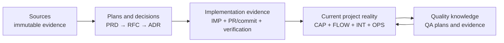

# Content

This directory is an interlinked knowledge base for planning, testing, and building Nimara.
It follows the llm-wiki shape: a directory of Markdown files with YAML frontmatter, standard Markdown cross-links, reserved `index.md` files for progressive disclosure, and reserved `log.md` files for chronological updates.

## Source of truth

- The wiki view is the complete `llm-wiki/` tree at one exact Git commit.
- `main` is the canonical development branch.
- A branch name is a movable alias; provenance always includes the resolved commit SHA.
- A `vX.Y.Z` tag is the immutable release snapshot.
- There are no per-branch directories. Git already versions branch-specific state.

# Folder Structure

Content is grouped by domain:

```text
llm-wiki/
├── AGENTS.md         # this file: bundle schema and operating rules
├── index.md          # root index; exhaustive catalogue of concepts
├── log.md            # root update log
├── _templates/       # reusable document templates
├── sources/          # raw or near-raw source material the notes synthesize
├── references/       # source lists and bibliographies
├── prd/              # product requirement documents - planned, implemented, blocked
|-- product/          # Current product state. Represents what's real, not planned
|   ├── capabilities/
|   ├── flows/
|   ├── integrations/
|   └── overview/
├── market/           # market related to the product discovery and strategy. Hypothetical scenarior
│   ├── personas/
│   ├── research/
│   ├── strategy/
│   │   └── initiatives/
├── quality/          # QA operating knowledge
└── tech/
    ├── ADR/          # architecture decision records
    ├── RFC/          # RFC design proposals and register
    └── saleor/       # version-stamped notes on the Saleor GraphQL schema
```

## Knowledge model - glossary

| Record | Responsibility                                                 |
| ------ | -------------------------------------------------------------- |
| PRD    | Why and what are product requirements                          |
| RFC    | A proposed technical solution and considered alternatives      |
| ADR    | A durable architecture decision                                |
| IMP    | What was implemented and how it was verified                   |
| CAP    | Current product capability                                     |
| INT    | Current integration contract                                   |
| FLOW   | Current end-to-end product flow                                |
| QA     | Verification plan and acceptance evidence                      |
| OPS    | Operational knowledge, runbook, rollback, or incident guidance |

## Workflow



## Concept Document Format

Generic concepts use the [Undefined template](_templates/Undefined.md). Specialized records
use the contracts and templates below.

## Record Schema

Every authored record begins with YAML frontmatter. These common fields are required:

| Field         | Rule                                                                 |
| ------------- | -------------------------------------------------------------------- |
| `type`        | Exact record type from the specialized contract or selected template |
| `title`       | Human-readable record title                                          |
| `description` | One-sentence summary used by indexes and retrieval                   |
| `tags`        | YAML list of short strings without `#`                               |
| `created`     | ISO 8601 creation time                                               |
| `timestamp`   | ISO 8601 time of the last meaningful record change                   |

Additional frontmatter is allowed when its record contract or template defines it. Consumers
must tolerate unknown fields. `timestamp` is the canonical last-change field; legacy
`updated` fields may remain but do not replace it.

Reserved `index.md` and `log.md` files and immutable source documents follow the formats
defined by their own sections; they are not specialized authored records.

Files under `_templates/` are reusable sources, not authored records. Their frontmatter may
use `type: "Template"` and `template_for`. When creating a record, replace template-only
metadata and every placeholder with the authored record's contract values.

All record links use standard relative Markdown links. Identifiers are monotonically
increasing, never reused, and must match the filename prefix.

### PRD — Product Requirements Document

- **Location and template:** `prd/`, created from `_templates/prd.md`.
- **Filename and ID:** `PRD-NNN <Title>.md` and matching `id: "PRD-NNN"`.
- **Type:** `Product Requirements Document`.
- **Required additions:** `id`, `status`, `owner`, `prd_type`, and `personas`.
- **Personas:** a YAML list of relative Markdown links; every link must resolve.
- **Lifecycle:** new records start as `draft`. Supported states are `draft`, `analyzing`,
  `approved`, `implemented`, and `blocked`. A status transition requires explicit user
  approval.
- **Relationships:** register the PRD in `index.md`; link its personas and any downstream RFC
  under `Related Notes`; link each PRD and RFC in both directions.

### RFC — Request for Comments

- **Location and template:** `tech/RFC/`, created from `_templates/RFC.md`.
- **Filename and ID:** `RFC-NNNN <Title>.md` and matching `id: "RFC-NNNN"`.
- **Type:** `Request for Comments`.
- **Required additions:** `id`, `status`, `owner`, and `prd`.
- **PRD relation:** `prd` contains exactly one relative Markdown link to the PRD this proposal
  serves. Repeat that relationship under `Related Notes` and link the PRD back to the RFC.
- **Lifecycle:** new records start as `Draft`, then move through `In Review` to `Final` only
  with explicit user approval. `Final` means the proposal is complete; an ADR records
  acceptance or rejection.
- **Relationships:** register every RFC in `tech/RFC/RFC MOC.md` and `index.md`; link the ADR
  that resolves it when one exists.

### ADR — Architecture Decision Record

- **Location and template:** `tech/ADR/`, created from `_templates/ADR.md`.
- **Filename and ID:** `ADR-NNNN <Title>.md` and matching `id: "ADR-NNNN"`.
- **Type:** `Architecture Decision Record`.
- **Required additions:** `id` and `status`.
- **Lifecycle:** new records start as `Proposed`. Supported states are `Proposed`, `Accepted`,
  `Rejected`, and `Superseded by ADR-NNNN <Title>`. Accepted ADRs are immutable; replace a
  decision by creating a new ADR and superseding the old one.
- **Relationships:** register every ADR in `tech/ADR/ADR MOC.md` and `index.md`. Link the PRD
  and RFC proposals it resolves under `Related Notes`.

## Index and log

`index.md` and `log.md` are llm-wiki reserved filenames.

- `index.md` is content-oriented. It lists every validated record once, grouped by record type,
  with a link, title, and one-line summary.
- `log.md` is chronological and append-only. It records maintenance, ingest, query, lint, and
  release operations using parseable dated headings. Date headings must use `YYYY-MM-DD`.

```markdown
# Directory Update Log

## 2026-07-09

- **Update**: Added a new concept document for ...
- **Lint**: Repaired broken Markdown links in ...
```

# Saleor Schema Notes

Curated notes on the Saleor GraphQL API live in `tech/saleor/`, registered in
[Saleor Schema (MOC)](tech/saleor/Saleor%20Schema%20%28MOC%29.md). They are version-stamped
because Nimara does not pin a Saleor version: it connects only through
`NEXT_PUBLIC_SALEOR_API_URL`, and `pnpm codegen` fetches the schema live from that URL into
`packages/codegen/schema.ts`. That committed file is the de-facto pin.

Rules:

- Type: `Saleor Schema Note`. Create from `_templates/saleor-schema-note.md`. Keep notes
  curated and one-idea-per-note (per domain), not an auto-generated per-type dump.
- Every note carries `saleor_schema_hash` - the short sha256 of `packages/codegen/schema.ts`
  it was written against - plus `saleor_schema_generated`.
- Stamp with `pnpm wiki:saleor:hash`. Verify with `pnpm wiki:saleor:check` before citing a
  Saleor note. `OK` = matches the current schema; `STALE` = the schema was regenerated and the
  note needs review, then restamp.
- A `STALE` result is expected after `pnpm codegen` changes `packages/codegen/schema.ts`.
  The stamp is whole-schema, so any regeneration flags every
  Saleor note - a conservative, intentionally simple freshness gate.

# Maintaining The Wiki

Use the repo-local `llm-wiki` skill for discovery and verified answers. Use
`llm-wiki-bookkeeping` for ingest, audit, graph repair, durable file-back, and architecture
decisions. PRD, RFC, and QA authoring remain owned by their specialized skills.

Expected operations:

- Ingest a new source: update synthesized notes, update `index.md`, and append to `log.md`.
- Lint or audit: check frontmatter, links, orphans, MOC coverage, stale claims, and source
  coverage.
- Answer and file back: answer from existing concepts first, then add durable insights as
  concept documents when they should persist.

Sources under `sources/` should preserve the source body. Prefer appending metadata,
provenance, or citations over rewriting the raw source text unless the user explicitly asks
for a migration or correction.

# QMD Retrieval

`qmd` is the preferred local retrieval layer once configured. The Markdown files remain the
source of truth; the generated QMD SQLite index is local developer state and is never
committed.

Project wrapper commands:

```bash
pnpm wiki:qmd:setup
pnpm wiki:qmd:embed
pnpm wiki:qmd:query "what contradicts the user reviews PDR?"
pnpm wiki:qmd:search "ADR MOC" -- --json -n 10
pnpm wiki:qmd:get "#abc123" -- --full
pnpm wiki:qmd:mcp
```

Operational rules:

- Use [LLM Wiki](sources/LLM%20Wiki.md) for the upstream pattern and this file for Nimara's
  local schema.
- Run `pnpm wiki:qmd:update` after Markdown changes and `pnpm wiki:qmd:embed` when semantic
  search should reflect those changes.
- Use `qmd search` or `qmd query` to get a `docid` or `qmd://...` URI before calling
  `qmd get`.
- Do not treat QMD results as validation. Link integrity, frontmatter, source integrity, MOC
  coverage, and index coverage still require an `llm-wiki-bookkeeping` audit.

# Related Notes

[LLM Wiki](sources/LLM%20Wiki.md)
[ADR MOC](tech/ADR/ADR%20MOC.md)
[Product Strategy 2026 (MOC)](market/strategy/Product%20Strategy%202026%20%28MOC%29.md)
