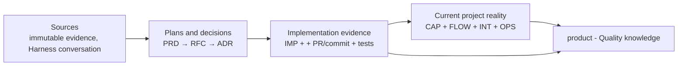

# Content

This directory is an interlinked knowledge base for planning, testing, and building Nimara.
It follows the llm-wiki shape: a directory of Markdown files with YAML frontmatter, standard Markdown cross-links, reserved `index.md` files for progressive disclosure, and reserved `log.md` files for chronological updates.

## Source of truth

- The wiki view is the complete `llm-wiki/` tree at one exact Git commit.
- `main` is the canonical development branch.
- A branch name is a movable alias; provenance always includes the resolved commit SHA.
- A `vX.Y.Z` tag is the immutable release snapshot.
- There are no per-branch directories. Git already versions branch-specific state.

# Folder Structure

Content is grouped by domain:

```text
llm-wiki/
├── AGENTS.md         # this file: bundle schema and operating rules
├── index.md          # root index; exhaustive catalogue of concepts
├── log.md            # root update log
├── sources/          # raw or near-raw source material the notes synthesize

├── operations/       # OPS operational records and register
├── prd/              # product requirement documents - planned, implemented, blocked
├── product/          # current product state at this Git ref
│   ├── Product (MOC).md
│   ├── capabilities/
│   ├── flows/
│   ├── integrations/
│   └── overview/
├── market/           # market related to the product discovery and strategy. Hypothetical scenarior
│   ├── personas/
│   ├── research/
│   ├── strategy/
│   │   └── initiatives/
├── quality/          # QA operating knowledge
│   └── records/      # durable QA records; large evidence remains external
└── tech/
    ├── ADR/              # architecture decision records
    ├── RFC/              # RFC design proposals and register
    ├── implementation/   # IMP implementation evidence and register
    └── saleor/           # version-stamped notes on the Saleor GraphQL schema
```

## Knowledge model - glossary

| Record | Responsibility                                                 |
| ------ | -------------------------------------------------------------- |
| PRD    | Why and what are product requirements                          |
| RFC    | A proposed technical solution and considered alternatives      |
| ADR    | A durable architecture decision                                |
| IMP    | What was implemented and how it was verified                   |
| CAP    | Current product capability                                     |
| INT    | Current integration contract                                   |
| FLOW   | Current end-to-end product flow                                |
| OPS    | Operational knowledge, runbook, rollback, or incident guidance |

## Workflow



## Concept Document Format

Generic concepts use the [Undefined template](_templates/Undefined.md). Specialized records
use the contracts and templates below.

### PRD — Product Requirements Document

- **Location and template:** `prd/`, created from `_templates/PRD.md`.
- **Filename and ID:** `PRD-NNN <Title>.md` and matching `id: "PRD-NNN"`.
- **Type:** `Product Requirements Document`.
- **Required additions:** `id`, `status`, `owner`, `prd_type`, and `personas`.
- **Personas:** a YAML list of relative Markdown links; every link must resolve.
- **Lifecycle:** new records start as `draft`. Supported states are `draft`, `analyzing`,
  `approved`, `implemented`, and `blocked`. A status transition requires explicit user
  approval.
- **Relationships:** register the PRD in `index.md` and link its personas under
  `Related Notes`. Downstream RFCs point to the PRD; do not duplicate that relation as a
  handwritten backlink.

### RFC — Request for Comments

- **Location and template:** `tech/RFC/`, created from `_templates/RFC.md`.
- **Filename and ID:** `RFC-NNNN <Title>.md` and matching `id: "RFC-NNNN"`.
- **Type:** `Request for Comments`.
- **Required additions:** `id`, `status`, `owner`, and `prd`.
- **PRD relation:** `prd` contains exactly one relative Markdown link to the PRD this proposal
  serves. Repeat that relationship under `Related Notes`; do not add a backlink to the PRD.
- **Lifecycle:** new records start as `draft`, then move through `in_review` to `final` only
  with explicit user approval. `final` means the proposal is complete; an ADR records
  acceptance or rejection.
- **Relationships:** register every RFC in `tech/RFC/RFC MOC.md` and `index.md`; link the ADR
  that resolves it when one exists.

### ADR — Architecture Decision Record

- **Location and template:** `tech/ADR/`, created from `_templates/ADR.md`.
- **Filename and ID:** `ADR-NNNN <Title>.md` and matching `id: "ADR-NNNN"`.
- **Type:** `Architecture Decision Record`.
- **Required additions:** `id`, `status`, and `owner`.
- **Lifecycle:** new records start as `proposed`. Supported states are `proposed`, `accepted`,
  `rejected`, and `superseded`. Accepted ADRs are immutable; replace a decision by creating a
  new ADR, setting the old record to `superseded`, and linking the replacing ADR in
  `superseded_by`.
- **Supersession:** `superseded_by` is `null` unless `status` is `superseded`; then it contains
  exactly one relative Markdown link to the replacing ADR.
- **Relationships:** register every ADR in `tech/ADR/ADR MOC.md` and `index.md`. Link the PRD
  and RFC proposals it resolves under `Related Notes`.

### IMP — Implementation Record

- **Location and template:** `tech/implementation/`, created from `_templates/IMP.md`.
- **Filename and ID:** `IMP-NNNN <Title>.md` and matching `id: "IMP-NNNN"`.
- **Type:** `Implementation Record`.
- **Required additions:** `id`, `status`, `owner`, `work_item`, `relations`, `code`,
  `verification`, `rollout`, and `rollback`.
- **Work item:** `work_item.id` is a non-empty Jira or GitHub issue identifier;
  `work_item.url` is its stable URL, or `null` only when the tracker has no stable URL.
- **Relationships:** `prds`, `rfcs`, `adrs`, and `product_records` are YAML lists of relative
  Markdown links. The first three may be empty when the work legitimately required no such
  artifact. `product_records` lists every CAP, FLOW, INT, or OPS record changed by the
  implementation. `rolled_back_by` is `null` unless a later IMP performs a code rollback.
- **Code and verification:** `code.paths` lists affected repository paths and
  `code.pull_requests` lists stable PR URLs. Each verification entry names an acceptance
  criterion from the PRD or work item and the test paths that cover it. An `implemented`
  record must have at least one code path, PR, criterion, and test.
- **Lifecycle:** `planned` → `in_progress` → `implemented`. A later code-revert change may
  transition it from `implemented` to `rolled_back` and must set `rolled_back_by` to the IMP
  for that revert. No other transition from `implemented` is allowed.
- **Immutability and review:** after `implemented`, the record is immutable except for the
  `rolled_back` transition and `rolled_back_by`. Engineering reviews creation and every
  transition.
- **Registration:** register every IMP in `tech/implementation/Implementation (MOC).md` and
  `index.md`; append create, status-transition, and rollback events to `log.md`.

### CAP — Product Capability

- **Location and template:** `product/capabilities/`, created from `_templates/CAP.md`.
- **Filename and ID:** `CAP-NNNN <Title>.md` and matching `id: "CAP-NNNN"`.
- **Type:** `Product Capability`.
- **Required additions:** `id`, `status`, `owner`, `relations`, and `availability`.
- **Relationships:** `relations.integrations` contains relative Markdown links to INT records
  required by the capability. Do not add FLOW backlinks.
- **Availability:** `availability.since` and `availability.deprecated_since` are `null` for a
  candidate. `since` becomes the first release tag or exact 40-character SHA where the
  record became active. `deprecated_since` is `null` while active and records the tag or SHA
  that deprecated it.
- **Lifecycle:** `candidate` → `active` ↔ `deprecated`. `candidate` may exist only on an
  unmerged change branch. Merge it as `active` only with the code that makes the capability
  true. `deprecated` still describes available behavior; delete the record in the same
  change that removes the behavior. Git preserves its history and its ID is never reused.
- **Mutation and review:** update CAP atomically with behavior changes or in a separate
  evidence-backed knowledge repair. Product and Engineering approve creation, mutation, and
  status transitions.
- **Registration:** register every CAP under Capabilities in `product/Product (MOC).md` and
  `index.md`; append create, status-transition, and delete events to `log.md`.

### FLOW — Product Flow

- **Location and template:** `product/flows/`, created from `_templates/FLOW.md`.
- **Filename and ID:** `FLOW-NNNN <Title>.md` and matching `id: "FLOW-NNNN"`.
- **Type:** `Product Flow`.
- **Required additions:** `id`, `status`, `owner`, `relations`, `availability`, and `actors`.
- **Relationships:** `relations.capabilities` and `relations.integrations` contain relative
  Markdown links to every CAP and INT used by the flow.
- **Lifecycle:** `candidate` → `active` ↔ `deprecated`, with the same branch, merge, deletion,
  and ID-retention rules as CAP.
- **Mutation and review:** update FLOW atomically with behavior changes or in a separate
  evidence-backed knowledge repair. Product, Engineering, and QA approve creation, mutation,
  and status transitions.
- **Registration:** register every FLOW under Flows in `product/Product (MOC).md` and
  `index.md`; append create, status-transition, and delete events to `log.md`.

### INT — Integration Contract

- **Location and template:** `product/integrations/`, created from `_templates/INT.md`.
- **Filename and ID:** `INT-NNNN <Title>.md` and matching `id: "INT-NNNN"`.
- **Type:** `Integration Contract`.
- **Required additions:** `id`, `status`, `owner`, and `availability`.
- **Relationships:** INT has no required outbound record relation. CAP and FLOW point to the
  integrations they use; do not add CAP or FLOW backlinks.
- **Lifecycle:** `candidate` → `active` ↔ `deprecated`, with the same branch, merge, deletion,
  and ID-retention rules as CAP.
- **Mutation and review:** update INT atomically with contract changes or in a separate
  evidence-backed knowledge repair. Engineering approves creation, mutation, and status
  transitions.
- **Registration:** register every INT under Integrations in `product/Product (MOC).md` and
  `index.md`; append create, status-transition, and delete events to `log.md`.

### OPS — Operational Record

- **Location and template:** `operations/`, created from `_templates/OPS.md`.
- **Filename and ID:** `OPS-NNNN <Title>.md` and matching `id: "OPS-NNNN"`.
- **Type:** `Operational Record`.
- **Required additions:** `id`, `status`, `owner`, `kind`, and `relations`.
- **Kind:** exactly one of `runbook`, `rollback`, or `incident_response`.
- **Relationships:** `implementations` and `product_records` contain relative Markdown links
  to the IMP and CAP/FLOW/INT records the operational guidance supports. At least one of
  those lists must be non-empty.
- **Lifecycle:** `draft` → `active` ↔ `deprecated`. Merge `active` guidance with or before the
  code that requires it. Delete the record when it no longer applies; Git preserves history
  and the ID is never reused.
- **Mutation and review:** update OPS atomically with operational behavior or in a separate
  evidence-backed knowledge repair. Operations/Platform approves creation, mutation, and
  status transitions.
- **Registration:** register every OPS in `operations/Operations (MOC).md` and `index.md`;
  append create, status-transition, and delete events to `log.md`.

## Index and log

`index.md` and `log.md` are llm-wiki reserved filenames.

- `index.md` is content-oriented. It lists every validated record once, grouped by record type,
  with a link, title, and one-line summary.
- `log.md` is chronological and append-only. It records maintenance, ingest, query, lint, and
  release operations using parseable dated headings. Date headings must use `YYYY-MM-DD`.

```markdown
# Directory Update Log

## 2026-07-09

- **Update**: Added a new concept document for ...
- **Lint**: Repaired broken Markdown links in ...
```

# Saleor Schema Notes

Curated notes on the Saleor GraphQL API live in `tech/saleor/`, registered in
[Saleor Schema (MOC)](tech/saleor/Saleor%20Schema%20%28MOC%29.md). They are version-stamped
because Nimara does not pin a Saleor version: it connects only through
`NEXT_PUBLIC_SALEOR_API_URL`, and `pnpm codegen` fetches the schema live from that URL into
`packages/codegen/schema.ts`. That committed file is the de-facto pin.

Rules:

- Type: `Saleor Schema Note`. Create from `_templates/saleor-schema-note.md`. Keep notes
  curated and one-idea-per-note (per domain), not an auto-generated per-type dump.
- Every note carries `saleor_schema_hash` - the short sha256 of `packages/codegen/schema.ts`
  it was written against - plus `saleor_schema_generated`.
- Stamp with `pnpm wiki:saleor:hash`. Verify with `pnpm wiki:saleor:check` before citing a
  Saleor note. `OK` = matches the current schema; `STALE` = the schema was regenerated and the
  note needs review, then restamp.
- A `STALE` result is expected after `pnpm codegen` changes `packages/codegen/schema.ts`.
  The stamp is whole-schema, so any regeneration flags every
  Saleor note - a conservative, intentionally simple freshness gate.

# Maintaining The Wiki

Use the repo-local `llm-wiki` skill for discovery and verified answers. Use
`llm-wiki-bookkeeping` for ingest, audit, graph repair, durable file-back, and architecture
decisions. PRD and RFC authoring remain owned by their specialized skills.

Expected operations:

- Ingest a new source: update synthesized notes, update `index.md`, and append to `log.md`.
- Lint or audit: check frontmatter, links, orphans, MOC coverage, stale claims, and source
  coverage.
- Answer and file back: answer from existing concepts first, then add durable insights as
  concept documents when they should persist.

Sources under `sources/` should preserve the source body. Prefer appending metadata,
provenance, or citations over rewriting the raw source text unless the user explicitly asks
for a migration or correction.

# QMD Retrieval

`qmd` is the preferred local retrieval layer once configured. The Markdown files remain the
source of truth; the generated QMD SQLite index is local developer state and is never
committed.

Project wrapper commands:

```bash
pnpm wiki:qmd:setup
pnpm wiki:qmd:embed
pnpm wiki:qmd:query "what contradicts the user reviews PRD?"
pnpm wiki:qmd:search "ADR MOC" -- --json -n 10
pnpm wiki:qmd:get "#abc123" -- --full
pnpm wiki:qmd:mcp
```

Operational rules:

- Use [LLM Wiki](sources/LLM%20Wiki.md) for the upstream pattern and this file for Nimara's
  local schema.
- Run `pnpm wiki:qmd:update` after Markdown changes and `pnpm wiki:qmd:embed` when semantic
  search should reflect those changes.
- Use `qmd search` or `qmd query` to get a `docid` or `qmd://...` URI before calling
  `qmd get`.
- Do not treat QMD results as validation. Link integrity, frontmatter, source integrity, MOC
  coverage, and index coverage still require an `llm-wiki-bookkeeping` audit.

# Related Notes

[LLM Wiki](sources/LLM%20Wiki.md)
[ADR MOC](tech/ADR/ADR%20MOC.md)
[Product Strategy 2026 (MOC)](market/strategy/Product%20Strategy%202026%20%28MOC%29.md)
