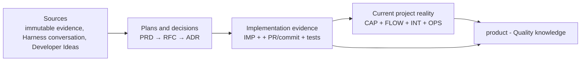

# Content

This directory is an interlinked knowledge base for planning, testing, and building this project.
It follows the llm-wiki shape: a directory of Markdown files with YAML frontmatter, standard Markdown cross-links, reserved `index.md` files for progressive disclosure, and reserved `log.md` files for chronological updates.

## Source of truth

- The wiki view is the complete `llm-wiki/` tree at one exact Git commit.
- `main` is the canonical development branch.
- A branch name is a movable alias. Where a record anchors code at all, it resolves that alias
  to a release tag or an exact 40-character commit SHA.
- Current-state records — CAP, FLOW, INT, OPS — carry no `Provenance` section and no commit
  permalinks. They describe what is true at the commit that contains them, so a permalink inside
  one is a second, separately rotting copy of that answer. Implementation evidence belongs to IMP.
- A `vX.Y.Z` tag is the immutable release snapshot.
- There are no per-branch directories. Git already versions branch-specific state.
- When a note last changed comes from Git — `git log -1 --format=%cs -- <path>`
- A record's identity is its filename.

# Folder Structure

Content is grouped by domain:

```text
llm-wiki/
├── AGENTS.md         # this file: bundle schema and operating rules
├── index.md          # root index; exhaustive catalogue of concepts
├── log.md            # root update log
├── sources/          # raw or near-raw source material the notes synthesize

├── operations/       # OPS operational records and register
├── prd/              # product requirement documents - planned, implemented, blocked
├── product/          # current product state at this Git ref
│   ├── Product (MOC).md
│   ├── capabilities/
│   ├── flows/
│   ├── integrations/
│   └── overview/
├── market/           # market related to the product discovery and strategy. Hypothetical scenarior. It does not reflect the current status of the project.
│   ├── personas/
│   ├── research/
│   ├── strategy/
│   │   └── initiatives/
├── quality/          # QA operating knowledge
│   └── records/      # durable QA records; large evidence remains external
└── tech/
    ├── ADR/              # architecture decision records
    ├── RFC/              # RFC design proposals and register
    ├── implementation/   # IMP implementation evidence and register
    └── saleor/           # version-stamped notes on the Saleor GraphQL schema
```

## Knowledge model

Every record is created from its template, and the template is the contract: its frontmatter
carries every required field, and each field is commented with the rule that governs it —
location and filename, allowed statuses and who approves a transition, link shape, and where the
record is registered. Read the template before creating or changing a record of that type. The
rules are not repeated here, so this file cannot drift from them.

| Record             | Responsibility                                                    | Template                                               |
| ------------------ | ----------------------------------------------------------------- | ------------------------------------------------------ |
| PRD                | Why and what are product requirements                             | [PRD Template](_templates/prd.md)                      |
| RFC                | A proposed technical solution and considered alternatives         | [RFC Design Doc](_templates/RFC.md)                    |
| ADR                | A durable architecture decision                                   | [ADR Template](_templates/ADR.md)                      |
| IMP                | What was implemented and how it was verified                      | [IMP Template](_templates/IMP.md)                      |
| CAP                | Current product capability                                        | [CAP Template](_templates/CAP.md)                      |
| INT                | Current integration contract                                      | [INT Template](_templates/INT.md)                      |
| FLOW               | Current end-to-end product flow                                   | [FLOW Template](_templates/FLOW.md)                    |
| OPS                | Operational knowledge, runbook, rollback, or incident guidance    | [OPS Template](_templates/OPS.md)                      |
| Saleor schema note | One domain of the Saleor GraphQL schema, stamped with its version | [Saleor Schema Note](_templates/saleor-schema-note.md) |
| Anything else      | A generic concept with no record contract                         | [Undefined Template](_templates/Undefined.md)          |

A Saleor schema note additionally obeys the version-stamp rules in
[Saleor Schema Notes](#saleor-schema-notes), because those depend on repository tooling rather
than on the record's own shape.

The field comments are guidance for the author: strip them once the fields are filled in. A
created record carries values, not the rules that produced them.

## Workflow



## Index and log

`index.md` and `log.md` are llm-wiki reserved filenames.

- `index.md` is content-oriented. It lists every validated record once, grouped by record type,
  with a link, title, and one-line summary.
- `log.md` is chronological and append-only. It records maintenance, ingest, query, lint, and
  release operations using parseable dated headings. Date headings must use `YYYY-MM-DD`.

```markdown
# Directory Update Log

## 2026-07-09

- **Update**: Added a new concept document for ...
- **Lint**: Repaired broken Markdown links in ...
```

# Saleor Schema Notes

Curated notes on the Saleor GraphQL API live in `tech/saleor/`, registered in
[Saleor Schema (MOC)](tech/saleor/Saleor%20Schema%20%28MOC%29.md). They are version-stamped
because Nimara does not pin a Saleor version: it connects only through
`NEXT_PUBLIC_SALEOR_API_URL`, and `pnpm codegen` fetches the schema live from that URL into
`packages/codegen/schema.ts`. That committed file is the de-facto pin.

Rules:

- Type: `Saleor Schema Note`. Create from `_templates/saleor-schema-note.md`. Keep notes
  curated and one-idea-per-note (per domain), not an auto-generated per-type dump.
- Every note carries `saleor_schema_hash` - the short sha256 of `packages/codegen/schema.ts`
  it was written against - plus `saleor_schema_generated`.
- Stamp with `pnpm wiki:saleor:hash`. Verify with `pnpm wiki:saleor:check` before citing a
  Saleor note. `OK` = matches the current schema; `STALE` = the schema was regenerated and the
  note needs review, then restamp.
- A `STALE` result is expected after `pnpm codegen` changes `packages/codegen/schema.ts`.
  The stamp is whole-schema, so any regeneration flags every
  Saleor note - a conservative, intentionally simple freshness gate.

# Skills

Skills live inside this directory, under `.claude/skills/`.


| Skill                                        | Use it for                                                                                                                                                                           | Writes to                        |
| -------------------------------------------- | ------------------------------------------------------------------------------------------------------------------------------------------------------------------------------------ | -------------------------------- |
| [`explore`](.claude/skills/explore/SKILL.md) | Every way into this directory — the index, the MOCs, `qmd` semantic search, plain grep — and how to answer from what you find. Read that skill instead of reinventing a search here. | nothing — read only              |
| `bookkeeping`                                | Ingesting a source, filing durable knowledge, auditing or repairing the graph, reconciling the index and log after a change, recording an ADR.                                       | any record, `index.md`, `log.md` |
| `prd-modeling`                               | Creating, rewriting, or stress-testing a PRD. Stops at an approved PRD: it does not design the solution or decompose the work.                                                       | `prd/`                           |
| `rfc-modeling`                               | Turning an approved PRD into an RFC design proposal. Stops at a proposal: an ADR records the verdict.                                                                                | `tech/RFC/`                      |
| `grilling`                                   | Stress-testing a plan or design one question at a time. `prd-modeling` runs it as its business-grilling stage.                                                                       | nothing — asks questions         |
| `handoff`                                    | Compacting a conversation into a document another agent can pick up. `prd-modeling` runs it to close a session.                                                                      | wherever it is told to write     |

# Maintaining The Wiki

Expected operations:

- Ingest a new source: update synthesized notes, run `pnpm wiki:index:sync`, and append to
  `log.md`.
- Lint or audit: run `pnpm wiki:lint`, then check what it cannot — stale claims, source
  coverage, and contradictions between records.
- Answer and file back: answer from existing concepts first, then add durable insights as
  concept documents when they should persist.

Finish every change to this directory with `pnpm wiki:lint`, and leave it at zero violations.

- `pnpm wiki:lint` checks frontmatter against [`_schema.json`](_schema.json), link and anchor
  integrity, orphans, and register coverage. Every violation is an error. For machine-readable
  output use `pnpm --silent wiki:lint -- --json`; without `--silent`, pnpm's banner breaks the
  JSON. It is deliberately not wired into CI, so nothing else will run it.
- `pnpm wiki:index:sync` adds and removes rows in `index.md` and the MOC registers. It keeps
  existing rows verbatim and appends new ones at the end of their section — several sections
  are ordered by hand, so move an inserted row if the section has a reading order, and shorten
  the hook it copied from the note's `description`.
- `_schema.json` is the machine-readable half of the record contracts in `_templates/`. When a
  contract changes, change both. Silencing a rule means adding an `except` entry with a
  reason.

Sources under `sources/` should preserve the source body. Prefer appending metadata,
provenance, or citations over rewriting the raw source text unless the user explicitly asks
for a migration or correction.

# Related Notes

[LLM Wiki](sources/LLM%20Wiki.md)
[ADR MOC](tech/ADR/ADR%20MOC.md)
[Product Strategy 2026 (MOC)](market/strategy/Product%20Strategy%202026%20%28MOC%29.md)
