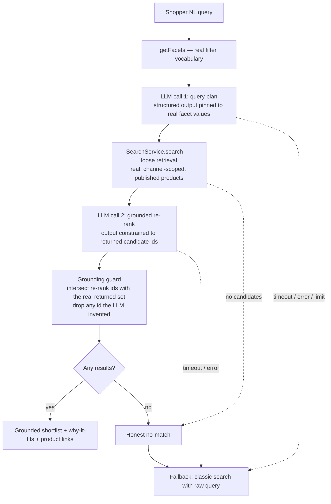

# Natural-Language Product Discovery

Serves [PRD-001 Natural-Language Product Discovery](../../../prd/PRD-001%20Natural-Language%20Product%20Discovery.md). Requirement IDs below (`S-*`, `AC-*`, `NFR-*`, `M-*`, `G-*`) reference that PRD.

## Problem

Nimara's shipped search is **lexical**: the Saleor-native provider uses Postgres full-text search, the Algolia provider is keyword/lexical. Both match tokens, not intent. A shopper who describes a _need_ in natural language — "waterproof coat to keep a toddler warm on winter walks, under $50" — is served poorly, because the words they use rarely match the catalog's terminology and the provider cannot rank by fit.

Closing this gap is a market-parity requirement for developers and agencies evaluating Nimara for intent-heavy catalogs (PRD-001). The forces that constrain any solution:

- There is **no LLM, embedding, or vector code anywhere in the repository** today — this is a greenfield capability.
- Nimara is an **open-source product**, not a specific deployment. A solution cannot mandate a paid vendor or a proprietary index; strategy explicitly forbids building a search index/storage engine ([Do Not Pursue](../../../market/strategy/Do%20Not%20Pursue.md)), and AI-assisted shopper recommendations are positioned as a table stake, with UCP/MCP as the separate differentiator ([Table Stakes vs Differentiators](../../../market/research/Table%20Stakes%20vs%20Differentiators.md)).
- A shopper must **never** see a product that does not exist or fails current eligibility (PRD NFR-1) — an honest no-match is preferable to an invalid suggestion.
- The capability is **off by default**. When disabled, it must not change storefront behavior or performance. When enabled, a slow or failing provider must never block page render or classic search. (PRD NFR-2)

## Requirements

### Functional requirements

- **FR-1** — Accept single-turn natural-language input and return a configurable short list of **real** products, each with a concise catalog-grounded "why it fits" explanation and a link to its standard product page. (S-3, AC-4)
- **FR-2** — Return an honest no-match, and fall through to classic search on no-match, timeout, provider failure, or a reached limit, carrying the original request. (S-5, AC-6)
- **FR-3** — Keep the LLM provider swappable behind a stable boundary, with one core-maintained reference adapter. (S-6, AC-3)
- **FR-4** — Expose extension points — placement, shortlist size, eligibility, ranking policy — without forking the core module; no commercial ranking boost by default. (S-7, AC-3)
- **FR-5** — Emit structured telemetry (outcome, returned product ids, fallback reason, latency, provider usage/cost); raw query text off by default. (S-8, AC-8)

### Non-functional requirements

- **NFR-1** — Disabled: zero behavior/performance change. Enabled: non-blocking; never blocks page render or classic search. (PRD NFR-2, AC-10)
- **NFR-2** — Accessible: keyboard operation, assistive-technology status, understandable loading/error/fallback states, AI-assisted labeling. (PRD NFR-3, PRD NFR-5, AC-7)
- **NFR-3** — Anonymous-first; abuse and cost bounded by configurable limits, not mandatory authentication. (PRD NFR-4, AC-9)
- **NFR-4** — No universal latency/cost target; each adopter observes and sets its own limits with a safe fallback. (PRD NFR-7, G-055)
- **NFR-5** — Raw natural-language queries are not persisted by default; an adopter that enables raw-query analytics owns its consent, redaction, retention, and provider-data-transfer policy. (PRD NFR-6, G-065)
- **NFR-6** — Product existence and eligibility are **inherited from the configured search provider**, not re-validated by the discovery layer: discovery is exactly as fresh and correct as classic search — no stronger, no weaker. (PRD NFR-1, AC-5, S-4)

### Assumptions

- **The global usage/cost ceiling is enforced by the LLM provider, not by Nimara.** The design relies on limits configured in the provider account — e.g. Bedrock service quotas (RPM/TPM) and AWS Budgets, plus the demo's isolated account budget (S-2, R-7) — as the global cap. Nimara implements no global cost limiter; it treats the provider's throttle/limit response as `limit-reached` → classic-search fallback + an observable event (AC-9). (NFR-3, R-4, G-043)

## Proposed solution

A new **discovery layer** that _composes_ the existing `SearchService` and adds a _separate, swappable_ LLM-provider boundary. The LLM is a **query-understanding and re-ranking layer, not a retrieval engine** — retrieval is always the real, configured search provider, so the design cannot surface an invented product.

The design is a **hybrid query-plan + grounded re-rank** pipeline (alternatives in [Alternative solutions](#alternative-solutions)). Two constrained LLM calls bracket a real provider search:

Design invariant across the whole pipeline: **the LLM can only surface products the real search returned — it can never introduce one of its own.** Call 1 emits only query parameters, no products. Call 2 may only reorder the returned candidates: its output is constrained to their ids, then intersected with that real set.

Two properties keep query strategy viable on a lexical backend:

- **Facet vocabulary, not the catalog, is the LLM's context.** `getFacets` returns a bounded set of filter dimensions and allowed values; those values are injected into Call 1's output schema as enums, so the LLM maps intent onto _real_ filters and cannot invent a filter value. For large catalogs the injected vocabulary must be bounded to high-signal facets.
- **Tight core query + exact filters + loose retrieval + re-rank.** Call 1 emits a narrow head query and pushes qualifiers into exact filters, rather than a long keyword bag that a lexical `AND` engine would over-constrain to zero results. Retrieval stays loose (high recall); precision is recovered in the Call 2 re-rank, which only ever sees real candidates.

### Component changes

Scope: the change lands entirely in the nimara-ecommerce monorepo — a new discovery capability in the shared packages, consumed and configured by `apps/storefront`.

- **`apps/storefront`** — the search surface gains a discovery entry point backed by a new **discovery service**. The service composes the reused `SearchService` (facets + retrieval) with a swappable **`LLMProvider`** — a boundary separate from the search provider — runs the `plan → retrieve → re-rank → grounding-guard` pipeline, and returns a `Result`. A **discovery UI** renders the input, results, and states.

### API changes

**No public or external API** — the feature is an internal, server-side service call (Server Action / RSC), with no new endpoint and no Saleor-schema change.

### Database changes

**None** — the feature is stateless and uses no database (no table, index, or vector store).

### Reference model and cost

The reference adapter (resolving PRD open question on adapter choice) is **AWS Bedrock**, with a default model of **Llama 4 Scout 17B**, selected on cost and operability while remaining fully swappable.

**Why Bedrock as the reference:**

- **Model swap without code changes.** Bedrock's Converse API exposes a uniform tool-use / structured-output interface across Nova, Llama, Mistral, and Claude, so changing the reference model is a configuration change, not a code change — a good fit for a reference adapter others copy.
- **Fits AWS-native adopters.** Adopters already on AWS reuse existing account, region, and IAM, with no separate vendor key to provision.
- **Cheapest _reliable_ tool-use option on Bedrock** for this workload (below), with capability appropriate to the task (query parsing + re-rank are not hard reasoning).

**Cost model (reference workload).** The design makes **two** LLM calls per shopper query. Modeled token profile per request: Call 1 ≈ 2,000 input / 150 output; Call 2 ≈ 3,500 input / 400 output → **≈ 5,500 input + 550 output tokens/request** (5.5M input + 0.55M output per 1,000 requests). Cost/1k = `5.5 × input$/M + 0.55 × output$/M`.

| Model (host)                           | Input $/M | Output $/M | **Cost / 1,000 requests** | Note                                                           |
| :------------------------------------- | --------: | ---------: | ------------------------: | :------------------------------------------------------------- |
| **Llama 4 Scout 17B (Bedrock)**        |      0.17 |       0.66 |                 **$1.30** | **Reference** — cheapest reliable Converse tool-use on Bedrock |
| Gemini 2.5 Flash-Lite (Google)         |      0.10 |       0.40 |      $0.77 ($0.50 cached) | Cheapest capable overall; alt tier                             |
| GPT-OSS-120B (Groq / Bedrock)          |     ~0.15 |      ~0.60 |               ~$1.16–1.19 | Open-weight; no-lock-in alt                                    |
| gpt-5.4-nano (OpenAI)                  |      0.20 |       1.25 |      $1.79 ($1.25 cached) | Guaranteed strict schema; max-assurance alt                    |
| Nova 2 Lite (Bedrock)                  |      0.30 |       2.50 |                     $3.03 | Output-heavy pricing ill-suits this input-heavy workload       |
| Claude Haiku 4.5 (Bedrock / Anthropic) |      1.00 |       5.00 |      $8.25 ($5.55 cached) | Most capable, most expensive                                   |

> Prices captured July 2026 from primary provider pricing pages; **re-verify at implementation time** — LLM prices and model line-ups change frequently. Prompt caching (large reusable system + facet prefix) materially lowers cost where a provider publishes cache rates. Cost is a **reference figure only**; each adopter sets and observes its own limits (NFR-4).

Pricing pages: [AWS Bedrock](https://aws.amazon.com/bedrock/pricing/) · [Google Gemini](https://ai.google.dev/gemini-api/docs/pricing) · [OpenAI](https://platform.openai.com/docs/pricing) · [Anthropic](https://www.anthropic.com/pricing) · [Groq](https://groq.com/pricing).

The reference model stays a documented default, not a mandate. Named swap targets: **Gemini 2.5 Flash-Lite** (lowest cost), **gpt-5.4-nano** (strongest structured-output guarantee), **GPT-OSS-120B on a managed host** (open-weight, no lock-in). Any of these sits behind the same `LLMProvider` boundary.

## Cross-cutting considerations

### Security

- **All text entering the LLM is data, not instructions.** Both the shopper query and — in the Call 2 re-rank — product names/descriptions are treated as untrusted input; prompts are structured so catalog or query content cannot take over instructions. Prompt injection via product content is the principal new trust-boundary risk introduced by the re-rank pass, and is contained by treating catalog text as data plus constraining Call 2's output to returned ids and post-intersecting with the real result set.
- **LLM provider credentials / IAM are server-side secrets** (server env / cloud role), never exposed to the client — consistent with existing provider handling.
- **Input bounds** on query length, plus provider safeguards; **no custom moderation system** is built (G-063) — out-of-bounds or unsafe input returns to classic search or no-match.
- **No per-customer (per-IP) throttling.** A single client can exhaust the provider's entire configured limit — a "denial-of-wallet within the cap" — degrading discovery to fallback for everyone until the cap trips. Per-customer rate limiting, if an adopter wants it, is an edge/WAF concern; a first-party limiter is out of scope (it needs a shared counter store — a new dependency plus state). The global provider limit (see [Assumptions](#assumptions)) bounds the blast radius. (NFR-3, R-7)
- **Unacceptable failure modes (hard):** showing a non-existent or ineligible product (grounding invariant); leaking a provider secret to the client; sending data to the provider without documented data transfer (G-065).

### Monitoring and alerting

Every path is observable through emitted structured events: outcome, returned product ids, fallback reason, latency, and provider usage/cost. A recommended minimum signal set — fallback rate, provider-error rate, p95 latency, cost per query — is documented, but **alert rules and thresholds are adopter-owned**; Nimara sets no universal thresholds (NFR-4). Nimara stores nothing; the adopter attaches its own sink (e.g. Sentry / analytics).

### Failure cases and remediation

Every failure path degrades safely to classic search or an honest no-match — never an error page, never a dead end (PRD NFR-2) — and is observable.

| Failure mode                         | Remediation                                                                                                            |
| :----------------------------------- | :--------------------------------------------------------------------------------------------------------------------- |
| LLM timeout / slow                   | Fallback → classic search with the raw query (AC-6)                                                                    |
| LLM provider error / outage          | Fallback → classic search                                                                                              |
| No credible match                    | Honest no-match + classic search (AC-6)                                                                                |
| Usage / cost limit reached           | Do not call the provider; fallback; emit `limit-reached` event (AC-9)                                                  |
| Re-rank returns invented / empty ids | Grounding guard (intersection with the real returned set) drops them; if empty → no-match / fallback (AC-5, PRD NFR-1) |

### Alternative solutions

_Deferred to separate RFCs._ The solution space is too large to carry in one document; each alternative that warrants a decision gets its own RFC, cross-linked here.

- **[RFC-0002 Provider-Native Natural-Language Product Discovery](RFC-0002%20Provider-Native%20Natural-Language%20Product%20Discovery.md)** — competing approach serving the same PRD: discovery as an optional capability of the search provider (Algolia Agent Studio holds the prompt, model, and limits) instead of a pipeline built in Nimara. The two are mutually exclusive; RFC-0002 carries the side-by-side comparison.

### Dependencies

- **`@aws-sdk/client-bedrock-runtime`** — client for the Bedrock reference adapter (Converse API). New to the storefront; the AWS SDK is already used in `apps/marketplace`. Alternative: a dependency-free thin adapter over the provider's REST API.
- **An AWS Bedrock account** — the reference host (account, region, IAM). Swappable for another provider.

### System impacts

**None beyond the change described above** — search providers stay unchanged, no other app is affected, UCP/MCP is untouched (G-014), and there is no codegen change.

### Documentation changes

Developer-facing only (G-050): setup and one-business-day activation (M-3); **provider data-transfer disclosure** (what catalog/query data reaches the provider — G-065); configuration (placement, shortlist size, eligibility, ranking policy); privacy (raw-query off by default and what enabling analytics entails); cost controls and limits; an evaluation guide; and extension points. No operator/merchant documentation until a corresponding workflow exists.

### QA validation

- **No invented products** — verifies every displayed product came from the search results, so the LLM cannot add one of its own. This is the one hard quality bar (M-4, AC-5, PRD NFR-1).
- **Fallback paths** — no-match, timeout, provider-error, limit-reached all degrade to classic search (AC-6, AC-9).
- **Disabled = no change** — storefront behavior and performance unchanged when no provider is configured (AC-10).
- **Accessibility** — keyboard, AT status, AI-assisted labeling (AC-7, NFR-2).
- **Relevance quality** — Nimara sets no universal relevance threshold; each adopter sets and measures its own (G-017).

### DevOps / infrastructure

- **Infrastructure (AWS, via Terraform/console — not the SDK):** an IAM policy granting the storefront invoke access to the chosen Bedrock model, and credentials for it (role or access keys); plus the global cap — Bedrock service quotas and an AWS Budget (see [Assumptions](#assumptions)).
- **Configuration (envs, Zod-validated server-side):** the discovery feature flag, the LLM-provider selector, model id, and region — off / absent by default. Secrets per environment in the hosting platform.

## Related Notes

[RFC-0001 Natural-Language Product Discovery - Grilling Log](RFC-0001%20Natural-Language%20Product%20Discovery%20-%20Grilling%20Log.md)
[RFC-0002 Provider-Native Natural-Language Product Discovery](RFC-0002%20Provider-Native%20Natural-Language%20Product%20Discovery.md)
[PRD-001 Natural-Language Product Discovery](../../../prd/PRD-001%20Natural-Language%20Product%20Discovery.md)[Do Not Pursue](../../../market/strategy/Do%20Not%20Pursue.md)
[Table Stakes vs Differentiators](../../../market/research/Table%20Stakes%20vs%20Differentiators.md)
[RFC MOC](../RFC%20MOC.md)
[ADR MOC](../../ADR/ADR%20MOC.md)
