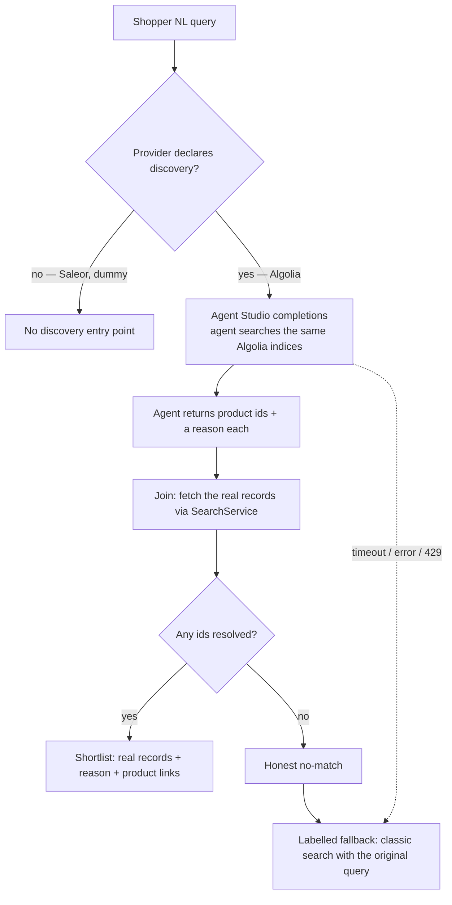

# Provider-Native Natural-Language Product Discovery

Serves [PRD-001 Natural-Language Product Discovery](../../../prd/PRD-001%20Natural-Language%20Product%20Discovery.md). Requirement IDs below (`S-*`, `AC-*`, `NFR-*`, `M-*`, `G-*`) reference that PRD.

Competing approach to [RFC-0001 Natural-Language Product Discovery](RFC-0001%20Natural-Language%20Product%20Discovery.md), which serves the same PRD by building the discovery pipeline inside Nimara. The two are compared in [Alternative solutions](#alternative-solutions).

## Problem

Nimara's shipped search is **lexical**: the Saleor-native provider uses Postgres full-text search, the Algolia provider is keyword/lexical. Both match tokens, not intent. A shopper who describes a _need_ in natural language — "waterproof coat to keep a toddler warm on winter walks, under $50" — is served poorly, because the words they use rarely match the catalog's terminology and the provider cannot rank by fit. Closing this gap is a market-parity requirement for developers and agencies evaluating Nimara (PRD-001).

The forces below shape this proposal specifically:

- **Search vendors now ship agentic discovery themselves.** Algolia Agent Studio is generally available and runs an LLM over the customer's own Algolia indices.
- **Discovery of this kind cannot be separated from the search backend.** An Algolia agent searches Algolia indices. Such a capability is not swappable independently of the provider that holds the catalog.
- A shopper must **never** see a product that does not exist or fails current eligibility (PRD NFR-1) — an honest no-match is preferable to an invalid suggestion.
- The capability is **off by default**. When disabled, it must not change storefront behavior or performance. When enabled, a slow or failing provider must never block page render or classic search. (PRD NFR-2)

## Requirements

### Functional requirements

- **FR-1** — Accept single-turn natural-language input and return a configurable short list of **real** products, each with a concise "why it fits" line and a link to its standard product page. (S-3, AC-4)
- **FR-2** — Return an honest no-match, and fall through to classic search on no-match, timeout, provider failure, or a reached limit, carrying the original request. (S-5, AC-6)
- **FR-3** — Keep the LLM swappable. (S-6, AC-3)
- **FR-4** — Expose extension points — shortlist size, eligibility, ranking policy — without forking the core module. (S-7, AC-3)
- **FR-5** — Emit structured telemetry (outcome, returned product ids, fallback reason, latency, provider usage/cost); raw query text off by default. (S-8, AC-8)

### Non-functional requirements

- **NFR-1** — Disabled: zero behavior/performance change. Enabled: non-blocking; never blocks page render or classic search. (PRD NFR-2, AC-10)
- **NFR-2** — Accessible: keyboard operation, assistive-technology status, understandable loading/error/fallback states, AI-assisted labeling. (PRD NFR-3, PRD NFR-5, AC-7)
- **NFR-3** — Anonymous-first; abuse and cost bounded by configurable limits, not mandatory authentication. (PRD NFR-4, AC-9)
- **NFR-4** — No universal latency/cost target; each adopter observes and sets its own limits with a safe fallback. (PRD NFR-7, G-055)
- **NFR-5** — Raw natural-language queries are not persisted by default; an adopter that enables raw-query analytics owns its consent, redaction, retention, and provider-data-transfer policy. (PRD NFR-6, G-065)
- **NFR-6** — Product existence and eligibility are **inherited from the configured search provider**, not re-validated by the discovery layer: discovery is exactly as fresh and correct as classic search — no stronger, no weaker. (PRD NFR-1, AC-5, S-4)

Two of these are not fully met by this approach — see [For the ADR](#for-the-adr).

### Assumptions

- **The provider owns the LLM call and its configuration.** The agent's prompt, model, LLM API key, token and step caps, rate limits, and approved domains all live in the adopter's Algolia dashboard, not in Nimara. The global cost ceiling is whatever the adopter sets there and at their own LLM provider.
- **The agent reads the same indices the storefront searches**, so discovery and classic search see identical data and identical freshness.

## Proposed solution

Discovery becomes an **optional capability of the search provider**. `SearchService` gains a discovery operation that a provider may declare or omit: the Algolia provider implements it by calling Agent Studio; the Saleor and dummy providers omit it, and where the capability is absent the storefront renders no discovery entry point — the same path as an unconfigured feature (AC-10).

Nimara does not run the LLM. The agent does the natural-language work against the adopter's own indices and returns **product ids with a reason each**; the storefront joins those ids back to real records and renders them.

Two properties carry the design:

- **Grounding is the join.** The agent returns ids, never product payloads. The storefront must fetch the records anyway in order to render them, so an id that does not resolve simply drops out. Prices, links, and availability always come from the catalog; the model only writes the reason. This gives the 100% bar (M-4) without a separate mechanism.
- **Nimara defines the interface, not the configuration.** How a provider is configured is the provider's business — a dashboard here, an app or config file elsewhere. Two consequences follow: a store owner or marketer can tune the prompt without a deploy, and Nimara ships no operator UI to make that possible (G-040 allows exactly this — deployment policies without an operator UI).

### Component changes

Scope: the change lands entirely in the nimara-ecommerce monorepo — an optional discovery operation on `SearchService`, implemented by the Algolia provider and consumed by `apps/storefront`.

- **`apps/storefront`** — the search surface gains a discovery entry point backed by a new **optional discovery operation on `SearchService`**. The **Algolia provider** implements it: one REST call to Agent Studio, then a join of the returned ids back to real records. The reference **agent prompt** ships as a versioned file in the repo.

### API changes

**No public or external API** — the feature is an internal, server-side service call, with no new endpoint and no Saleor-schema change. Outbound, the Algolia provider calls Agent Studio's completions endpoint (`POST https://{appId}.algolia.net/agent-studio/1/agents/{agentId}/completions`), for which a search-only key is sufficient.

### Database changes

**None** — the feature is stateless and uses no database.

## Cross-cutting considerations

### Security

- **The reference prompt is the injection defense — and it leaves our control after setup.** The agent reads product content, so catalog text can attempt to take over the agent's instructions. Nimara's only lever is the prompt it ships; the adopter can edit it in the dashboard and assumes that risk. This is weaker than holding the defense in code, and the documentation must say so.
- **Credentials.** The search-only key stays server-side, as today. The adopter's **LLM API key is stored in Algolia** — a third party holds their provider credential.
- **Data transfer.** The shopper's query and catalog content travel two hops: storefront → Algolia → the LLM provider, in whatever region that provider runs. This must be documented, not hidden (G-065).
- **Retention.** Algolia stores agent conversations, and no setting to disable this was found in the dashboard. Raw shopper queries are therefore persisted by a third party by default — a property of the provider, not a design choice, and the reason NFR-5 is not met.
- **Rate limiting server-side.** Agent Studio offers an agent-wide rate limit, a per-IP rate limit, and approved-domain checks. Called from the server, only the **agent-wide limit** applies: Algolia sees the storefront's IP, and there is no `Origin` header. Whether a shopper IP can be forwarded is unverified.
- **Unacceptable failure modes:** rendering a product whose id did not resolve to a record; leaking a credential to the client; sending data to Algolia or an LLM provider without documenting the transfer.

### Monitoring and alerting

The storefront emits structured events for outcome, returned product ids, fallback reason, and latency. **Usage and cost are not in Nimara's telemetry**: the LLM call is made by Algolia with the adopter's key, so token counts and spend are visible only in the adopter's Algolia and LLM-provider accounts — FR-5 is met only in part. Alert thresholds are adopter-owned; Nimara sets none (NFR-4).

### Failure cases and remediation

Every failure ends in classic search or an honest no-match — never an error page, never a dead end (PRD NFR-2).

| Failure mode | Remediation |
| :-- | :-- |
| Agent Studio slow or times out | Labelled fallback → classic search with the original query (AC-6) |
| Agent Studio error or outage | Labelled fallback → classic search |
| Agent rate limit reached (HTTP 429) | Fallback; emit a `limit-reached` event (AC-9) |
| The adopter's LLM key fails or hits its own quota | The agent errors; fallback. Not visible to Nimara beyond the error |
| No credible match | Honest no-match, then classic search with the original query, clearly labelled — not a silent backfill (AC-6, G-020) |
| A returned id does not resolve in the join | It drops out; if none remain, no-match |

### Alternative solutions

- **[RFC-0001 Natural-Language Product Discovery](RFC-0001%20Natural-Language%20Product%20Discovery.md)** — Nimara builds the pipeline itself: an LLM provider boundary separate from search, a query-plan call, a re-rank call, and a grounding guard in code, with AWS Bedrock as the reference adapter. The two proposals answer the same PRD and are mutually exclusive in their first decision:

  | | RFC-0001 | RFC-0002 (this) |
  | :-- | :-- | :-- |
  | Who builds discovery | Nimara | The search provider |
  | Works on | Any search provider, including the default Saleor stack | Only where the provider offers it — today, Algolia |
  | Nimara code | Orchestrator, two LLM calls, grounding guard, telemetry | One REST call plus the id→record join |
  | Prompt | In code; changing it is a deploy | In the adopter's dashboard; tunable without a deploy |
  | New dependency / infra | AWS SDK client, IAM, Bedrock quotas, budgets | None |
  | Cost telemetry | Nimara sees tokens and spend | Not visible to Nimara |
  | Raw-query retention | Off by default, as PRD requires | Retained by Algolia; no known toggle |

- **Extending `nimara-search-algolia-backend` with a discovery endpoint** — the private Python/Lambda app that indexes Saleor into Algolia could have proxied Agent Studio. **Not chosen**: a search-only key is enough to call Agent Studio, the agent's configuration lives in Algolia rather than in the app, and the id→record join needs `SearchService`, which the storefront already has. The app would be a pure proxy, while adding a cold-start hop and a new critical dependency to the shopper path. It keeps its indexing role and stays off the read path.

### Dependencies

- **No new package.** The Agent Studio call is plain REST.
- **An Algolia account with Agent Studio, plus the adopter's own LLM provider key.** Algolia bills Agent Studio usage as standard searches and records; the adopter pays their LLM provider directly ([pricing](https://www.algolia.com/pricing), retrieved July 2026 — re-verify at implementation time). Two limits worth setting deliberately in the dashboard: **max steps per completion**, since each step is billed as a separate LLM call, and the **agent rate limit**. Plan gating is unresolved: Algolia's launch post says Build & Grow customers can start, while the pricing page lists Agent Studio under Elevate — confirm with Algolia before committing.

### System impacts

**None beyond the change described above** — the Saleor and dummy providers are untouched, `nimara-search-algolia-backend` keeps its current indexing role, no other app is affected, UCP/MCP is untouched (G-014), and there is no codegen change.

### Documentation changes

Developer-facing (G-050), and heavier than in RFC-0001 because setup lives outside the repo: creating the agent in the adopter's Algolia account, pasting the **reference prompt** shipped in the repo, selecting the indices, configuring their own LLM provider and key, and setting the token, step, and rate limits. Documentation must also disclose the two-hop data transfer and the conversation retention honestly (G-065), state that **editing the prompt moves the injection risk to the adopter**, and explain that prompt changes in Nimara **do not propagate** to existing agents — adopters re-paste.

### QA validation

- **No invented products** — verifies every displayed product resolved to a real record through the join. The one hard quality bar (M-4, AC-5, PRD NFR-1).
- **Fallback paths** — timeout, provider error, 429, and no-match all reach classic search with the original query.
- **Capability absent** — with the Saleor provider, the storefront behaves exactly as today (AC-10).
- **Accessibility** — keyboard, AT status, AI-assisted labeling (AC-7, NFR-2).
- **Reference prompt** — evaluated as the shipped artifact; an adopter's edited prompt is their own responsibility.
- **Relevance quality** — Nimara sets no universal relevance threshold; each adopter sets and measures its own (G-017).

### DevOps / infrastructure

- **Configuration:** the storefront already holds the Algolia app id and search key for the search provider; discovery adds an agent id and a feature flag, off by default.
- **No new infrastructure** — no IAM, no cloud quotas, no budgets.

### For the ADR

Three questions this RFC does not answer, because they decide acceptance:

1. **Discovery would exist only where a provider offers it — today, Algolia alone.** Nimara's default provider is `saleor`, so an adopter on the default stack gets nothing. Is that acceptable against S-1 and M-2 ("independent teams deploy without maintaining a fork")?
2. **NFR-5 is not met**: Algolia's conversation retention (see [Security](#security)) contradicts PRD NFR-6 / G-018, and this design cannot turn it off.
3. **Plan gating is unresolved** (see [Dependencies](#dependencies)). If Agent Studio is enterprise-gated, this repeats the objection that removed provider-native semantic search from the base of RFC-0001.

## Related Notes

[RFC-0002 Provider-Native Natural-Language Product Discovery - Grilling Log](RFC-0002%20Provider-Native%20Natural-Language%20Product%20Discovery%20-%20Grilling%20Log.md)
[RFC-0001 Natural-Language Product Discovery](RFC-0001%20Natural-Language%20Product%20Discovery.md)
[PRD-001 Natural-Language Product Discovery](../../../prd/PRD-001%20Natural-Language%20Product%20Discovery.md)[Do Not Pursue](../../../market/strategy/Do%20Not%20Pursue.md)
[Table Stakes vs Differentiators](../../../market/research/Table%20Stakes%20vs%20Differentiators.md)
[RFC MOC](../RFC%20MOC.md)
[ADR MOC](../../ADR/ADR%20MOC.md)
