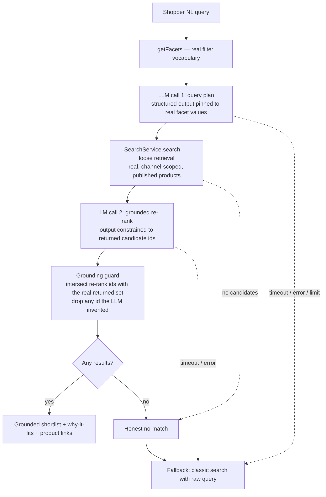

# Natural-Language Product Discovery

> An RFC is a proposal — a full design page for a non-trivial change. It does not
> record the verdict or the result: the decision and its outcome are captured in an
> [ADR](../ADR/ADR%20MOC.md). `status` moves Draft → In Review → Final. This RFC is a
> _solution proposal_, not an implementation plan — it states architectural principles,
> boundaries, and the gotchas that decide the design, and leaves package-level layout to
> implementation. Nimara designs stay OSS provider-agnostic: layer over existing provider
> abstractions, do not mandate a vendor.

Serves [PRD-001 Natural-Language Product Discovery](product/prds/PRD-001%20Natural-Language%20Product%20Discovery.md). Requirement IDs below (`S-*`, `AC-*`, `NFR-*`, `M-*`, `G-*`) reference that PRD and its [grilling log](product/prds/grilling/PRD-001%20Natural-Language%20Product%20Discovery%20-%20Grilling%20Log.md).

## Problem

Nimara's shipped search is **lexical**: the Saleor-native provider uses Postgres full-text search, the Algolia provider is keyword/lexical. Both match tokens, not intent. A shopper who describes a _need_ in natural language — "waterproof coat to keep a toddler warm on winter walks, under $50" — is served poorly, because the words they use rarely match the catalog's terminology and the provider cannot rank by fit.

Closing this gap is a market-parity requirement for developers and agencies evaluating Nimara for intent-heavy catalogs (PRD-001). The forces that constrain any solution:

- There is **no LLM, embedding, or vector code anywhere in the repository** today — this is a greenfield capability.
- Nimara is an **open-source product**, not a specific deployment. A solution cannot mandate a paid vendor or a proprietary index; strategy explicitly forbids building a search index/storage engine ([Do Not Pursue](product/strategy/Do%20Not%20Pursue.md)), and AI-assisted shopper recommendations are positioned as a table stake, with UCP/MCP as the separate differentiator ([Table Stakes vs Differentiators](product/market/Table%20Stakes%20vs%20Differentiators.md)).
- A shopper must **never** see a product that does not exist or fails current eligibility (PRD NFR-1) — an honest no-match is preferable to an invalid suggestion.
- The capability is **opt-in**; disabled, it must not change storefront behavior or performance; enabled, provider latency or failure must never block page render or classic search (PRD NFR-2).

## Requirements

### Functional requirements

- **FR-1** — Accept single-turn natural-language input and return a configurable short list of **real** products, each with a concise catalog-grounded "why it fits" explanation and a link to its standard product page. (S-3, AC-4)
- **FR-2** — Return an honest no-match, and fall through to classic search on no-match, timeout, provider failure, or a reached limit, carrying the original request. (S-5, AC-6)
- **FR-3** — Keep the LLM provider swappable behind a stable boundary, with one core-maintained reference adapter. (S-6, AC-3)
- **FR-4** — Expose extension points — placement, shortlist size, eligibility, ranking policy — without forking the core module; no commercial ranking boost by default. (S-7, AC-3)
- **FR-5** — Emit structured telemetry (outcome, returned product ids, fallback reason, latency, provider usage/cost); raw query text off by default. (S-8, AC-8)

### Non-functional requirements

- **NFR-1** — Disabled: zero behavior/performance change. Enabled: non-blocking; never blocks page render or classic search. (PRD NFR-2, AC-10)
- **NFR-2** — Accessible: keyboard operation, assistive-technology status, understandable loading/error/fallback states, AI-assisted labeling. (PRD NFR-3, PRD NFR-5, AC-7)
- **NFR-3** — Anonymous-first; abuse and cost bounded by configurable limits, not mandatory authentication. (PRD NFR-4, AC-9)
- **NFR-4** — No universal latency/cost target; each deployment observes and sets its own limits with a safe fallback. (PRD NFR-7, G-055)
- **NFR-5** — Raw natural-language queries are not persisted by default; a deployment that enables raw-query analytics owns its consent, redaction, retention, and provider-data-transfer policy. (PRD NFR-6, G-065)
- **NFR-6** — Product existence and current eligibility are **inherited from the configured search provider** (the retrieval source), not re-validated by the discovery layer. The design must never display a product the provider would not return: the re-rank introduces no products, and the LLM's output is constrained to the ids the provider actually returned. Discovery inherits exactly the freshness/eligibility guarantee of classic search — no stronger, no weaker. (PRD NFR-1, AC-5, S-4)

## Proposed solution

A new **opt-in discovery layer** that _composes_ the existing `SearchService` and adds a _separate, swappable_ LLM-provider boundary. The LLM is a **query-understanding and re-ranking layer, not a retrieval engine** — retrieval is always the real, configured search provider, so the design cannot surface an invented product.

The chosen approach is a **hybrid query-plan + grounded re-rank** pipeline (Approach C; alternatives in [Alternative solutions](#alternative-solutions)). Two constrained LLM calls bracket a real provider search:

Design invariant across the whole pipeline: **the LLM never emits a product identity that has not been validated against the real catalog.** Call 1 emits only query parameters; Call 2's output is constrained to the ids the provider actually returned and is then intersected with that real set.

Two properties keep query strategy viable on a lexical backend:

- **Facet vocabulary, not the catalog, is the LLM's context.** `getFacets` returns a bounded set of filter dimensions and allowed values; those values are injected into Call 1's output schema as enums, so the LLM maps intent onto _real_ filters and cannot invent a filter value. For large catalogs the injected vocabulary must be bounded to high-signal facets (see [deferred: catalog-readiness](#deferred-decisions)).
- **Tight core query + exact filters + loose retrieval + re-rank.** Call 1 emits a narrow head query and pushes qualifiers into exact filters, rather than a long keyword bag that a lexical `AND` engine would over-constrain to zero results. Retrieval stays loose (high recall); precision is recovered in the Call 2 re-rank, which only ever sees real candidates.

### Component changes

Stated as roles and boundaries; package-level placement is left to implementation.

#### Existing components

- **`SearchService`** (infrastructure search use-case) — reused **unchanged** and **injected** into the discovery layer. Discovery calls it twice: `getFacets` for the query-plan vocabulary, and `search` for candidate retrieval. Because retrieval is always the real provider, existence and eligibility are guaranteed by `SearchService` itself — discovery adds no separate validation pass. Discovery adds no method to `SearchService`, so no search provider inherits an LLM dependency and each provider stays independently swappable.
- **Storefront search surface** — gains an opt-in discovery entry point rendered in a non-blocking boundary, degrading to the existing classic search UI on any failure path. Disabled by default; when disabled the surface is absent and classic behavior is untouched (AC-10).

#### New components

- **A discovery orchestrator** — a new capability that composes an injected `SearchService` and an injected `LLMProvider` and runs the `plan → retrieve → re-rank → grounding-guard` pipeline, returning a `Result`. It owns the grounding invariant, the fallback decision, and telemetry emission. Layered _above_ search, in the infrastructure composition direction (depends on domain/foundation only), consumed by the app through a service — never importing generated GraphQL directly.
- **An `LLMProvider` boundary** — a stable port with swappable adapters, selected by configuration, mirroring the existing search-provider manifest/selector pattern. This is a **separate** boundary from the search provider because the LLM is orthogonal to search: a deployment mixes any search provider with any LLM provider independently.
- **Discovery UI** — feature-level components for the NL input, the grounded result list, and the no-match / error / fallback / loading states, meeting the accessibility and AI-labeling requirements (NFR-2).

### API changes

- **Internal service only — no new public REST/HTTP endpoint in the MVP.** The capability is single-turn and storefront-facing; it is consumed server-side (Server Action / RSC segment). This keeps the abuse/cost surface small and keeps this feature distinct from the separate agent-facing UCP/MCP concern (G-014). If programmatic access is ever needed, that is a separate RFC.
- **Contract returns a `Result`** (`AsyncResult`) from `@nimara/domain/objects/Result`; expected business outcomes are not thrown. The success value carries **either** a grounded shortlist **or** a typed no-result outcome. Failure/timeout/limit collapse to a **machine-readable fallback reason** (`no-match` | `timeout` | `provider-error` | `limit-reached`) that the UI (FR-2) and telemetry (FR-6) act on — the reason is part of the contract, not a log line.
- **No change to the raw Saleor schema**; all access is through infrastructure use-cases/services.

### Database changes

**None.** The capability is **stateless** — no new table, field, index, or vector store on Nimara's side. This follows the "no proprietary search index" strategy and the grounding model (retrieval is always the real provider). Observability is delivered as emitted structured events whose sink is owned by the deployment; raw query text is off by default (NFR-5).

### Reference model and cost

The reference adapter (resolving PRD open question on adapter choice) is **AWS Bedrock**, with a default model of **Llama 4 Scout 17B**, selected on cost and operability while remaining fully swappable.

**Why Bedrock as the reference:**

- **Model swap without code changes.** Bedrock's Converse API exposes a uniform tool-use / structured-output interface across Nova, Llama, Mistral, and Claude, so changing the reference model is a configuration change, not a code change — a good fit for a reference adapter others copy.
- **Fits AWS-native deployments.** Deployments already on AWS reuse existing account, region, and IAM, with no separate vendor key to provision.
- **Cheapest _reliable_ tool-use option on Bedrock** for this workload (below), with capability appropriate to the task (query parsing + re-rank are not hard reasoning).

**Cost model (reference workload).** Approach C makes **two** LLM calls per shopper query. Modeled token profile per request: Call 1 ≈ 2,000 input / 150 output; Call 2 ≈ 3,500 input / 400 output → **≈ 5,500 input + 550 output tokens/request** (5.5M input + 0.55M output per 1,000 requests). Cost/1k = `5.5 × input$/M + 0.55 × output$/M`.

| Model (host) | Input $/M | Output $/M | **Cost / 1,000 requests** | Note |
| :-- | --: | --: | --: | :-- |
| **Llama 4 Scout 17B (Bedrock)** | 0.17 | 0.66 | **$1.30** | **Reference** — cheapest reliable Converse tool-use on Bedrock |
| Gemini 2.5 Flash-Lite (Google) | 0.10 | 0.40 | $0.77 ($0.50 cached) | Cheapest capable overall; alt tier |
| GPT-OSS-120B (Groq / Bedrock) | ~0.15 | ~0.60 | ~$1.16–1.19 | Open-weight; no-lock-in alt |
| gpt-5.4-nano (OpenAI) | 0.20 | 1.25 | $1.79 ($1.25 cached) | Guaranteed strict schema; max-assurance alt |
| Nova 2 Lite (Bedrock) | 0.30 | 2.50 | $3.03 | Output-heavy pricing ill-suits this input-heavy workload |
| Claude Haiku 4.5 (Bedrock / Anthropic) | 1.00 | 5.00 | $8.25 ($5.55 cached) | Most capable, most expensive |

> Prices captured July 2026 from primary provider pricing pages; **re-verify at implementation time** — LLM prices and model line-ups change frequently. Prompt caching (large reusable system + facet prefix) materially lowers cost where a provider publishes cache rates. Cost is a **reference figure only**; each deployment sets and observes its own limits (NFR-4).

The reference model stays a documented default, not a mandate. Named swap targets: **Gemini 2.5 Flash-Lite** (lowest cost), **gpt-5.4-nano** (strongest structured-output guarantee), **GPT-OSS-120B on a managed host** (open-weight, no lock-in). Any of these sits behind the same `LLMProvider` boundary.

## Cross-cutting considerations

### Security

- **All text entering the LLM is data, not instructions.** Both the shopper query and — in the Call 2 re-rank — product names/descriptions are treated as untrusted input; prompts are structured so catalog or query content cannot take over instructions. Prompt injection via product content is the principal new trust-boundary risk introduced by the re-rank pass, and is contained by treating catalog text as data plus constraining Call 2's output to returned ids and post-intersecting with the real result set.
- **LLM provider credentials / IAM are server-side secrets** (server env / cloud role), never exposed to the client — consistent with existing provider handling.
- **Input bounds** on query length, plus provider safeguards; **no custom moderation system** is built (G-063) — out-of-bounds or unsafe input returns to classic search or no-match.
- **Unacceptable failure modes (hard):** showing a non-existent or ineligible product (grounding invariant); leaking a provider secret to the client; sending data to the provider without documented data transfer (G-065).

### Monitoring and alerting

Every path is observable through emitted structured events: outcome, returned product ids, fallback reason, latency, and provider usage/cost. A recommended minimum signal set — fallback rate, provider-error rate, p95 latency, cost per query — is documented, but **alert rules and thresholds are deployment-owned**; Nimara sets no universal thresholds (NFR-4). Nimara stores nothing; the deployment attaches its own sink (e.g. Sentry / analytics).

### Failure cases and remediation

Every failure path degrades safely to classic search or an honest no-match — never an error page, never a dead end (PRD NFR-2) — and is observable.

| Failure mode | Remediation |
| :-- | :-- |
| LLM timeout / slow | Fallback → classic search with the raw query (AC-6) |
| LLM provider error / outage | Fallback → classic search |
| No credible match | Honest no-match + classic search (AC-6) |
| Usage / cost limit reached | Do not call the provider; fallback; emit `limit-reached` event (AC-9) |
| Re-rank returns invented / empty ids | Grounding guard (intersection with the real returned set) drops them; if empty → no-match / fallback (AC-5, PRD NFR-1) |

### Alternative solutions

_Deferred to separate RFCs._ The solution space is too large to carry in one document, so the alternative approaches are intentionally not detailed here. Each alternative that warrants a decision will be captured as its **own RFC** and cross-linked back to this section. Candidates identified during design (to be written up separately):

- **LLM query-translation only** — this pipeline minus the re-rank pass.
- **Provider-native semantic retrieval** — vector similarity delegated to a provider that owns the vectors (e.g. Algolia NeuralSearch), sitting under the same `SearchService`.
- **Self-hosted embeddings / vector store** — noted here as out of scope: it conflicts with the "no proprietary search index/storage engine" strategy ([Do Not Pursue](product/strategy/Do%20Not%20Pursue.md)) unless that constraint is revisited first.

### Dependencies

- **`LLMProvider` boundary — Nimara-owned port, no dependency.** The stable interface and its adapter-selection pattern are internal (mirroring the search-provider manifest); swapping providers is Nimara code, not a third-party framework.
- **Reference adapter client — proposed, pending approval.** The Bedrock reference adapter is implemented over the **AWS SDK Bedrock Runtime client** (`@aws-sdk/client-bedrock-runtime`, Converse API), so switching the model within Bedrock (Nova / Llama / Mistral / Claude) is a configuration change. The AWS SDK ecosystem is already used in the monorepo (`@aws-sdk/client-secrets-manager` in `apps/marketplace`), though this specific package would be new to the storefront. Per Nimara policy no dependency is **assumed**; the actual `pnpm add` waits for explicit approval at implementation time. Alternatives:
  - **(a) [Vercel AI SDK](https://ai-sdk.dev)** (`ai`, Apache-2.0) with `@ai-sdk/amazon-bedrock` — one client library spanning many providers, so every adapter shares one API. Note this **partly duplicates the `LLMProvider` port**: the AI SDK's main value is cross-provider swap, which Nimara's own boundary already provides — so it is only worth the third-party dependency if a deployment deliberately wants a single shared client across all adapters, not for Bedrock alone.
  - **(b) Dependency-free thin adapter** over each provider's REST API — no new dependency, more code to own.
- **Reference model host — AWS Bedrock** (recommended tier, swappable; adds AWS account/region/IAM setup versus a single hosted key). Not mandatory — deployments may point the same `LLMProvider` boundary at Gemini, OpenAI, or a managed open-weight host through their own adapter.

### System impacts

- **Search providers** — reused via injection, unchanged; no provider gains an LLM dependency.
- **Storefront** — a new opt-in, non-blocking surface; disabled by default with zero impact (AC-10).
- **Public Nimara demo** — enables the capability prominently behind an isolated, strictly budgeted provider account with rate limits and fallback (S-2, R-7); the demo operating budget is a deployment/product decision (PRD open question, before public preview).
- **UCP/MCP** — explicitly untouched; agent-facing discovery remains a separate concern (G-014).
- **No codegen impact** — no `.graphql` changes.

### Documentation changes

Developer-facing only (G-050): setup and one-business-day activation (M-3); **provider data-transfer disclosure** (what catalog/query data reaches the provider — G-065); configuration (placement, shortlist size, eligibility, ranking policy); privacy (raw-query off by default and what enabling analytics entails); cost controls and limits; an evaluation guide; and extension points. No operator/merchant documentation until a corresponding workflow exists.

### QA validation

- **Grounding / no-invention gate** — asserts the re-rank output is always a subset of the ids the provider returned, so discovery never displays a product the search provider did not (existence and eligibility are inherited from the provider, not re-implemented). **Automatable; a hard gate** and the one universal quality bar (M-4, AC-5, PRD NFR-1).
- **Fallback paths** — no-match, timeout, provider-error, limit-reached all degrade to classic search (AC-6, AC-9). **Automatable** with a mocked LLM provider.
- **Disabled = no change** — storefront behavior and performance unchanged when no provider is configured (AC-10). **Automatable.**
- **Accessibility** — keyboard, AT status, AI-assisted labeling (AC-7, NFR-2). Partly automatable (axe) plus manual.
- **Relevance quality** — re-rank ordering is **human-rated per deployment** (G-017); not a universal automated gate, and outside Nimara's quality bar.

### DevOps / infrastructure

- **Configuration:** a discovery feature flag and an LLM-provider selector, both **off / absent by default**; provider credentials or IAM role; and usage/cost limits — all validated as envs (Zod), server-side.
- **No CI task-graph / codegen change** (no GraphQL edits).
- **Demo:** isolated provider account, defined budget, rate limits, automatic fallback; secrets via per-environment platform envs.

### Deferred decisions

- **Catalog-readiness semantics (U-5)** — the minimum product content and eligibility semantics that make a catalog discovery-ready, and how the injected facet vocabulary is bounded for large catalogs. Owner: Product + Architecture. Gate: before implementation approval.
- **Concrete latency / cost thresholds** — deployment-owned by design (NFR-4); the reference figure above is illustrative, not a target.

## Related Notes

[PRD-001 Natural-Language Product Discovery](product/prds/PRD-001%20Natural-Language%20Product%20Discovery.md)
[PRD-001 Natural-Language Product Discovery - Grilling Log](product/prds/grilling/PRD-001%20Natural-Language%20Product%20Discovery%20-%20Grilling%20Log.md)
[Do Not Pursue](product/strategy/Do%20Not%20Pursue.md)
[Table Stakes vs Differentiators](product/market/Table%20Stakes%20vs%20Differentiators.md)
[RFC MOC](tech/RFC/RFC%20MOC.md)
[ADR MOC](tech/ADR/ADR%20MOC.md)
