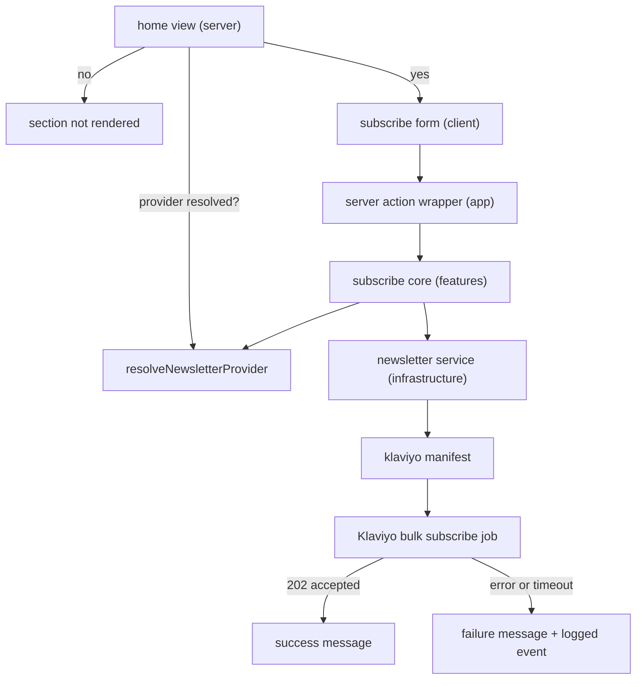

# Newsletter Subscription Provider Seam

## Problem

The storefront home page renders a subscribe box. The action behind it accepts a name and an email
address, returns success, and stores nothing. No contract for newsletter capture exists in any
layer. An adopter who needs the capability writes the whole integration alone.

Three forces shape the design.

The repository already solves provider neutrality once. Search and content select an implementation
from a provider manifest, through a shared selector, a lazy cached loader, and a preflight report.
That machinery exists and a fourth capability can reuse it.

The selection default that search and content use does not transfer. Both default to the commerce
backend, because the commerce backend serves both capabilities. It has no newsletter capability, so
newsletter has no default provider and an unconfigured deployment has no provider at all.

Honest result states cost more than they look. The current form always reports success, so the
capability cannot fail visibly. A design that reports success only after a provider acknowledgement
must carry the acknowledgement through every layer between the provider and the toast.

## Requirements

### Decision drivers

Ranked from the PRD success metrics. The first two dominate, and the design is scored against them
below. The owner has not confirmed this ranking.

1. An adopter connects a provider through configuration only. M-1 carries the entire business bet,
   and M-2 and M-3 are diagnostics that prove the capability works rather than that it is valuable.
2. A second provider costs one manifest entry. This is the property the falsification test measures,
   so a design that cannot be tested cheaply cannot be falsified.
3. Honest result states. A success message without a provider acknowledgement is the one
   unacceptable outcome.
4. Data minimisation. No stored address, and no address in a log.
5. No new dependency without a reason. The owner accepted one, recorded under Dependencies.

The proposed design scores as follows. Driver 1 holds because selection, provider configuration, and
the render gate are all environment values, and no application file changes in an adopter's tree.
Driver 2 holds because the manifest, the selector, and the preflight row derive from one array, so a
second provider adds an entry and touches no caller. Driver 3 holds because the success path runs
only on a provider acknowledgement and the empty service answers an error rather than a payload.
Driver 4 holds because no component persists the address and the failure event excludes it. Driver 5
is a trade the owner made deliberately, against the `fetch` alternative recorded under Alternative
solutions.

### Functional requirements

- The storefront delivers a submitted email address to the configured email provider.
- Provider selection is configuration. Adding the first provider changes no application code in an
  adopter's tree.
- A deployment with no configured provider renders no subscribe section and accepts no submission.
- The shopper reads the purpose of the subscription and reaches the privacy policy before submitting.
- The shopper sees success only after the provider acknowledges the request, and sees a failure
  message in every other outcome.
- An invalid address fails in the form and reaches no provider.
- A failure produces a logged event.

### Non-functional requirements

- Data minimisation. The address is the only field collected, and no layer of Nimara stores it.
- A second provider costs one manifest entry and no change to the submit path. This is the property
  that the PRD falsification test measures.
- No personal data enters application logs.
- The provider credential stays server-side and never reaches the client bundle.
- An unconfigured deployment constructs no provider and performs no network call.

## Proposed solution

Newsletter becomes a selectable capability in the shape the repository already uses for search and
content. A use-case contract states one operation. One manifest per provider owns that provider's
configuration schema, its configuration mapping, and its lazy factory. A selector resolves the
manifest. A cached loader in the storefront constructs the service on first use. The integration
preflight gains a row derived from the same manifests.

`NEWSLETTER_SERVICE` selects the implementation and has no default. An absent value means no
provider, which is the on switch the PRD describes and the reason the release needs no feature flag.

Provider resolution is the single answer to the question "is a provider configured". The home view
reads it to decide whether to render the section. The submit path reads it again and refuses early,
because a client that was rendered before a configuration change can still post. The loader keeps an
empty-service fallback that answers a not-configured error, so a missed check degrades to a refusal
rather than a crash.

Corrected at implementation time. Resolution answers which provider was selected, which is not the
same question: a selected provider missing its keys passed the gate, rendered the section, and then
threw out of the loader, because every provider config mapper validates with a throwing parse. The
render gate now asks whether the capability is selected *and* its configuration schema validates,
the loader catches a failed construction and serves the empty service, and the registry logs the
missing keys once at build time. The submit-path check stays as the second line of defence.

Placement suggestion, not binding on the implementer: the contract sits beside the existing
use-case contracts in `packages/infrastructure`, and the Klaviyo provider sits beside the other
provider directories in the same package.

### Component changes

#### Existing components

- The home view gains the configuration gate and stops rendering the section unconditionally.
- The subscribe form drops the name field, gains consent text with a privacy-policy link, and
  reports the outcome the action returns instead of always reporting success. The home view already
  receives the privacy-policy path, so no new routing input is needed.
- The form validation schema keeps the address and loses the name.
- The stub subscribe action is replaced by a thin application wrapper over a pure core function, the
  pattern that cart and add-to-bag already use.
- The server environment schema gains `NEWSLETTER_SERVICE`, with allowed values derived from the
  newsletter manifests, and no default value.
- The shared provider-resolution module gains newsletter resolution. It does not use the
  commerce-backend fallback that search and content share.
- The service registry gains one newsletter entry, and the capability-services type follows from it.
- The integration preflight gains one newsletter capability row.
- The empty-service module gains an empty newsletter service that answers a not-configured error.
- The domain error catalogue gains a newsletter error-code group. It distinguishes a provider
  rejection from a not-configured refusal, because the shopper messages and the operator response
  differ.
- The storefront message catalogue loses the name-field keys and gains the consent text.
- The end-to-end fixtures lose the name field.

#### New components

- A newsletter use-case contract with one operation: subscribe an address. It answers the
  repository `Result` type, so a caller cannot read a payload without handling failure.
- A newsletter selector built from provider manifests, in the same shape as the search selector.
- A Klaviyo provider: an environment schema, a configuration mapping, and the subscribe
  implementation.
- A cached newsletter service loader in the storefront.
- A pure subscribe core function in the features package, which takes the service registry and the
  submitted address.

### API changes

No public HTTP route is added. The submit path is a Server Action, which keeps shopper form
mutations on one convention.

The internal contract is the newsletter use-case operation. It accepts the address and answers a
`Result`. The success payload carries the provider acknowledgement and nothing else, because Nimara
holds no subscription state to return. Every failure answers an error carrying a code from the new
newsletter group, so the form maps a code to a message and never infers an outcome from an absent
payload.

The Server Action signature changes: the name field goes. The stub has no caller outside the
storefront, so no external consumer breaks and no versioning is required.

The external call is Klaviyo's bulk subscribe job endpoint,
`POST /api/profile-subscription-bulk-create-jobs`. It answers `202 Accepted`, which is the success
condition for the whole design. The `klaviyo-api` package version pins the API revision, so the
dependency version is the contract version and a revision change is a visible dependency bump.
([Klaviyo bulk subscribe reference](https://developers.klaviyo.com/en/reference/subscribe_profiles),
captured 2026-08-20. Re-verify the endpoint and the status code before implementation.)

Two provider properties shape the operator contract.

Double opt-in belongs to the Klaviyo list, not to the request. The configured list must have double
opt-in enabled, otherwise the provider subscribes the address immediately and sends no confirmation
message. The list identifier is therefore required configuration rather than an input.

The preflight can confirm that the configuration keys are present and well formed. It cannot confirm
that the Klaviyo list has double opt-in enabled. That check stays a documented setup step, and the
gap is worth stating rather than implying.

### Database changes

None. Nimara persists nothing. The provider is the system of record for the subscriber, the list,
the consent record, and the unsubscribe link. No migration and no rollback of data applies.

## Cross-cutting considerations

### Security

The design adds one trust boundary: an unauthenticated write path that reaches a paid third-party
API. Rate limiting is deferred, so that exposure is open by decision. See the deferred items.

The Klaviyo private key is read on the server from the provider manifest, in the same way that the
content and search credentials are read today. It never reaches the client bundle. Rotation follows
the existing storefront configuration procedure.

The submitted address is personal data. It is forwarded to the provider and held nowhere in Nimara.
A failure event carries the selected provider, the provider response status, and the error code. It
never carries the address, because Nimara cannot retry one subscriber and the address would only
widen where personal data comes to rest.

One provider behavior needs a decision before implementation. The subscribe endpoint removes
`UNSUBSCRIBE`, `SPAM_REPORT`, and `USER_SUPPRESSED` suppressions from the submitted profiles. A
resubscribe request can therefore clear a previous unsubscribe on the merchant's list.
([Klaviyo bulk subscribe reference](https://developers.klaviyo.com/en/reference/subscribe_profiles),
captured 2026-08-20.)

The unacceptable failure mode is a success message without a provider acknowledgement. Every other
failure is merely bad.

### Monitoring and alerting

- Signal: subscribe failures grouped by provider and by provider response status. Alert when the
  failure rate stays high across a window rather than on a single failure. Remediation: check the
  credential and the list identifier against the preflight report, then check the provider status
  page before changing code.
- Signal: not-configured refusals on a deployment that has a provider selected. One refusal means a
  stale client posted after a configuration change. A sustained rate means the deployment lost its
  configuration. Remediation: run the preflight and compare the environment against the last
  known-good deployment.
- Not a signal: a single invalid-address validation failure. It is shopper input, and it triggers no
  provider call.

### Failure cases and remediation

| Case                         | Shopper sees                                            | Log                            | Remediation                                                  |
| :--------------------------- | :------------------------------------------------------ | :----------------------------- | :----------------------------------------------------------- |
| Invalid address              | Field validation message                                | None                           | None. No provider call happens.                              |
| No provider configured       | Section absent, or a failure message for a stale client | Refusal event                  | Set `NEWSLETTER_SERVICE` and the provider keys, then deploy. |
| Provider rejects the request | Failure message                                         | Provider status and error code | Verify the credential and the list identifier.               |
| Provider unavailable         | Failure message                                         | Provider status and error code | Wait for the provider, then the shopper retries.             |
| Request times out            | Failure message                                         | Timeout error code             | None automatic. See the gotcha below.                        |

The timeout case is ambiguous by construction. A request that times out after the provider accepted
it produces a failure message, and the shopper can still receive the confirmation message. The
design accepts that, because the alternative is a success message the provider never acknowledged.
The PRD requires the honest failure. The behavior belongs in the documentation so an adopter is not
surprised by a support question.

### Alternative solutions

- **Klaviyo's browser endpoint with the public site ID.** No secret and no server call. Rejected:
  the seam would live in client code, outside the service registry and the preflight, the
  application could log no provider failure and perform no server-side validation, and every later
  provider would have to offer an equivalent browser endpoint.
- **A feature-level integration with no registry entry.** Cheaper at release. Rejected: the
  provider-neutral claim would exist only in prose, and the second-provider falsification test would
  first have to build the seam it is meant to test.
- **An availability flag on the service instead of resolver-driven gating.** Keeps the view away
  from selection policy. Rejected: it forces service construction on every home-page render,
  including deployments that never use the capability.
- **A dedicated route handler instead of a Server Action.** A stable path is easier for a platform
  rule to target. Rejected: it introduces a second convention for shopper forms. This alternative
  becomes relevant again if rate limiting arrives, so it is recorded rather than discarded.
- **Platform `fetch` instead of the vendor SDK.** Viable and cheaper in dependencies. Chosen at
  implementation time, after the vendor SDK proved incompatible with the edge runtime the storefront
  `opengraph-image` routes use. See Dependencies.

### Dependencies

- No new package. The design first selected `klaviyo-api` 23.0.0, the official TypeScript client.
  Implementation reversed that choice: the package requires Node's `querystring`, and three
  storefront `opengraph-image` routes run on the edge runtime and import the service registry, so
  the package broke the storefront build. Platform `fetch` replaced it, which is the alternative
  recorded below. The provider pins the API revision in a constant instead of through a package
  version. ([npm registry metadata](https://registry.npmjs.org/klaviyo-api/latest), captured
  2026-08-20.)
- A Klaviyo account, with a list that has double opt-in enabled, and a private API key. This is an
  adopter obligation, not a repository change.

### System impacts

- Storefront application: environment schema, provider resolution, service registry, preflight,
  empty services, the home view, and one action wrapper.
- Features package: the subscribe form, its validation schema, and the new subscribe core function.
- Infrastructure package: the newsletter contract, the selector, the Klaviyo provider, and one new
  dependency.
- Domain package: one new error-code group.
- Message catalogue: the name-field keys go, the consent text arrives. Every locale is affected.
- Automated tests: the end-to-end fixtures carry the name field today and must lose it in the same
  change.
- External system: the merchant's Klaviyo account receives profiles and owns the confirmation
  message, the consent record, and the unsubscribe link. Klaviyo publishes a burst limit of 75
  requests per second and a steady limit of 750 requests per minute on this endpoint, which a single
  storefront form does not approach.
  ([Klaviyo bulk subscribe reference](https://developers.klaviyo.com/en/reference/subscribe_profiles),
  captured 2026-08-20. Re-verify both limits before any design sends bulk traffic to this endpoint.)

### Documentation changes

- A Klaviyo setup walkthrough in the storefront integration documentation. It must be complete
  enough for a developer to connect the provider on a fresh clone without changing application code,
  because that walkthrough is what the PRD success metric measures. It must also carry the list
  requirement that the preflight cannot verify, and the timeout behavior described above.
- The storefront environment example gains `NEWSLETTER_SERVICE` and the Klaviyo keys, with the same
  commented grouping the search and content keys use.
- The storefront provider rollback record covers search and content selection today. It must gain
  newsletter selection, because the same build-and-configuration rollback applies.
- After implementation: a capability record, an integration contract for newsletter provider
  selection, and an implementation record. Those are outcomes of the change, not parts of this
  proposal.

### QA validation

Scenarios only. Automatability is the decision of the QA team.

- A deployment with no provider selected renders no subscribe section, and a submission posted
  directly is refused.
- A deployment with a provider selected but with a missing key fails the preflight, and the
  preflight names the missing key.
- A valid address reaches the configured Klaviyo list, and the confirmation message arrives.
- A confirmed subscription appears in the provider list within one minute of confirmation.
- An invalid address shows a field message and produces no provider call.
- A provider rejection shows a failure message, produces a logged event, and shows no success
  message.
- A provider timeout shows a failure message and produces a logged event.
- The form collects the address only, and shows the purpose text and a working privacy-policy link.
- No log entry produced by any of the scenarios above contains the submitted address.
- The end-to-end suites that reference the newsletter fixtures still pass after the name field goes.

### DevOps / infrastructure

- Two new server-side environment values per storefront environment: the provider selection and the
  Klaviyo credentials. They follow the existing configuration and secret handling: public and
  private values stay separate, and the private key lives only in the deployment platform.
- No new infrastructure resource, no new network path inbound, and one new outbound destination.
- The preflight row makes the newsletter selection visible before a build, which is how the existing
  deployment validation runbook already checks provider configuration.
- Selection changes require a deployment, exactly as the search and content selection does. Removing
  the configuration is the kill switch, and it removes both the section and the endpoint behavior.
  The blast radius is one home-page section and one action.

## Deferred decisions

- D-1: closed. Rate limiting is out of this design by owner decision.
  [ADR-0004](../ADR/ADR-0004%20Newsletter%20Capture%20Is%20A%20Selectable%20Provider%20Capability.md)
  resolved the gate by narrowing PRD-004 rather than by blocking release: requirement S-7, user
  story US-6, and acceptance criterion AC-9 were removed, and risk R-2 now records the accepted
  exposure. The public submit path is unbounded by decision. Provider double opt-in still means that
  a fake address receives no mail, so the accepted cost is request volume against the paid provider
  API. The research is held in
  [Rate Limiting for Public Storefront Endpoints](../../market/strategy/initiatives/Rate%20Limiting%20for%20Public%20Storefront%20Endpoints.md).
- D-2: closed. The request timeout applied to the provider call is 5 seconds. No measurement
  existed, so the value was set by owner decision at implementation time. A shopper waits for this
  call, and the endpoint answers `202` without doing the work, so the budget is one request and the
  provider client performs no retry.
- D-3: closed. A submission proceeds even when the address is already suppressed in the merchant's
  Klaviyo account. The subscribe endpoint clears the suppression, so a resubscribe undoes an earlier
  unsubscribe. The alternative, reading the profile first and refusing, costs a second API call per
  submission and an extra read scope on the key. The behavior is documented for the adopter instead.

## Next step

[ADR-0004 Newsletter Capture Is A Selectable Provider Capability](../ADR/ADR-0004%20Newsletter%20Capture%20Is%20A%20Selectable%20Provider%20Capability.md)
accepts this design and carries the verdict on D-1. This RFC records the design only. D-2 and D-3
are closed above, and the design is implemented.

## Related Notes

[PRD-004 Newsletter Subscriptions](../../prd/PRD-004%20Newsletter%20Subscriptions.md)
[ADR-0004 Newsletter Capture Is A Selectable Provider Capability](../ADR/ADR-0004%20Newsletter%20Capture%20Is%20A%20Selectable%20Provider%20Capability.md)
[CAP-0001 Swappable Storefront Search and Content Providers](../../product/capabilities/CAP-0001%20Swappable%20Storefront%20Search%20and%20Content%20Providers.md)
[INT-0001 Search Provider Selection](../../product/integrations/INT-0001%20Search%20Provider%20Selection.md)
[INT-0002 Content Provider Selection](../../product/integrations/INT-0002%20Content%20Provider%20Selection.md)
[OPS-0001 Storefront Deployment and Configuration Validation](../../operations/OPS-0001%20Storefront%20Deployment%20and%20Configuration%20Validation.md)
[OPS-0006 Storefront Provider Change and Rollback](../../operations/OPS-0006%20Storefront%20Provider%20Change%20and%20Rollback.md)
[Rate Limiting for Public Storefront Endpoints](../../market/strategy/initiatives/Rate%20Limiting%20for%20Public%20Storefront%20Endpoints.md)
[ADR MOC](../ADR/ADR%20MOC.md)
