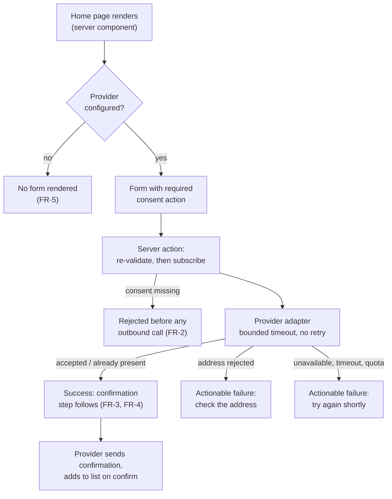

# Newsletter Subscription

This proposal designs the capability requested by
[PRD-004 Newsletter Subscription](../../prd/PRD-004%20Newsletter%20Subscription.md): turning the
storefront's newsletter placeholder into a working subscription path through a swappable
email-service-provider boundary, with the provider — not Nimara — holding the list, the consent
record, confirmation, and unsubscribe.

## Problem

The storefront renders a newsletter form whose submit action returns a fixed success and stores
nothing, and whose client shows a success toast on that result. The form appears only in the
`shop-basic` home variant. The repository therefore publishes a capability it does not have, and a
shopper who submits an address is told it worked.

The forces that shape any solution:

- **Nimara must hold no subscriber data.** The adopter is the data controller and the provider its
  processor. This rules out any mechanism that survives a provider outage by storing the address —
  a queue, an outbox, or a table of unconfirmed subscribers.
- **Confirmation and unsubscribe belong to the provider,** which must perform them on its own side.
  A Nimara-implemented double opt-in would require storing unconfirmed addresses.
- **The capability must be absent, not inert, where no provider is configured.** This is the first
  storefront capability with that property. Search and content selection both default to `saleor`,
  so those capabilities are always present and always render UI; their `null` resolution exists only
  as a production safety net for an unconfigured backend.
- **Providers disagree about almost everything.** List membership, how confirmation is triggered,
  and where consent data can be attached all differ per provider, so what is allowed to cross the
  boundary decides whether the swap promise is real.
- **Adoption is configuration, not development.** The developer-activation goal is a delivered test
  subscription within one business day, following documentation, without reading the integration's
  source.

## Requirements

### Functional requirements

- **FR-1** — the existing home-page form is the single entry point, and a submission reaches the
  configured provider's list.
- **FR-2** — an explicit consent action is required, and a submission without it never leaves the
  storefront.
- **FR-3** — a success message appears only for a submission the provider accepted; otherwise the
  shopper gets a failure they can act on. No submission is silently discarded.
- **FR-4** — the storefront states that a confirmation step follows, and neither confirms nor
  stores the address itself.
- **FR-5** — with no provider configured, the form is absent and nothing else about the storefront
  changes.
- **FR-6** — a deployment can replace the provider adapter without forking shared code, and the
  form, validation, translations and outcome states are unchanged when it does.
- **FR-7** — all subscriber-facing copy resolves through the existing message catalogue.
- **FR-8** — no subscriber data is persisted anywhere in Nimara, log and error-reporting stores
  included.

### Non-functional requirements

These are the decision drivers the design was chosen against; the first three dominate and break
ties.

- **NFR-1 (dominant) — delivery honesty.** The storefront must learn the real outcome of the
  provider call before it tells the shopper anything.
- **NFR-2 (dominant) — provider-side confirmation with zero Nimara storage.** Confirmation is
  structurally the provider's job, not a Nimara feature and not an account setting Nimara depends
  on.
- **NFR-3 (dominant) — configuration-only adoption.** Environment variables and provider-side setup
  only, with missing configuration reported by the existing deployment preflight.
- **NFR-4 — boundary neutrality.** Provider-specific concepts stay inside the adapter's
  configuration and never reach the call site.
- **NFR-5 — layer fit.** The capability uses the existing provider-selection mechanism and respects
  the dependency direction; deployment configuration stays readable only by the app.
- **NFR-6 — bounded latency and a resolved outcome.** No provider round-trip in the home page's
  render path, and every submission resolves to success or a shown failure inside a bounded budget.
- **NFR-7 — accessibility.** Keyboard operation, labelled fields, and validation and submission
  errors exposed to assistive technology.
- **NFR-8 — demo within a free tier** on an isolated provider account.

## Proposed solution

A new swappable storefront capability, built on the mechanism that already selects the search and
content providers: a set of provider manifests, each owning its own configuration schema and its own
lazy factory, resolved from a single server-side selector environment variable. Unlike the existing
capabilities, this one has **no default provider** — an unset selector resolves to nothing, and that
resolution is the designed "capability off" state rather than a fallback. The home page's server
component reads that resolution and omits the form entirely, so absence is decided once, on the
server, and the client never learns whether a provider exists.

One operation crosses the boundary. It carries the address, an optional name, the shopper's locale,
and consent expressed as data; it returns a status the caller can render, or a typed error the
caller can turn into an actionable message. Everything provider-shaped — list identifiers, the
confirmation-email template, the post-confirmation redirect — stays in the selected manifest's
configuration schema.

The reference adapter is **Brevo**, whose double-opt-in endpoint sends the confirmation email itself
and adds the contact to the configured lists only after the recipient confirms
([Brevo API reference](https://developers.brevo.com/reference/create-doi-contact), captured
2026-08-18; re-verify at implementation time). That property is what makes NFR-2 structural rather
than a setting: with MailerLite, double opt-in for API traffic is an account-level toggle, so
provider-side confirmation could be switched off without any Nimara change. Self-hosted
[listmonk](https://listmonk.app/docs/apis/subscribers/) also confirms on its own side and remains
the natural second adapter, but it requires the adopter to host it, which is the worst outcome for
NFR-3 and gives the demo a running cost instead of a free tier.

A second, dummy adapter ships alongside it, following the convention the search and content
capabilities already use. It satisfies the boundary, makes no outbound call, and lets both the test
suite and a developer without credentials exercise the whole path.

### Component changes

The change lands in `apps/storefront` and the shared packages of this repository: a new swappable
capability in the shared infrastructure layer, its selection and its server action wired in the
storefront app, and the existing home-page form extended with a consent action. No other app is
touched. As a non-binding placement suggestion, the capability sits alongside the existing
`search` and `cms-page` capabilities, and the action follows the storefront's route-local action
convention.

#### New capability

- **A newsletter capability with one operation and two adapters.** A provider-neutral service
  contract, its use-case, a Brevo adapter, and a dummy adapter — each adapter carrying its own
  configuration schema and lazy factory so an unselected provider is neither loaded nor validated.
  The Brevo adapter maps the neutral input onto the provider's double-opt-in request, and maps
  provider outcomes onto the contract's status and error codes. It is written against `fetch`, so
  the timeout budget and the absence of retries are properties of the adapter rather than of a
  client library's defaults.

#### Existing components that change

- **The stub submit action is removed.** Leaving a second, dishonest submission path in the tree is
  how the current problem arose.
- **The home-page newsletter form** gains a required consent control linking to the deployment's
  privacy-policy path, which the home view already receives, and receives the subscribe action as an
  injected prop. It stays presentational: it calls what it was handed and never learns which
  provider is behind it.
- **The home view** renders the form only when the app passed an action, so the gate and the action
  are one fact rather than a boolean and a callback that could disagree.
- **The storefront's provider resolution, service registry and empty-service set** gain the new
  capability. Its empty implementation returns an error result rather than a success, so a direct
  invocation of the action cannot be answered with a fabricated success even if the render gate is
  ever bypassed.
- **The integration preflight** picks the capability up without new reporting code, because it
  derives its report from the manifests and already prints an explicit line for a capability with no
  provider configured.
- **The shared error-code catalogue** gains a newsletter group, following the existing per-domain
  convention.

### API changes

No public HTTP API is added or changed. The capability is reached through one internal service
operation and one server action.

The service operation takes the address, an optional name, the shopper's locale, and consent as data
— the moment consent was granted and the absolute URL of the privacy policy the shopper was shown.
It returns `Result`: on success a status the caller renders, whose first value states that a
confirmation step follows; on failure a non-empty array of typed errors. Locale crosses deliberately
— the confirmation email is the provider's, and locale is the only way an adapter can select the
right template for the shopper.

The error codes distinguish at least two classes, because one opaque code cannot produce both
"check the address you typed" and "try again shortly": the provider rejected this address, and the
provider was unreachable, slow, or out of quota.

Two properties of the contract carry the design and are easy to erode:

- **No list identifier, template identifier or redirect URL is a parameter.** They are configuration
  of the selected adapter. A "which list?" argument reads as flexibility, but it makes every caller
  hold provider knowledge, and per-vendor lists are out of scope for this PRD.
- **The response never varies with list membership.** The adapter collapses "accepted" and "already
  present" into the same success, and the two failure classes stay membership-blind. The form is
  public and the action is directly reachable, so a distinguishable "already subscribed" answer would
  turn the storefront into a membership oracle for any address. This does not weaken FR-3: a
  duplicate is neither a discarded submission nor a failure presented as success — the address is on
  the operator's list, which is the outcome the shopper asked for. The operator still sees new and
  existing contacts distinguished in the provider's own dashboard.

### Database changes

None. The storefront has no database, and FR-8 forbids persisting subscriber data, so there is no
schema change, no migration, and no stored state to roll back.

## Cross-cutting considerations

### Security

- **Provider credentials are server-side only.** No configuration key for this capability is
  publicly exposed to the client, including the selector: the presence decision is the server's.
- **No authentication or authorization surface changes.** Subscription is anonymous, the action
  requires no session, and no existing permission or token path is touched.
- **Consent is enforced on the server.** The action re-validates the submission before any outbound
  call. The client-side resolver is a courtesy; the server action is a public endpoint and is what
  FR-2 rests on.
- **Unacceptable failure modes**, to be treated as defects rather than trade-offs: an address
  written to any Nimara-side store, including a log line, a captured exception, or a provider
  response body echoed into either; a success message shown for a submission the provider did not
  accept; a response that reveals whether an address is already on the list; a configuration key
  for this capability exposed to the client.
- **Abuse protection has a place but no implementation here.** The whole submit path passes through
  one server-side choke point, which is where a rate limit, a challenge, or an edge rule attaches.
  It stays out of the boundary contract and out of the adapters, because the right mechanism is
  deployment-specific and an adapter-level implementation would have to be rebuilt per provider.
  This is also why a browser-to-provider submission was rejected: it removes the request a
  protection mechanism would act on. The demo's exposure is bounded by configuration — removing the
  provider configuration removes the form, with no code change.

### Monitoring and alerting

Each submission emits the resolved provider id, the outcome class, the provider's own status or
error identifier, and the call duration. That answers whether the integration works and how fast,
which is what the delivery-honesty guarantee needs in production.

The address, the name, and anything derived from them are never emitted. A hash of an address is
still a stable identifier for a person, so it is excluded too. The adapter must not log the
provider's raw response body: every candidate provider echoes the submitted contact in responses and
errors, which makes "log the response while debugging" the most likely accidental route to storing
addresses. The same rule applies to captured exceptions — Sentry is already wired into the
storefront and is the second store an address could reach.

Quota exhaustion is mapped to its own error class rather than into the generic unavailability
bucket. The demo's free-tier limit is a real operational risk, and an explicit limit policy is only
enforceable if hitting the send limit is distinguishable from a provider outage. Alerting is a rate
condition over the failure classes: one shopper's rejected address is not an incident, a sustained
share of unavailability or quota outcomes is.

### Failure cases and remediation

| Failure | Shopper sees | Remediation |
| --- | --- | --- |
| Provider rejects the address | Actionable message about the address | Shopper corrects and resubmits |
| Provider unreachable, or slower than the timeout budget | Actionable message to try again shortly | Shopper resubmits; a duplicate is safe because duplicates succeed |
| Provider send quota exhausted | Actionable failure | Operator raises the limit or accepts the documented decision to disable the form |
| Provider configured with an invalid key or list | Form absent or submissions failing, depending on which key is wrong | Preflight names the missing or invalid keys before deployment |
| No provider configured | No form | Nothing to remediate; this is the designed state |

The design has no durability, which is the honest consequence of FR-8. A
timed-out request is ambiguous: the provider may have accepted it and already sent the confirmation
email. There is therefore **no automatic retry**, because retrying would re-send that email; the
shopper's own resubmission is the retry, and duplicates resolving to success is what makes it safe.
The subscribe call is a mutation and is never cached, so a cached response cannot become a
fabricated success.

Two invariants exist to stop a later well-meant change from breaking the design:

- The configuration gate stays a configuration read. Implementing it as a provider health check at
  render time would look like a robustness improvement while putting a provider round-trip in the
  home page's critical path and letting the provider's uptime decide whether the form exists.
- The adapter's timeout and its absence of retries are explicit. A default-driven client library
  would reintroduce both.

### Alternative solutions

**Browser submits directly to the provider's public endpoint.** Nimara's form, posting to the
provider's own subscribe endpoint. Pros: no server credentials, no Nimara data path, the provider
does everything. Cons: cross-origin submission is either blocked or fire-and-forget, so the
shopper's outcome is a guess — this fails NFR-1 outright; list identifiers and keys reach the
client; provider endpoint shapes differ so much that the boundary would carry little meaning; and it
removes the server-side request that abuse protection needs. Not chosen.

**A generic outbound-webhook adapter** — a configured URL, auth header and field mapping, pointed at
any provider or automation platform. Pros: no vendor coupling at all, one adapter covers everything,
nothing to maintain against a specific API. Cons: provider-side confirmation cannot be guaranteed,
and a `200` from an automation platform does not mean a subscriber was accepted, so both dominant
drivers degrade; the adopter still builds the receiving end. Not chosen as the reference adapter,
but it is the most useful **second** adapter: it is the cheapest way to test whether the boundary
stays neutral, which the PRD treats as a falsification condition.

**A provider integration behind the commerce backend** — the storefront calls the backend, and a
backend application forwards to the provider. Pros: credentials leave the storefront, and other
frontends reuse one integration. Cons: the commerce backend has no newsletter primitive, so this
means a new deployable application with its own installation and configuration, far beyond the
PRD's appetite; and holding subscribers there would contradict FR-8. Not chosen. If keeping
credentials off the storefront ever becomes a requirement, it deserves its own RFC rather than a
variation of this one.

**Brevo's official SDK instead of `fetch`.** Considered and rejected on a licensing finding:
`@getbrevo/brevo` 6.0.3 declares no license in its registry metadata, its repository has no license
file, and GitHub detects none (checked 2026-08-18). Two of its defaults also work against this
design — retries are enabled by default with exponential backoff on retryable status codes, and the
default request timeout is an order of magnitude above the budget here — so adopting it would mean
carrying an unlicensed dependency in order to then disable its behaviour. The operation is a single
`POST`, so `fetch` costs nothing and this design adds no package dependency.

### Dependencies

- **No new package dependency.** The adapter uses `fetch`. Should a future adapter genuinely need a
  vendor client library, the repository's convention is `optionalDependencies` in the shared
  infrastructure package, as used for the existing search and content providers, so adopters who do
  not select that provider never install it.
- **One new external account:** an email-service-provider account. For an adopter this is their own,
  with their own plan and credentials. For the public demo it is an isolated account whose free-tier
  suitability should be confirmed against
  [Brevo's pricing](https://www.brevo.com/pricing/) at implementation time — this proposal
  deliberately quotes no limit figure, because the only sources found for one were secondary.
  Brevo's EU data residency, which matters for the demo where Mirumee is the controller, should be
  confirmed from [Brevo's own data-security page](https://www.brevo.com/features/data-security/) at
  the same time rather than taken from this document.

### System impacts

Only `apps/storefront` and the shared packages change. The marketplace and payment applications, the
commerce backend, and its schema are untouched — the design adds no query, mutation or webhook there.
The one new external system is the adopter's provider account. Existing capabilities are unaffected:
the new manifests, selector value and registry entry are additive, and an unset selector leaves
storefront behaviour, layout and performance as they are.

### Documentation changes

- **One new integration guide** covering configuration, the provider-swap boundary, the
  provider-side setup the adopter must do first, and the data responsibility the adopter takes on as
  controller. It belongs with the existing per-integration guides.
- **The environment-variable reference** gains a newsletter subsection under provider selection.
- Two provider-side prerequisites must be explicit, because both fail quietly. Custom contact
  attributes generally have to exist in the provider account before they accept values, so consent
  data would go nowhere while subscriptions appear to work. And the post-confirmation redirect is a
  URL the deployment owns — Nimara ships no "subscription confirmed" page — so an adopter who points
  it at the home page leaves the shopper with no acknowledgement that confirmation worked.
- **Wiki records in the same change:** a new integration-contract record for newsletter provider
  selection alongside the existing search and content selection records; the swappable-provider
  capability record extended or given a sibling; and a note in the storefront deployment-validation
  record that preflight now reports this capability. An implementation record follows the merge; an
  ADR records the verdict on this proposal.

### QA validation

A correction to the PRD's risk register first: the risk that gating the form invalidates existing
end-to-end coverage is weaker than stated. The suite's newsletter assertions are already behind a
configuration flag that is currently off, so the presence assertions do not run today. This change
replaces a dormant assertion, not a live one — and makes absence a real assertion for the first
time.

Scenarios to cover:

- With a provider configured, a submission with consent given reaches the provider and the shopper
  is told a confirmation step follows.
- With no provider configured, the form is absent from the home page and nothing else about the page
  changes.
- Consent not given: the form explains the requirement, and — asserted at the action level, not only
  in the browser — no address leaves the storefront.
- The provider rejects the address: an actionable failure, never a success.
- The provider is unreachable or exceeds the timeout budget: an actionable failure, and no retry is
  issued.
- The provider reports the address is already present: the same success as a new subscription.
- Quota exhaustion is reported as its own outcome class.
- Keyboard-only completion of the form, including the consent control, with validation and
  submission errors exposed to assistive technology.

The dummy adapter carries the configured happy path, so no test needs an account, an email, or
quota. Provider failures are injected at the network level rather than by teaching the dummy adapter
to fail on special input — rejection, unavailability and timeout are transport behaviour, and
stubbing the transport is what tests the real adapter's mapping into the error codes. No automated
test targets the demo's real provider account; the demo is verified once by a person.

### DevOps / infrastructure

- **Configuration**, following the repository's existing
  `<CAPABILITY>_SERVICE` / `<CAPABILITY>_<PROVIDER>_*` naming — the PRD leaves these names to this
  proposal:
  `NEWSLETTER_SERVICE` (the selector, no default), and for the reference adapter
  `NEWSLETTER_BREVO_API_KEY`, `NEWSLETTER_BREVO_LIST_IDS`, `NEWSLETTER_BREVO_DOI_TEMPLATE_ID`,
  `NEWSLETTER_BREVO_REDIRECT_URL`, required when the selector names that provider and validated by
  its manifest. All are server-side; none is publicly exposed to the client. A timeout override is
  exposed with a proposed default of about three seconds; that figure is a design choice rather than
  a measured one, and the first real deployment should tune it.
- **No infrastructure change** otherwise: no new service, database, firewall rule or Terraform
  module. Adding the configuration to a deployment is the whole rollout.
- **The selector is read the way the existing ones are,** so changing or removing the provider
  requires a rebuild and redeploy, exactly as the existing provider-change runbook describes.
- **The demo** is enabled by configuring its isolated account and disabled by removing that
  configuration.

## Reversibility and blast radius

Reversal is cheap in three independent ways: a deployment that never sets the selector is unaffected
by any of this; replacing or removing the adapter is one manifest entry behind a contract the call
site does not see; and because nothing is persisted, there is no stored state to migrate back. The
blast radius of a bad adapter is one form on one page, on deployments that opted in.

The direction should be superseded by a later ADR if provider API or free-tier terms shift enough to
demand continuous upkeep, or if adding a second adapter shows that provider semantics cannot be kept
out of the contract. The PRD treats the second as a falsifying result; the exit is to keep the
documented boundary and a reference example and stop maintaining a first-party integration.

## Assumptions

- Consent stays a storefront concern, with no link to an account-level privacy surface. The PRD
  tracks that question, and its answer would add a surface rather than change this boundary.
- The demo's provider free tier is adequate for evaluator traffic. This is why quota exhaustion is
  a distinguishable outcome rather than an assumption the design relies on.

## Deferred decisions

- **Does Nimara ship a "subscription confirmed" page as the post-confirmation redirect target, or
  does each deployment point at its own?** Shipping one improves the shopper's experience and the
  demo, but adds a route and copy the PRD did not ask for. Owner: this RFC's author with Product.
  Gate: before the implementation is merged.

## For the ADR

The verdict this proposal asks for: accept the capability, its reference adapter, and the two
contract properties most expensive to change later — that no provider-shaped parameter crosses the
boundary, and that the response never varies with list membership.

## Related Notes

[PRD-004 Newsletter Subscription](../../prd/PRD-004%20Newsletter%20Subscription.md)
