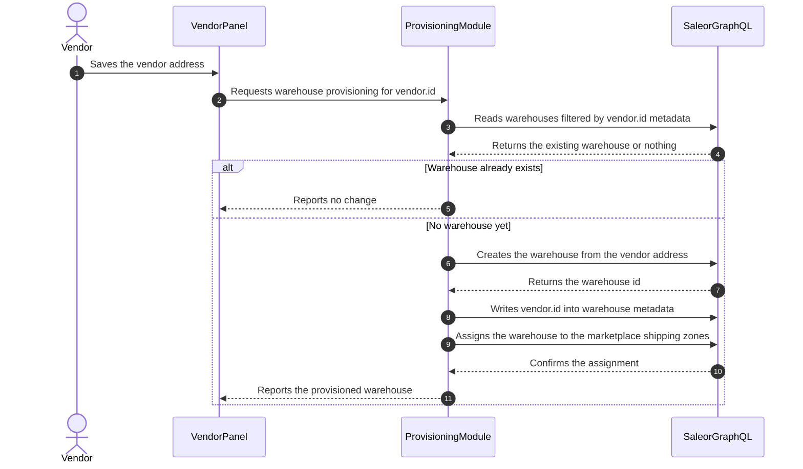

# Vendor Warehouse Provisioning and Isolation

## Problem

Saleor has no vendor entity. The marketplace models vendor ownership with the `vendor.id`
metadata key on products, orders, and customers, and the vendor panel filters queries by that key.
Warehouses are outside that contract.

Three facts describe the current state:

- The vendor panel allows the `warehouses` query and applies no vendor filter to it, unlike
  products and orders. Every vendor sees every marketplace warehouse.
- The vendor panel allows no warehouse mutation. A vendor cannot create, rename, or delete a
  warehouse, and depends on the marketplace owner for any change.
- Vendor registration creates a vendor profile page and a default collection. It creates no
  warehouse.

The result is that vendor stock rows live in locations the marketplace owner controls. Requirement
7 of the DERBY Nimara Marketplace design asks for warehouses per vendor, and that requirement is
not met.

A warehouse in Saleor is not only a stock counter. It carries an address and it must belong to a
shipping zone before it can serve a shipment. Shipping zones and shipping methods stay with the
marketplace owner under requirement 8 of the same design. Any vendor warehouse must therefore be
created by the platform and attached to zones the platform owns.

## Requirements

### Functional requirements

- Every vendor owns exactly one warehouse, created by the platform and not by the vendor.
- The warehouse carries the vendor's `vendor.id` value in metadata.
- The warehouse address comes from the vendor's Saleor customer address.
- The vendor panel returns only warehouses that belong to the signed-in vendor.
- A stock write to a warehouse that belongs to another vendor is refused.
- The vendor cannot create or change a warehouse, channel, shipping zone, or shipping method.
- Provisioning is idempotent: a second run creates no second warehouse.

### Non-functional requirements

- Provisioning uses the installed app token, the same credential that creates the vendor profile
  page and the default collection.
- A provisioning failure leaves no half-built state that blocks a retry.
- The vendor panel learns nothing about warehouses outside its own vendor, including names.
- The change adds no table to the payable ledger database.

## Proposed solution

Provisioning runs on the server, with the app token, at the moment the vendor address becomes
available. It cannot run at sign-up, because the sign-up form collects a vendor name, a company
name, a VAT id, and an email, but no address. The vendor address appears later, on the Saleor
customer account, and the vendor panel already reads it from there for the addresses page.

The trigger is therefore the address save in vendor configuration. There is no second entry point.
A vendor that registered before this change is deleted by the marketplace owner rather than
provisioned, which the PRD records under Out of Scope.

### Warehouse identity and naming

- Name: the vendor name from the vendor profile page, so the marketplace owner can read the
  warehouse list without a lookup.
- Slug: derived from the vendor page slug, which is already unique per vendor.
- Metadata: `vendor.id` with the vendor profile page id, the value the rest of the marketplace
  already uses.

Metadata is the join key, not the name or the slug. A renamed warehouse stays attached to its
vendor.

### Shipping zone assignment

A warehouse without a shipping zone produces a product that no customer can ship. Provisioning
must therefore assign the new warehouse to marketplace zones, and the rule that picks the zones is
an open question, recorded as Q-1 in the PRD and owned by the PRD owner.

This proposal recommends the narrow rule: assign the warehouse to every shipping zone of the
marketplace channel whose country list contains the warehouse country. The rule uses data the
marketplace owner already maintains and needs no new configuration surface. If no zone matches,
provisioning still creates the warehouse, records the gap, and raises an alert, because a missing
zone is an operator decision and not a vendor error.

### Isolation in the vendor GraphQL layer

The vendor panel reaches Saleor through a stitched schema that injects metadata filters for
products and orders. The warehouse list joins that mechanism:

- The `warehouses` query gains a `metadata: [{ key: "vendor.id", value: vendorId }]` filter, built
  the same way as the existing product and order filters.
- Variant stock writes are validated against the vendor's own warehouse ids before the mutation
  reaches Saleor. A foreign warehouse id is refused with a field-level error.
- No warehouse mutation is added to the allowed mutation list. The vendor stays read-only on
  warehouses.

### Component changes

#### Existing components

- Vendor GraphQL layer — adds the warehouse metadata filter and the stock-write guard.
- Vendor configuration actions — call provisioning after a successful address save.
- Vendor variant stock UI — shows one warehouse instead of a list, and states what to do when no
  warehouse exists yet.

#### New components

- Warehouse provisioning module — reads, creates, tags, and assigns the warehouse. It follows the
  vendor profile bootstrap module, which already performs idempotent Saleor setup with the app
  token.

### API changes

No new external endpoint. The marketplace app starts using three Saleor mutations that it does not
use today: warehouse creation, warehouse metadata update, and warehouse-to-shipping-zone
assignment. All three run with the app token, outside the vendor allowlist.

### Database changes

None. The payable ledger schema is untouched. All state lives in Saleor, on the warehouse object
and its metadata.

## Cross-cutting considerations

### Security

- Provisioning runs with the installed app token and never with a vendor session, so a vendor
  cannot create a warehouse by replaying a request.
- The warehouse filter closes a small information leak: today a vendor reads the names of every
  marketplace warehouse.
- The stock-write guard is the enforcement point. The filter alone hides foreign warehouses but
  does not stop a crafted mutation that names one.

### Monitoring and alerting

- Alert on a provisioning failure, with the vendor id and the failing step.
- Alert on a warehouse that belongs to a vendor and sits in no shipping zone, because the vendor's
  catalog is unsellable until an operator acts.
- Track vendors that hold stock but own no warehouse. Every such vendor registered before this
  change, and the marketplace owner must delete it.
- Track the count of warehouses, because it grows with the vendor count and affects stock
  allocation in Saleor.

### Failure cases and remediation

- Vendor has no address: provisioning does not run. The panel states that the address is required
  before stock can be held.
- Warehouse creation succeeds and metadata write fails: the next run finds no warehouse by
  metadata and would create a duplicate. Provisioning therefore looks up the warehouse by slug as
  well, and repairs the metadata instead of creating a second warehouse.
- No matching shipping zone: the warehouse is created, the gap is recorded, and an alert reaches
  the operator.
- Repeated provisioning: the read step makes the routine idempotent.
- Vendor registered before this change: no warehouse is provisioned and the panel shows an empty
  list, so the vendor cannot hold stock. The marketplace owner deletes the vendor. This is
  acceptable only while no production marketplace runs on this code.

### Alternative solutions

- **Keep shared marketplace warehouses.** Cost: nothing to build. It suits a marketplace where the
  platform holds the goods and ships for the vendor. It does not suit a vendor that ships from its
  own building, and it leaves requirement 7 unmet and the vendor persona's pain in place. Not
  chosen, because the product asks for vendor-held stock.
- **Let the vendor create its own warehouse through the panel.** Cost: add warehouse mutations to
  the vendor allowlist. It gives the vendor full autonomy, and it breaks requirement 8, because a
  vendor could then place warehouses in the marketplace shipping topology at will. Not chosen.
- **One warehouse per vendor per shipping zone.** It models a vendor with several depots and
  removes the zone-matching rule. It multiplies warehouse count and complicates the panel. Not
  chosen for the MVP, and reachable later, because the metadata join key does not assume a single
  warehouse.
- **Provision at sign-up with a placeholder address.** It keeps all setup in one place. It creates
  a warehouse with false address data, which then reaches shipping calculations. Not chosen.

### Dependencies

- Saleor warehouse, shipping zone, and metadata mutations, and the permissions the app already
  holds for shipping and products.
- The installed app token in the app config store.
- The vendor profile page and the `vendor.id` metadata contract.
- The vendor customer address, which the vendor fills in the panel.

### System impacts

- Vendor panel: warehouse list, variant stock section, configuration address flow.
- Saleor: one warehouse per vendor, each joined to marketplace shipping zones.
- Storefront: no change. Shipping methods stay marketplace-owned and per-vendor checkouts already
  exist.
- Marketplace owner: a longer warehouse list, and a new alert to act on when a zone does not
  match.

### Documentation changes

- `product/capabilities/CAP-0004 Marketplace Vendor Operations.md` states that a vendor can
  inspect available warehouses. It must state ownership and the filter once this ships.
- `docs/06-Advanced/01-Marketplace.md` must describe warehouse provisioning in the vendor
  onboarding flow.
- The DERBY Nimara Marketplace design must record that requirement 7 is delivered by platform
  provisioning, not by vendor self-service.

### QA validation

- A new vendor saves an address and receives exactly one warehouse tagged with its `vendor.id`.
- A second address save creates no second warehouse.
- A vendor sees only its own warehouse in the panel, and the response contains no other name.
- A stock write naming another vendor's warehouse is refused.
- A product with stock in the vendor warehouse offers a shipping method at checkout.
- A vendor with no address sees the message about the missing address and no warehouse appears.
- A vendor created before this change shows an empty warehouse list and no error page.
- A warehouse whose country matches no zone raises the alert and the warehouse still exists.
- A vendor attempt to create or edit a warehouse is refused.

The first five scenarios are automatable. The zone-mismatch case needs a prepared Saleor
configuration and is a candidate for a manual check first.

### DevOps / infrastructure

None. No new service, no new environment variable, no schema migration.

## Related Notes

[PRD-003 Vendor-Owned Warehouses](../../prd/PRD-003%20Vendor-Owned%20Warehouses.md)
